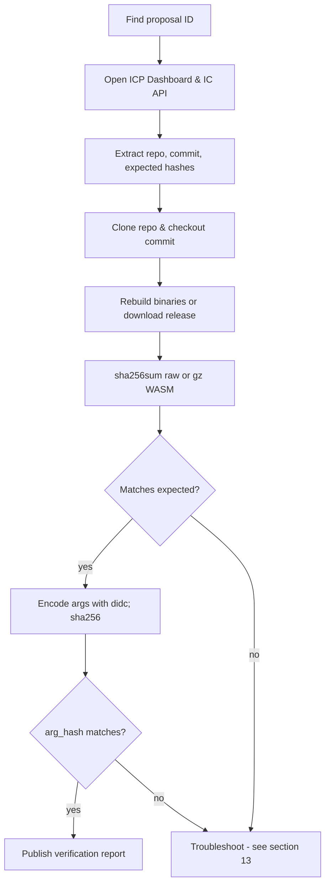
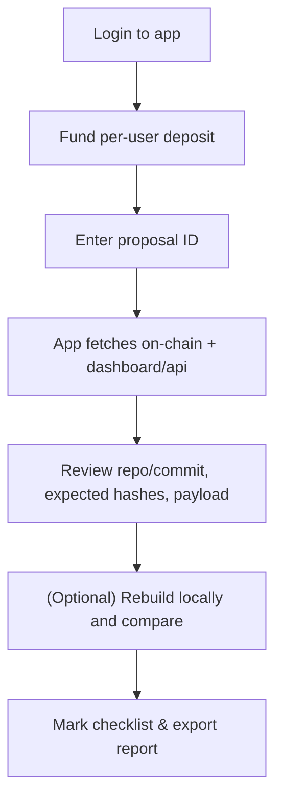

# Internet Computer Proposal Verification Guide (Manual & With the Proposal Verifier App)

> A practical, beginner-friendly handbook to verify NNS proposals step-by-step, rebuild binaries, check argument hashes, and publish your results. It also shows how to use the **Proposal Verifier** app and how to verify **manually in parallel**.

---

## Table of Contents

* [1. What is a proposal & why verification matters](#1-what-is-a-proposal--why-verification-matters)
* [2. Where proposals live (NNS, Dashboard & API)](#2-where-proposals-live-nns-dashboard--api)
* [3. Proposal types & what to verify for each](#3-proposal-types--what-to-verify-for-each)
* [4. Core concepts in plain English](#4-core-concepts-in-plain-english)
* [5. Setup & dependencies (Windows/macOS/Linux)](#5-setup--dependencies-windowsmacoslinux)
* [6. Two workflows at a glance (diagrams)](#6-two-workflows-at-a-glance-diagrams)

  * [A. Manual verification (no app)](#a-manual-verification-no-app)
  * [B. With the Proposal Verifier app](#b-with-the-proposal-verifier-app)
* [7. Full step-by-step (manual method)](#7-full-step-by-step-manual-method)
* [8. Full step-by-step (Proposal Verifier app)](#8-full-step-by-step-proposal-verifier-app)
* [9. Rebuilding & hashing binaries (IC canisters & IC-OS)](#9-rebuilding--hashing-binaries-ic-canisters--ic-os)
* [10. Candid arguments & `arg_hash` — where to find them and how to verify](#10-candid-arguments--arg_hash--where-to-find-them-and-how-to-verify)

  * [10.1 Where do I find the arguments?](#101-where-do-i-find-the-arguments)
  * [10.2 How to encode arguments (with `didc`)](#102-how-to-encode-arguments-with-didc)
  * [10.3 Compute the `arg_hash` and compare](#103-compute-the-arg_hash-and-compare)
  * [10.4 “Null/empty” arguments and common gotchas](#104-nullempty-arguments-and-common-gotchas)
* [11. Manual-heavy proposals (controllers, motions, participants)](#11-manual-heavy-proposals-controllers-motions-participants)
* [12. Publishing a verification report](#12-publishing-a-verification-report)
* [13. Troubleshooting & common pitfalls](#13-troubleshooting--common-pitfalls)
* [14. Using the Proposal Verifier app locally (clone, configure, deploy)](#14-using-the-proposal-verifier-app-locally-clone-configure-deploy)
* [15. Quick checklists](#15-quick-checklists)

---

## 1. What is a proposal & why verification matters

On the Internet Computer (IC), upgrades and governance changes are enacted via **Network Nervous System (NNS) proposals**. These can upgrade core protocol canisters, deploy new features, change controllers, and even roll out new IC-OS versions. Because proposals can be powerful, **anyone** should be able to independently verify what’s being voted on: confirm the source commit, rebuild the binaries, check hashes and arguments, and ensure the payload does exactly what it claims. Clear, reproducible verification turns governance from “trust us” into “trust, but verify.”

---

## 2. Where proposals live (NNS, Dashboard & API)

* **NNS dapp** shows each proposal, payload, and status.
* **ICP Dashboard** provides detailed proposal pages and typically a **“Wasm Verification”** area for install/upgrade proposals with the expected hash.
* **IC Public API** exposes proposals in JSON:
  `https://ic-api.internetcomputer.org/api/v3/proposals/<PROPOSAL_ID>`
  This is handy for scripts/automation and for extracting payload fields and hashes.

---

## 3. Proposal types & what to verify for each

Here’s a high-level mapping (not exhaustive). The right column is what *you* should independently confirm.

| Category (examples)                                                         | What to verify (minimum)                                                                                                                                                                            |
| --------------------------------------------------------------------------- | --------------------------------------------------------------------------------------------------------------------------------------------------------------------------------------------------- |
| **Protocol Canister Management** (e.g., governance, registry, NNS frontend) | Source **repo & commit**; **rebuild** the WASM (or use release artifact), compute **SHA-256** (raw and/or gzipped), compare to expected/“proposed wasm sha-256”; verify **`arg_hash`** if provided. |
| **Application Canister Management** (ledger, II, ckBTC, etc.)               | Same as above: repo/commit → rebuild → SHA-256 → compare; confirm **payload args** and **install mode** (upgrade vs reinstall).                                                                     |
| **IC-OS Version Deployment/Election**                                       | Confirm **release package** link & **release SHA-256**, or reproduce via the official script; compare calculated hash to the proposal’s expected hash.                                              |
| **Subnet/Node/Participant/Network Economics**                               | No WASM to rebuild; verify **principals/IDs**, **document hashes** (e.g., PDFs), **config/allowances**, and **tables/parameters** against the stated intent.                                        |
| **Governance (Motion) Proposals**                                           | **Text-only** intent. Read the summary/discussion and verify the stated scope and implications. No bytecode to hash.                                                                                |

---

## 4. Core concepts in plain English

* **Git commit** – a fingerprint (hash) that points to *exact* source code. The proposal should state a commit or link you can check.
* **WASM module** – compiled bytecode you deploy to a canister. We hash the bytes (and sometimes the gzipped bytes) to verify integrity.
* **Hash (SHA-256)** – a one-way fingerprint of bytes. If two parties compute SHA-256 on the *same* file/bytes, they must match.
* **Arguments / `arg_hash`** – for install/upgrade proposals, the payload can include arguments. The proposal typically stores **`arg_hash` = SHA-256 of the Candid-encoded argument bytes**. You re-encode the same arguments and compare.
* **Reproducible build** – re-building the WASM from the given commit in a clean environment and reproducing the same hash.

---

## 5. Setup & dependencies (Windows/macOS/Linux)

You don’t need deep dev experience—just a clean environment and the right tools.

**Common tools (all OS)**

* **Git** (clone the repo and checkout the commit)
* **Docker** (official IC build scripts use Docker to make builds reproducible)
* **curl** (download release artifacts or helper scripts)
* **sha256sum / shasum** (compute hashes)
* **`dfx`** (IC SDK; optional but useful)
* **`didc`** (Candid codec; encode args to compare against `arg_hash`)

**Install `dfx` (recommended via dfxvm)**

```bash
sh -ci "$(curl -fsSL https://internetcomputer.org/install.sh)"
# Then:
dfxvm install <version>
dfx --version
```

**Install `didc`**

* macOS (Homebrew): `brew install dfinity/tap/didc`
* Linux/WSL: download or build a `didc` binary for your architecture and put it on your `PATH`.
* Windows: use **WSL2** (Ubuntu) and follow Linux steps.

**OS notes**

* **Windows (best: WSL2 + Ubuntu)**

  1. Install WSL2 + Ubuntu from MS Store
  2. Inside Ubuntu: `sudo apt update && sudo apt install -y git docker.io curl coreutils`
  3. Add your WSL user to `docker` group; restart WSL
  4. Install `dfx` via the script above

* **macOS**
  `brew install git docker coreutils` + install Docker Desktop and start it, then install `dfx`.

* **Linux (Ubuntu/Debian)**

  ```bash
  sudo apt update
  sudo apt install -y git docker.io curl coreutils
  ```

  Then install `dfx`.

---

## 6. Two workflows at a glance (diagrams)


### A. Manual verification (no app)



### B. With the Proposal Verifier app



---

## 7. Full step-by-step (manual method)

1. **Identify the proposal**
   Find the numeric ID (e.g., from NNS dapp or Dashboard).

2. **Open Dashboard & API**

   * Dashboard: read title, summary, and payload.
   * IC API JSON: `https://ic-api.internetcomputer.org/api/v3/proposals/<ID>` for machine-readable fields (`payload_text_rendering`, `arg_hash`, etc.).

3. **Confirm the source commit**
   Open the GitHub repo + commit from the summary/payload and ensure it exists and matches what’s stated.

4. **Rebuild or download artifacts**

   * For NNS/IC repos: clone, checkout the commit, run official scripts (see §9).
   * For IC-OS releases: use the release package link and verify the **SHA-256** reported in the proposal (§9B).

5. **Compute hashes & compare**

   * `sha256sum <file.wasm>` and, if proposal specifies gzipped **WASM (gz)**, also `sha256sum <file.wasm.gz>`.
   * Compare with the Dashboard’s “Proposed WASM (gz) SHA-256” (or similar).

6. **Verify arguments (`arg_hash`)** — see §10 for details

   * Encode the exact Candid args with `didc encode '<args>' | shasum -a 256`.
   * Compare with the `arg_hash` shown on Dashboard/API.

7. **Publish your verification** — see §12
   Include: proposal ID, links, commands/logs, computed hashes, arg checks, conclusions.

---

## 8. Full step-by-step (Proposal Verifier app)

* **Live app**: `https://g5ige-nyaaa-aaaap-an4rq-cai.icp0.io/`
* **Source repo**: `https://github.com/dickhery/proposal_verifier`

> The app runs **on-chain** (Internet Computer). When it fetches a proposal and related data, it performs governance queries & HTTPS outcalls which **burn cycles**. Therefore, **each fetch has a fee** (collected from your per-user deposit subaccount shown in the UI).

**Using the app**

1. **Login** (Internet Identity).
2. **Fund deposit** (the app shows your per-user deposit account identifier).
3. Enter a **proposal ID** → the app fetches on-chain & dashboard/API data.
4. The app parses out **expected hashes**, **repo/commit**, and **payload** details.
   You can optionally **rebuild locally**, then paste your computed hashes to confirm.
5. Use the **checklist** and **export** actions to publish a “Proposal Verified” report.

---

## 9. Rebuilding & hashing binaries (IC canisters & IC-OS)

### A. Protocol/Application canisters (IC repo example)

Use the official containerized build to reproduce artifacts:

```bash
git clone https://github.com/dfinity/ic
cd ic
git fetch --all
git checkout <COMMIT>
./ci/container/build-ic.sh -c
# Artifacts appear under ./artifacts/canisters/...
sha256sum ./artifacts/canisters/*.wasm
sha256sum ./artifacts/canisters/*.wasm.gz  # if proposal expects gz hash
```

Then compare your SHA-256 to the **expected** hash shown on the Dashboard (labels like “Proposed WASM (gz) SHA-256”).

### B. IC-OS releases (GuestOS/HostOS)

IC-OS proposals usually link a **release package**; you’ll either:

* Download and hash it directly (compare to the proposal’s release SHA-256), or
* Run the official **repro-check** script (from the IC repo) that reproduces the release and prints hashes to compare.

---

## 10. Candid arguments & `arg_hash` — where to find them and how to verify

### 10.1 Where do I find the arguments?

* **ICP Dashboard proposal page**
  Look for **Argument / Payload** sections. Many proposals include a human-readable rendering of the Candid (sometimes under “payload text rendering”).
* **IC API**
  Open `https://ic-api.internetcomputer.org/api/v3/proposals/<ID>` and search for fields like `payload_text_rendering`, `payload`, and `arg_hash`.

  * `payload_text_rendering` may contain JSON or a string with Candid-like text.
  * `arg_hash` (if present) is the target hash you’ll compare with.
* **Proposal summary / repo docs**
  Some proposals include a ready-to-run “Argument verification” snippet (often a `didc encode` + `sha256` command).
* **InstallCode payload context**
  The on-chain `Proposal.action.InstallCode` stores the **hash** of the arg bytes (`arg_hash`), not the bytes themselves. You recreate the same Candid bytes from the payload description and/or linked docs.

### 10.2 How to encode arguments (with `didc`)

`didc` encodes Candid values to bytes. You then hash those bytes.

**Basics**

* Empty tuple (no args): `()`
* Explicit `null`: `(null)`
* Text: `("hello")`
* Principal: `(principal "ryjl3-tyaaa-aaaaa-aaaba-cai")`
* Record: `(record { a = 1; b = "x" })`
* Variant: `(variant { SetController = principal "aaaaa-aa" })`
* Optional: `(opt record { field = 42 })`
* Vector of bytes: `(vec {1; 2; 255})`
* Blob from hex escapes: `(blob "\00\ab\ff")`

**Examples**

```bash
# 1) Empty args
didc encode '()' | shasum -a 256

# 2) Explicit null (not the same as ())
didc encode '(null)' | shasum -a 256

# 3) Record & text
didc encode '(record { name = "NNS"; version = 1 })' | shasum -a 256

# 4) Principal and variant
didc encode '(variant { Upgrade = principal "ryjl3-..." })' | shasum -a 256

# 5) Bytes as vec
didc encode '(vec {1;2;255})' | shasum -a 256

# 6) Blob: hex-escaped bytes
didc encode '(blob "\00\ab\ff")' | shasum -a 256
```

> **Tip:** If a proposal references a `.did` interface and you prefer more type safety, you can use `didc` with a DID file to construct well-typed values. For simple payloads, inline Candid (as above) is quick and reliable.

### 10.3 Compute the `arg_hash` and compare

1. Encode the *exact* Candid value shown (or implied) in the proposal:

   ```bash
   didc encode '<YOUR_CANDID_VALUE>' > /tmp/args.bin
   ```
2. Hash the bytes:

   ```bash
   shasum -a 256 /tmp/args.bin      # macOS
   # or
   sha256sum /tmp/args.bin          # Linux/WSL
   ```
3. Compare the 64-hex result to the proposal’s **`arg_hash`**.

### 10.4 “Null/empty” arguments and common gotchas

* **`()` vs `(null)` are different.**
  `()` is “no arguments”; `(null)` is a typed value. They encode to different bytes and **different hashes**.
* **Common “empty” case**
  Many upgrade proposals pass **no arguments**. For `()` you can reproduce the hash locally (encode, then hash) as shown above.
* **Optional fields** (`opt`) default to `null` *or* are omitted depending on the schema—ensure you mirror the exact structure the canister expects.
* **Strings vs blobs** are different encodings. Don’t hash a human-readable string if the proposal intended a `blob`/`vec nat8`.

---

## 11. Manual-heavy proposals (controllers, motions, participants)

Some proposals don’t involve bytecode:

* **Add/Remove Controllers (canister settings)**

  * Payload contains **principal IDs** to be added/removed.
  * Verify those principals are the intended ones (cross-check in the forum thread and any linked docs).
  * If you control the canister locally you can call `canister_status` via the **management canister** to see current controllers; note only controllers (or the NNS for system canisters) can query this on mainnet.
  * Outcome check: controllers list should reflect exactly what the payload specifies after execution.

* **Motion (Governance) proposals**

  * Text-only, expressing intent or policy.
  * Verify clarity, scope, and that it **does not** implicitly authorize actions beyond what it states. Motions don’t deploy code.

* **Participant / Node provider changes**

  * Check identity documents or hashes (e.g., PDF hashes), forum due diligence, and that the principals match the intended entities.
  * Hash any linked PDFs yourself: `sha256sum file.pdf` and compare.

---

## 12. Publishing a verification report

A good report makes your work easy to reproduce:

* **Header**: proposal ID, title, links (NNS dapp & Dashboard), repo+commit, proposer (if listed).
* **Hashes**: your computed raw/gz WASM hashes and expected hash from the proposal.
* **Args**: the exact Candid value you encoded and the resulting `sha256`.
* **Build log**: key commands you ran and their outputs.
* **Conclusion**: “Verified” / “Mismatch” with brief notes.
* **Artifacts**: attach logs or paste hashes as code blocks.

---

## 13. Troubleshooting & common pitfalls

* **Hash mismatch**

  * Check if the **proposal expects gzipped** WASM. Hash **`.wasm.gz`** if so.
  * Make sure you checked out the **exact commit** (no uncommitted changes, right branch/tag).
  * Rebuild in a **clean** environment (Docker build script).

* **`arg_hash` mismatch**

  * Confirm the **exact Candid** shape: `()` vs `(null)` vs `record {}` are different.
  * Encode precisely with `didc`.
  * Some proposals encode **empty args**; when truly empty, `()` will match only if the proposal used no args.

* **IC-OS release not matching**

  * Make sure you used the **release package** or the official **repro-check** for the same commit/version.

* **API JSON lacks fields**

  * The IC API is helpful but sometimes omits context; always cross-read the Dashboard page and proposal summary.

* **Environment issues (Windows)**

  * Use **WSL2** and run everything inside Ubuntu; ensure Docker daemon is running and your user is in the `docker` group.

---

## 14. Using the Proposal Verifier app locally (clone, configure, deploy)

**Why self-host?**
Running your own instance means you control your cycles and pay only your own costs.

* **Live app**: `https://g5ige-nyaaa-aaaap-an4rq-cai.icp0.io/`
* **Repo**: `https://github.com/dickhery/proposal_verifier`

**Before you deploy your fork:**

1. **Change the beneficiary address** (where ICP fees are forwarded) from
   `2ec3dee16236d389ebdff4346bc47d5faf31db393dac788e6a6ab5e10ade144e`
   to **your** account identifier (64-hex). This constant is in the backend code.
2. **Replace canister IDs** (frontend/backend) after your first local deploy (`dfx deploy`) so your frontend points to *your* backend canister.
3. Review the repo **README** for environment notes (CSP, Internet Identity config, etc.).

**Local dev (example)**

```bash
# in project root
npm install
dfx start --clean --background
dfx deploy
# start the frontend workspace
npm start
```

**Production deploy**

* Create mainnet canisters with `dfx`, fund cycles, and deploy the backend first.
* Update the frontend `declarations` and CSP as needed, then deploy the asset canister.
* Test a fetch on a known proposal (see §15 “Known-good sanity checks”).

> **Fees**: The app charges a **per-fetch** fee because HTTPS outcalls and governance queries **burn cycles** on the backend. You’ll see (and fund) your **per-user deposit subaccount** in the UI; the app forwards the fee to the configured beneficiary address. If you self-host, **replace that address** with your own.

---

## 15. Quick checklists

### A. “Proposal Verified” (binary-bearing proposals)

* [ ] Open Dashboard + API for **<ID>**. Extract **expected hash** & any **`arg_hash`**.
* [ ] Follow repo link & **checkout the commit**.
* [ ] **Rebuild** with the official script (Docker).
* [ ] Compute **sha256** of **raw** and/or **gzipped** WASM (as the proposal specifies).
* [ ] **Compare** with expected.
* [ ] **Encode args** with `didc` (exact Candid), **sha256** the bytes, compare to `arg_hash`.
* [ ] Publish your **report** with commands + logs.

### B. Manual verification (controllers/participants/motions)

* [ ] Read payload and **list all principals** and values to change.
* [ ] Confirm identities with forum context and/or documentation.
* [ ] For motions, confirm scope and that no implicit authorization is hidden.
* [ ] Publish your **report**.

### C. Known-good sanity checks

* **Empty args (`()`)** — run locally to reproduce the “no-args” hash via `didc encode '()' | shasum -a 256`.
* **WASM (gz)** vs **WASM** — ensure you hash the **correct one** per the Dashboard label.

---

**Notes for readers of this guide:**

* The **Proposal Verifier app** is deployed on the Internet Computer at the URL above. Each fetch consumes cycles and charges a small fee. You may **clone and deploy your own** copy from the GitHub repository; before deploying, change the beneficiary address and update canister IDs so your frontend points to your backend.
* If you’re new, start with **IC-OS** or **simple canister upgrade** proposals; they’re the most straightforward to reproduce and hash. Then move on to controller or participant proposals to practice manual reviews.

