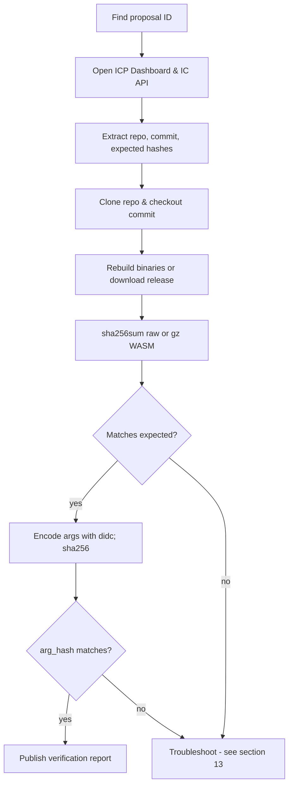
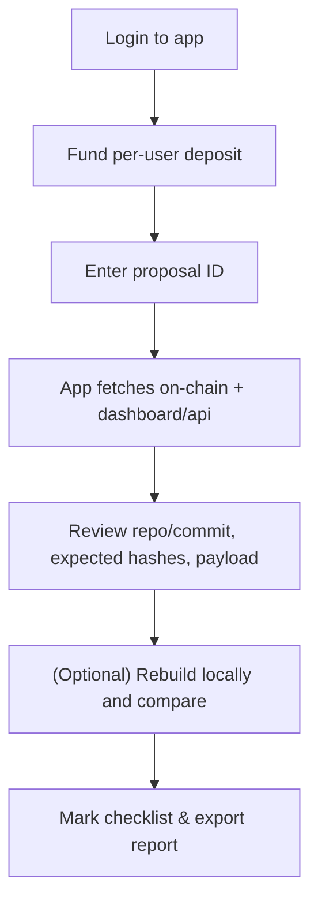

# Internet Computer Proposal Verification Guide (Manual & With the Proposal Verifier App)

> A practical, beginner-friendly handbook to verify NNS proposals step-by-step, rebuild binaries, check argument hashes, and publish your results. It also shows how to use the **Proposal Verifier** app and how to verify **manually in parallel**. This guide assumes no prior knowledge of proposals or blockchain governance, explaining everything from the basics to advanced troubleshooting.

---

## Table of Contents

* [1. What is a proposal & why verification matters](#1-what-is-a-proposal--why-verification-matters)
* [2. Where proposals live (NNS, Dashboard & API)](#2-where-proposals-live-nns-dashboard--api)
* [3. Proposal types & what to verify for each](#3-proposal-types--what-to-verify-for-each)
* [4. Core concepts in plain English](#4-core-concepts-in-plain-english)
* [5. Setup & dependencies (Windows/macOS/Linux)](#5-setup--dependencies-windowsmacoslinux)
* [6. Two workflows at a glance (diagrams)](#6-two-workflows-at-a-glance-diagrams)

  * [A. Manual verification (no app)](#a-manual-verification-no-app)
  * [B. With the Proposal Verifier app](#b-with-the-proposal-verifier-app)
* [7. Full step-by-step (manual method)](#7-full-step-by-step-manual-method)
* [8. Full step-by-step (Proposal Verifier app)](#8-full-step-by-step-proposal-verifier-app)
* [9. Rebuilding & hashing binaries (IC canisters & IC-OS)](#9-rebuilding--hashing-binaries-ic-canisters--ic-os)
* [10. Candid arguments & `arg_hash` — where to find them and how to verify](#10-candid-arguments--arg_hash--where-to-find-them-and-how-to-verify)

  * [10.1 Where do I find the arguments?](#101-where-do-i-find-the-arguments)
  * [10.2 How to encode arguments (with `didc`)](#102-how-to-encode-arguments-with-didc)
  * [10.3 Compute the `arg_hash` and compare](#103-compute-the-arg_hash-and-compare)
  * [10.4 “Null/empty” arguments and common gotchas](#104-nullempty-arguments-and-common-gotchas)
* [11. Manual-heavy proposals (controllers, motions, participants)](#11-manual-heavy-proposals-controllers-motions-participants)
* [12. Publishing a verification report](#12-publishing-a-verification-report)
* [13. Troubleshooting & common pitfalls](#13-troubleshooting--common-pitfalls)
* [14. Using the Proposal Verifier app locally (clone, configure, deploy)](#14-using-the-proposal-verifier-app-locally-clone-configure-deploy)
* [15. Quick checklists](#15-quick-checklists)

---

## 1. What is a proposal & why verification matters

The Internet Computer Protocol (ICP) is a decentralized blockchain platform designed to run smart contracts (known as "canisters") in a secure, scalable, and efficient manner. Unlike traditional blockchains, ICP uses a unique governance system called the **Network Nervous System (NNS)**, which is essentially a decentralized autonomous organization (DAO). This NNS allows holders of ICP tokens—who stake their tokens in "neurons"—to participate in decision-making by voting on proposals. These proposals are the core mechanism for evolving the ICP network, ensuring it remains community-driven and transparent.

A **proposal** in the NNS is essentially a formal request or suggestion for a change or action on the ICP network. Think of it like a bill in a legislature: it's submitted, discussed (often on forums), voted on by eligible participants (neurons), and if it passes (adopted), it automatically executes. Proposals can cover a wide range of actions, such as:
- Upgrading the code of critical canisters (e.g., the governance canister itself or the ICP ledger).
- Deploying new versions of the IC Operating System (IC-OS), which runs on the physical nodes that power the network.
- Adding or removing node providers (entities that operate the hardware nodes).
- Changing network economics, like rewards for nodes or voting parameters.
- Even non-binding "motions" that serve as polls or discussions to gauge community sentiment.

Proposals are numbered uniquely (e.g., Proposal #12345) and have a status: open (voting period), adopted (passed and executed), rejected, or failed (e.g., due to errors). Each proposal includes a title, summary (description), URL (often linking to forum discussions), and a payload (the actual data or code to execute if adopted). The payload might include hashes for verification, ensuring transparency.

**Why verification matters:** In a decentralized system like ICP, there's no central authority to "trust" blindly. Proposals can be powerful—they might introduce new code that could contain bugs, vulnerabilities, or even malicious changes if not scrutinized. Verification is the process of independently confirming that the proposal does exactly what it claims. For example:
- Does the proposed Wasm code match the source code at the specified commit? (Rebuild and hash to check.)
- Do the arguments (e.g., configuration data passed to a canister) hash to the value in the proposal? (Encode and hash to verify.)
- Are supporting documents (like node provider declarations) authentic and unchanged? (Download and hash to confirm.)

Without verification, the network risks "trust us" governance, where a few entities (like proposal submitters) control changes without checks. Instead, verification enables "trust, but verify"—a key principle of decentralization. Here's why it's crucial:
- **Reduces risks:** Catches errors (e.g., wrong commit), mismatches (e.g., hash doesn't match rebuilt code), or potential attacks (e.g., tampered binaries) before they execute.
- **Builds transparency:** Public verification reports create accountability—submitters know their work will be scrutinized, leading to higher-quality proposals.
- **Enhances resilience:** Distributed checks mean no single point of failure; if one verifier misses something (e.g., a subtle arg change), others might catch it.
- **Increases participation and education:** Verifying teaches you about ICP internals (e.g., how canisters upgrade), making you a better-informed voter and contributor.
- **Prevents centralization:** The more independent verifiers (like you), the less reliance on trusted parties (e.g., DFINITY submissions). This aligns with ICP's goal of full decentralization.
- **Community culture:** Repeated verifications set norms—e.g., always include rebuild instructions in summaries—making governance more robust over time.

In short, verification turns passive staking into active governance. Even if you're new and start with simple checks (like hashing a document), your contribution strengthens the network. Over time, this collective effort prevents centralization and ensures ICP evolves securely and fairly.

For deeper dives, explore the [ICP verifying proposals tutorial](https://internetcomputer.org/docs/building-apps/governing-apps/nns/concepts/proposals/verify-proposals) and [proposal topics/types](https://learn.internetcomputer.org/hc/en-us/articles/34140518658068-Proposal-Topics-and-Types).

---

## 2. Where proposals live (NNS, Dashboard & API)

To start verifying a proposal, you first need to locate it and gather its details. ICP provides several accessible interfaces for this purpose, each offering complementary information. Understanding these sources allows you to cross-reference data for accuracy and completeness. We'll explain each one, including how to navigate them and what key details to extract.

* **NNS dapp** ([nns.ic0.app](https://nns.ic0.app/)): This is the primary, user-friendly web application for interacting with the NNS. It's built as a canister running directly on the ICP network, making it decentralized and tamper-resistant. Here's a detailed walkthrough:
  - Open the site in your browser (no login needed to browse, but required to vote).
  - Go to the "Proposals" tab in the navigation menu.
  - Use filters: Sort by status (e.g., "Open" for proposals currently in voting), topic (e.g., "Governance" or "Subnet Management"), or search by ID.
  - Click on a proposal to view its full details: title, summary (descriptive text), proposer (the neuron or principal that submitted it), payload (the technical data or code), voting status (e.g., votes for/against), and links (often to forum discussions).
  - Key extractions: Copy the summary for repo/commit/hashes; note the payload for arguments (often in Candid format like `(record { ... })`); check the "Action" field for type (e.g., "InstallCode").
  - Why use it: It's the official voting interface, on-chain (data is verifiable), and includes community discussions. If you're a neuron holder, you can follow trusted neurons here for automated voting.
  - Tip: Proposals have a voting deadline (e.g., 4 days)—verify open ones promptly. If the proposal links to a forum thread, read it for context.

* **ICP Dashboard** ([dashboard.internetcomputer.org](https://dashboard.internetcomputer.org/)): This is a more technical, analytics-focused portal maintained by the DFINITY Foundation. It's off-chain but aggregates real-time network data and provides enhanced proposal views.
  - Navigate to the "Governance" or "Proposals" section.
  - Search by ID or browse lists (filter by topic, status, or date).
  - Each proposal page includes: title, summary, proposer, detailed payload rendering (often human-readable JSON or text), expected hashes (crucial for Wasm verification), and sometimes build/rebuild instructions.
  - Key extractions: Look for the "Wasm Verification" section (common in upgrade proposals) with "Proposed WASM (gz) SHA-256" or similar; extract `arg_hash` from payload; note any linked artifacts (e.g., release packages).
  - Why use it: Provides parsed, easy-to-read payloads and verification hints not always in NNS dapp. Great for cross-referencing hashes and args.
  - Tip: If the summary mentions a "release package," the dashboard often links it directly—download and hash immediately.

* **IC Public API**: This is a RESTful endpoint for programmatic access, ideal for scripts or when you need raw, structured data in JSON format. No UI—use a browser, curl, or tools like Postman.
  - Base URL: `https://ic-api.internetcomputer.org/api/v3/proposals/<PROPOSAL_ID>`.
  - Fetch example (curl): `curl https://ic-api.internetcomputer.org/api/v3/proposals/12345 > proposal.json`.
  - Response structure: A JSON object with fields like `id`, `proposal` (containing `title`, `summary`, `url`, `action` with hashes/args), and status.
  - Key extractions: Use `jq` for parsing (install via [jq download](https://stedolan.github.io/jq/download/)): `cat proposal.json | jq .proposal.action.InstallCode.wasm_module_hash` to get hashes; extract `arg_hash` similarly.
  - Why use it: Automation-friendly; precise for fields like binary hashes or encoded args. Handy in scripts to fetch multiple proposals.
  - Tip: If JSON is large, pipe to `jq` for filtering: `curl ... | jq .proposal.summary` for just the description.

**Best practices for using these sources:**
- **Cross-check always**: Start with NNS dapp for overview, Dashboard for details/hashes, API for raw data. If any mismatch (e.g., summary differs), investigate—could be an error.
- **Save offline**: Copy/paste summaries/JSON to files for reference.
- **Security**: Use HTTPS; verify URLs match official domains to avoid phishing.
- **If stuck**: Forum threads (linked in proposals) often clarify details.

These tools make proposals accessible—browse a few to familiarize yourself.

---

## 3. Proposal types & what to verify for each

Proposals are categorized by **topics** (broad groups like "Governance") and **types** (specific actions like "InstallCode"). Topics influence voting (e.g., higher rewards for critical ones) and restrictions (e.g., short periods for some). Types define execution (e.g., upgrade a canister). For a complete list with examples, see [ICP proposal topics and types](https://learn.internetcomputer.org/hc/en-us/articles/34140518658068-Proposal-Topics-and-Types).

Why classify? It guides verification: binary types need rebuilds/hashes; config types need ID checks; motions need intent review. The table maps common categories with minima—always read the summary for specifics. Use [ICP verify tutorial](https://internetcomputer.org/docs/building-apps/governing-apps/nns/concepts/proposals/verify-proposals) for videos/examples.

Here’s a high-level mapping (not exhaustive). The right column is what *you* should independently confirm.

| Category (examples)                                                         | What to verify (minimum)                                                                                                                                                                            |
| --------------------------------------------------------------------------- | --------------------------------------------------------------------------------------------------------------------------------------------------------------------------------------------------- |
| **Protocol Canister Management** (e.g., governance, registry, NNS frontend) | Source **repo & commit**; **rebuild** the WASM (or use release artifact), compute **SHA-256** (raw and/or gzipped), compare to expected/“proposed wasm sha-256”; verify **`arg_hash`** if provided. |
| **Application Canister Management** (ledger, II, ckBTC, etc.)               | Same as above: repo/commit → rebuild → SHA-256 → compare; confirm **payload args** and **install mode** (upgrade vs reinstall).                                                                     |
| **IC-OS Version Deployment/Election**                                       | Confirm **release package** link & **release SHA-256**, or reproduce via the official script; compare calculated hash to the proposal’s expected hash.                                              |
| **Subnet/Node/Participant/Network Economics**                               | No WASM to rebuild; verify **principals/IDs**, **document hashes** (e.g., PDFs), **config/allowances**, and **tables/parameters** against the stated intent.                                        |
| **Governance (Motion) Proposals**                                           | **Text-only** intent. Read the summary/discussion and verify the stated scope and implications. No bytecode to hash.                                                                                 |
| **SnsAndCommunityFund** (e.g., CreateServiceNervousSystem)                  | Verify **initial token distribution**, **swap params**, **Neurons' Fund usage**, and **SNS settings**. Rebuild SNS canisters if upgrading; check hashes for documents.                           |

**General tips for all types**: Start with summary—note intent. If hashes/docs, verify first (easy wins). For code, rebuild last (time-intensive). If unsure, forum thread clarifies.

---

## 4. Core concepts in plain English

If you're new to blockchain or ICP, these terms might seem technical—let's break them down simply, like explaining to a friend. We'll use analogies and examples to make them clear.

* **Hash (SHA-256)**: Imagine a file's "DNA" or unique fingerprint—a 64-character code (hex digits) generated from its exact content. If you change even one byte (e.g., add a space in a document), the hash changes completely. Analogy: Like a book's ISBN—if the book changes, so does the ISBN. In proposals, hashes prove "this is the exact file/code proposed." Tools like `sha256sum` compute it instantly. Example: Hash "hello" vs "hello!"—totally different outputs. Mismatch during verification? Signals a problem (e.g., wrong file).
* **Wasm (WebAssembly)**: The compiled, binary code that ICP canisters run. It's like an app's executable file (.exe on Windows). Proposals often upgrade Wasm—e.g., fix bugs or add features. To verify: Rebuild from source code (using tools like Docker) and hash the output. Matches proposal hash? The code is authentic. Analogy: Baking a cake from a recipe—if your cake matches the photo, the recipe is good.
* **Candid arguments**: Data passed to canisters during install/upgrade, like settings or configs. Often written in Candid (a human-readable format, e.g., `(record { key = "value" })`). Proposals hash these for integrity—`arg_hash` is SHA-256 of the encoded bytes. To verify: Encode text to bytes with `didc`, hash, compare. Analogy: Mailing a package—the label (Candid text) must match the contents (bytes) when unpacked (hashed).
* **Reproducible builds**: The holy grail of verification—same input (code at exact commit) produces identical output (Wasm/hash) on any machine. ICP scripts/Docker ensure this. Why? Prevents "my build differs" issues. Analogy: Following a recipe exactly—everyone gets the same cake.
* **On-chain vs off-chain**: On-chain = stored on blockchain (immutable, verifiable, e.g., hashes in proposal). Off-chain = external (e.g., GitHub code, PDFs)—you fetch/rebuild to verify. Analogy: On-chain is a sealed contract; off-chain is supporting evidence you check.
* **Principals/IDs**: Unique strings identifying users, canisters, nodes (e.g., "ryjl3-tyaaa-aaaaa-aaaba-cai"). Like email addresses but cryptographic. Verify they match expected (e.g., in configs). Analogy: Checking IDs at a door—wrong ID? No entry.
* **HTTPS outcalls**: Canisters calling external APIs (e.g., GitHub for commit existence). App uses these—consensus ensures responses match across replicas (prevents divergence). Analogy: Group fact-check—majority agrees on answer.

These concepts ensure trustless verification—no blind faith. For practical hashing, see [ICP verify hash guide](https://internetcomputer.org/docs/building-apps/governing-apps/nns/concepts/proposals/verify-proposals#verifying-arguments-match-the-hash).

---

## 5. Setup & dependencies (Windows/macOS/Linux)

Verification requires tools for code management, building, encoding, and hashing. We'll cover installation step-by-step, assuming no prior setup. This ensures reproducibility—your environment matches others'. Test each tool after install to catch issues early.

### Common Tools (All OS)
These are foundational—install first. They enable cloning, building, and verifying.
* **Git**: Version control for cloning repos and checking commits.
  - Why: Proposals reference GitHub—clone to rebuild.
  - Download/install: [git-scm.com](https://git-scm.com/downloads) (choose your OS).
  - Post-install: Add to PATH if prompted. Test: Open terminal/Git Bash, run `git --version` (should show version like 2.XX).
* **sha256sum/shasum**: Computes SHA-256 hashes for files/bytes.
  - Why: Core to verification—match proposal hashes.
  - Linux: Built-in (`sha256sum`).
  - macOS: Built-in (`shasum -a 256`).
  - Windows: Included in Git Bash (use `shasum -a 256`); or WSL.
  - Test: `echo -n "test" | sha256sum` (output: a94a8fe5ccb19ba61c4c0873d391e987982fbbd3).
* **didc**: Candid encoder/decoder for args.
  - Why: Converts Candid text to bytes for hashing.
  - Download binary: [GitHub releases](https://github.com/dfinity/candid/releases) (choose your OS/arch, e.g., didc-linux64).
  - Extract, add to PATH: Copy to `/usr/local/bin` (macOS/Linux) or a PATH dir (Windows).
  - Test: `didc --version` (shows version).
* **IC CDK (dfx)**: ICP CLI for local testing/queries.
  - Why: Optional for queries (e.g., canister status); useful for advanced.
  - Install: `DFX_VERSION=0.15.0 sh -ci "$(curl -fL https://internetcomputer.org/install.sh)"`.
  - Test: `dfx --version`.
* **Node.js**: For scripts/apps (e.g., app frontend).
  - Why: If self-hosting app.
  - Download: [nodejs.org](https://nodejs.org/en/download) (LTS version).
  - Test: `node --version`.
* **Docker**: Containerizes builds for reproducibility.
  - Why: ICP scripts use Docker—ensures same output.
  - Install Desktop: [docker.com](https://docs.docker.com/desktop/setup/install/windows-install/) (enable WSL on Windows).
  - Test: `docker --version`; run `docker run hello-world`.

### Windows-Specific Setup
Windows lacks native Linux tools—use **WSL** for compatibility. WSL runs Linux inside Windows.
1. Enable WSL: Settings > Apps > Optional features > More Windows features > Virtual Machine Platform & Windows Subsystem for Linux. Restart.
2. Install Ubuntu: Microsoft Store > Ubuntu > Install. Launch; set username/password (takes ~5 min).
3. In Ubuntu terminal: Update packages `sudo apt update && sudo apt install git curl docker.io -y`.
4. Add user to Docker: `sudo usermod -aG docker $USER`; logout/login.
5. Install dfx/didc: As above (in WSL).
6. Docker integration: In Docker Desktop > Settings > Resources > WSL Integration > Enable for Ubuntu.
Full guide: [Microsoft WSL install](https://learn.microsoft.com/en-us/windows/wsl/install). Tip: Use VS Code with WSL extension for editing.

### macOS/Linux Setup
* macOS: Install Homebrew (`/bin/bash -c "$(curl -fsSL https://raw.githubusercontent.com/Homebrew/install/HEAD/install.sh)"`); then `brew install git docker coreutils`. Start Docker Desktop.
* Linux: `sudo apt update && sudo apt install git curl docker.io -y`. Add to Docker group (as above).
* Install dfx/didc: As common.

**Troubleshoot**:
- PATH: Edit `~/.bash_profile` (macOS) or `~/.bashrc` (Linux/WSL): `export PATH="$PATH:/path/to/tool"`. Reload: `source ~/.bashrc`.
- Permissions: `chmod +x tool`.
- Docker: If "daemon not running," start app/service.

---

## 6. Two workflows at a glance (diagrams)

Verification has two paths: manual (hands-on, educational) or app-assisted (faster, automated). Choose based on experience—start manual to learn, then use app for efficiency.

### A. Manual verification (no app)


### B. With the Proposal Verifier app


---

## 7. Full step-by-step (manual method)

This section provides a complete, foundational guide to verifying NNS proposals manually, without relying on any apps or automated tools. It's designed for absolute beginners, assuming you have no prior experience with command-line tools, blockchain concepts, or verification processes. We'll explain every step in detail, including why it's important, potential pitfalls, troubleshooting tips, and exact commands with examples. By following this, you'll learn the core principles of verification while gaining hands-on experience.

Manual verification builds your understanding of ICP governance and ensures you can spot issues independently. It's more time-consuming than using the Proposal Verifier app (see Section 8), but it's reproducible on any machine and doesn't require login or fees. Always cross-reference with the proposal's summary, the [ICP Verify Proposals Tutorial](https://internetcomputer.org/docs/current/building-apps/governing-apps/nns/concepts/proposals/verify-proposals), and Section 3 (Proposal Types) for type-specific details.

Before starting, ensure your tools are set up (see Section 5: Setup & Dependencies). You'll need a terminal (e.g., Command Prompt on Windows, Terminal on macOS/Linux) and basic navigation skills (e.g., `cd folder` to change directories). If a command fails, copy the error and search it online (e.g., "git clone error").

1. **Find the proposal**: The first step is locating the proposal details. Proposals are publicly viewable on multiple platforms, which helps cross-verify information. Start by obtaining the proposal ID (a number like 12345) from discussions on the [DFINITY Developer Forum](https://forum.dfinity.org/c/governance/20) or announcements.
   - Open the [NNS dapp](https://nns.ic0.app/) in your browser. This is the official voting interface—search for the ID or browse open proposals. Click the proposal to view its title, summary (description), status (e.g., "Open" for voting), proposer (principal ID), and payload (data/code). Copy the full summary and any linked URLs. Note the voting deadline—if it's "Open," verify quickly to influence votes.
   - Alternatively, use the [ICP Dashboard](https://dashboard.internetcomputer.org/governance). Search by ID; it shows detailed payload (e.g., JSON-like args for code upgrades). Copy the "Payload" section if available—it's often more structured than the summary.
   - Via command line (advanced but tamper-proof): Use dfx to query directly: `dfx canister call rrkah-fqaaa-aaaaa-aaaaq-cai get_proposal_info '(12345)' --network ic`. This calls the governance canister (see attached IDL for details) and outputs Candid data—parse for summary/hashes.
   - Why? Ensures you're working with the canonical on-chain data. Pitfall: If status is "Adopted" or "Executed," verification is post-facto but still useful for audits. Save everything to a text file for reference.

2. **Determine type/topic**: Every proposal belongs to a topic (e.g., ProtocolCanisterManagement) and type (e.g., InstallCode), which dictates what to verify (e.g., code vs. text). Refer to Section 3 (Proposal types & what to verify for each) or the attached proposal-topics-and-types.txt for a full list.
   - From the summary or Dashboard: Look for keywords like "InstallCode" (code upgrade), "Motion" (text poll), or "AddNodeProvider" (participant). The Dashboard often labels "Proposal Type" explicitly.
   - Why? Topics guide focus—e.g., high-reward ones like Governance need deep review; binary-heavy like IcOsVersionElection require builds. Example: If "Upgrade the governance canister," it's ProtocolCanisterManagement → InstallCode, so prioritize Wasm/args.
   - Pitfall: Misclassification leads to wrong checks (e.g., hashing text as binary). Cross-check with [Proposal Topics Docs](https://learn.internetcomputer.org/hc/en-us/articles/34140518658068-Proposal-Topics-and-Types).

3. **Extract key info**: Scan the summary/payload for verifiable elements. This is like detective work—look for patterns in the text.
   - Common items: Repo (e.g., "https://github.com/dfinity/ic" or "dfinity/ic"), commit (40-hex string like "abcdef1234567890abcdef1234567890abcdef12"), hashes (64-hex SHA-256 like "1234567890abcdef1234567890abcdef1234567890abcdef1234567890abcdef"), args (Candid like `(record { key = value })`), docs (bullets like "* Declaration: hash" or URLs).
   - How: Copy summary to a text editor. Search for "github.com" (repo), 40-hex near "commit" or "checkout", 64-hex near "hash" or "sha256". For args, look for `(record ...)` in payload. Use tools like grep: `echo "summary text" | grep -o '[0-9a-f]{64}'` for hashes.
   - Why? These are the building blocks—wrong extraction invalidates everything. Example: In "git checkout abcdef123456 from https://github.com/dfinity/ic", extract repo="dfinity/ic", commit="abcdef123456".
   - Pitfall: Summaries vary—use [Base Text Module](https://internetcomputer.org/docs/current/motoko/base/Text) if scripting in Motoko, or simple regex in code (see attached base-text.txt). If unclear, check forum link.

4. **Clone & checkout repo**: Download the source code at the exact version.
   - Command: `git clone https://github.com/<org>/<repo>` (e.g., `git clone https://github.com/dfinity/ic`). This creates a local copy.
   - Navigate: `cd <repo>` (e.g., `cd ic`).
   - Checkout: `git checkout <commit>` (e.g., `git checkout abcdef123456`).
   - Verify: `git log -1`—output should show the commit hash, author, date. Matches proposal? Good.
   - Why? Ensures you're verifying the claimed code—wrong commit could hide changes.
   - Pitfall: Clone fails? Check URL (add .git if needed); network issues—use VPN. Invalid commit? Proposal error—report. Tools: Git ([Download](https://git-scm.com/downloads)).

5. **Rebuild binaries**: Compile code to binaries (e.g., Wasm) matching proposal.
   - Follow repo README (e.g., for IC: dependencies like Rust/Docker).
   - Command: `./ci/container/build-ic.sh -c` (IC-specific; others vary, e.g., `cargo build --release` for Rust).
   - Use Docker: `docker run --rm -v $(pwd):/ic ubuntu:22.04 /ic/ci/container/build-ic.sh -c`. Why isolation? Prevents host deps from interfering; reproducible.
   - Output: In `artifacts/` or `target/release/`. Locate Wasm/PDFs.
   - Why? Confirms no backdoors—rebuild from source, not trust pre-built.
   - Pitfall: Missing deps? Install (e.g., `apt install rustc`). Long build? Use powerful machine. Errors? Check README/forum. Tools: Docker ([Guide](https://docs.docker.com/desktop/install/)).

6. **Compute hashes**: Generate fingerprints of rebuilt files.
   - Command: `sha256sum artifacts/*.wasm.gz` (Linux/Mac: `shasum -a 256`). Outputs "hash  file".
   - For raw: `gunzip file.gz; sha256sum file.wasm`.
   - Compare: To proposal "wasm_module_hash" or Dashboard "expected hash". Exact match (case-insensitive).
   - Why? Detects tampering—if hashes differ, file altered.
   - Pitfall: Gz vs. raw? Check proposal (often gz). Wrong file? Verify path from README. Tools: sha256sum/shasum ([Expanded above](#2-tools-and-setup-in-depth-installation-for-all-platforms)).

7. **Verify args**: Check configuration data (Candid) hashes to `arg_hash`.
   - Find args: In summary/payload (e.g., `(record { ... })`). If null: `(null)` or `()`.
   - Encode: `didc encode '(args)' > hex.txt` (add `-d file.did` for interface; download .did from repo).
   - Bytes: `xxd -r -p hex.txt > args.bin`.
   - Hash: `sha256sum args.bin`.
   - Compare: To "arg_hash".
   - Why? Args configure upgrades—mismatch could change behavior.
   - Pitfall: Wrong Candid? Exact match, including spaces. Empty/null differ ([GUIDE.md](https://github.com/dickhery/proposal_verifier/blob/main/GUIDE.md#104-nullempty-arguments-and-common-gotchas)). No .did? Fetch from repo. Tools: didc, xxd ([Install](https://github.com/dfinity/candid/releases)).

8. **Verify docs**: Confirm supporting files (e.g., PDFs) unchanged.
   - Download: From proposal URLs (e.g., wiki/forum).
   - Hash: `sha256sum file.pdf`.
   - Compare: To proposal hashes.
   - Why? Docs prove identity/compliance—tampering invalidates.
   - Pitfall: Wrong file? Exact URL. Large files? Tools handle. Tools: curl (`curl -O url`), sha256sum.

9. **Check extras**: Verify non-binary elements (e.g., principals, motions).
   - Principals: Query registry: `dfx canister call rno2w-sqaaa-aaaaa-aaacq-cai get_subnet '(principal "<id>")' --network ic`.
   - Motions: Read summary/implications—does it align? Check forum.
   - Participants: Hash PDFs as above.
   - Why? Covers all aspects—e.g., wrong principal could misroute funds.
   - Pitfall: Use IDL for queries. Tools: dfx.

10. **Report mismatches**: Document and share findings.
    - If issues (e.g., hash mismatch): Note details (logs/hashes).
    - Reject: Vote no on NNS.
    - Post on [Forum](https://forum.dfinity.org/) (Governance > NNS Discussion): Title "Verification Report #12345 - Mismatch". Include template from Section 12.
    - Why? Alerts community—prevents bad proposals.
    - Pitfall: Be factual. Use app for structured reports.

Full examples: [ICP verify tutorial](https://internetcomputer.org/docs/current/building-apps/governing-apps/nns/concepts/proposals/verify-proposals). For app-assisted, see Section 8.

---

## 8. Full step-by-step (Proposal Verifier app)

The Proposal Verifier app is a powerful, user-friendly tool deployed directly on the ICP blockchain (at [https://g5ige-nyaaa-aaaap-an4rq-cai.icp0.io/](https://g5ige-nyaaa-aaaap-an4rq-cai.icp0.io/)) that streamlines the manual verification process by automating data fetching, parsing, and basic checks where possible. It queries the NNS governance canister, extracts key elements like repositories, commits, hashes, arguments, and URLs from the proposal summary, performs automated verifications (e.g., commit existence via GitHub API), and allows you to manually verify arguments and documents with built-in hashing tools. The app also provides type-specific checklists, guidance, and report exports to make verification accessible even for complete beginners.

Using the app reduces errors, saves time, and ensures consistency—it's especially helpful if you're new, as it handles complex parsing and provides visual feedback (e.g., ✅/❌ for matches). However, it complements (doesn't replace) manual checks: always reproduce critical steps like rebuilding binaries locally for full confidence. The app requires login for billed actions (fetching proposals costs ~0.03 ICP + 0.0001 ICP network fee, forwarded to fund cycles). You can deploy your own instance for customization (see step 10).

Follow these steps to verify a proposal using the app. We'll explain each in detail, including what happens behind the scenes, why it's important, and tips for success. Assume you've set up tools from Section 5 if needed for manual parallels.

1. **Access app**: Visit the [live app](https://g5ige-nyaaa-aaaap-an4rq-cai.icp0.io/) in your browser—it's hosted on ICP, so no installation required. The app loads quickly and shows a simple interface with a proposal ID input. To use billed features (like fetching), click "Login with Internet Identity" ([II docs](https://internetcomputer.org/docs/current/references/ii-spec)). Internet Identity (II) is ICP's secure, passwordless authentication system—it creates a unique principal (your digital ID) tied to your device/biometrics. If this is your first time, follow the on-screen prompts to create an "anchor" (a numeric ID you'll reuse). Why login? It enables secure billing from your deposit subaccount and attributes actions to you. After login, you'll see your principal and balance (initially 0)—refresh if needed. Tip: If login fails, check your browser (Chrome/Firefox work best) or clear cache. This step sets up your session for verification.

2. **Fund deposit**: Once logged in, the app displays your unique deposit address (a 64-hex string, e.g., "a1b2c3...") under "Fund your balance." Copy this address—it's a subaccount derived from your principal for secure, isolated deposits. Send ICP to it using any wallet (e.g., NNS dapp: paste into "To" field; or dfx: `dfx ledger transfer <address> --icp 0.5 --memo 0 --network ic`). Start with ~0.1 ICP to cover a few fetches (each costs 0.03 ICP + ~0.0001 ICP network fee). After sending, click "Refresh balances" in the app—it queries the ICP ledger (via ICRC-1 standard) to update your on-chain subaccount balance, credited total, and available amount. Why fund? Fetching is billed to cover cycles for HTTPS outcalls (e.g., GitHub checks) and queries—unused funds stay in your subaccount. The fee forwards to the beneficiary (hardcoded for cycle funding). Tip: Confirm transaction on a block explorer like [dashboard.internetcomputer.org](https://dashboard.internetcomputer.org/). If balance doesn't update, wait ~1-2 minutes or check for typos. Pitfall: Don't send to your principal directly—use the subaccount address.

3. **Enter ID & fetch**: In the app's main input, enter the proposal ID (a number like 12345, from NNS/Dashboard/forum). Click "Fetch Proposal" (billed action—confirm if prompted). Behind the scenes: The app calls the governance canister's `get_proposal_info` method (via dfx-generated actor, see attached main.mo and governance IDL), deducts the fee from your balance, and parses the returned summary/payload for repo (e.g., "dfinity/ic"), commit (40-hex), hashes (64-hex for Wasm/args/docs), Candid args (e.g., `(record {...})`), and URLs/links. It displays extracted data in sections like "Proposal Details" (ID/type/title/summary) and "Extracted Info" (repo/commit/hashes/docs). Why? This automates data gathering, reducing manual copy-paste errors. The parsed elements populate verification tools (e.g., commit check). Tip: If extraction misses something (unusual formatting), note it manually. Check "Document Expectation" (e.g., "expected" for PDFs). Pitfall: Invalid ID? App shows error—double-check on NNS.

4. **Review extracted**: The app shows parsed elements: repo/commit (with link if possible), hashes (onchain Wasm/arg), doc URL, artifact path, proposal type, URLs list, and docs table (name/hash). Scroll through—hover for previews. Auto-verifies basics like type detection (e.g., "ProtocolCanisterManagement"). Why? Confirms app parsed correctly; spot anomalies early (e.g., wrong commit). Use this as your verification hub—links open in new tabs for manual checks (e.g., browse repo on GitHub). Tip: If repo/commit wrong, it's a proposal issue—report. Cross-check with Dashboard ([https://dashboard.internetcomputer.org/proposal/ID](https://dashboard.internetcomputer.org/governance)). Pitfall: Dynamic URLs? App notes if non-deterministic (see HTTP outcalls docs).

5. **Verify commit**: In "Extracted Info," see "Commit Status" (e.g., "✅ Commit exists on dfinity/ic@abcdef12"). App auto-checks via GitHub API (browser for free; canister if blocked)—queries `https://api.github.com/repos/<repo>/commits/<commit>` (see attached github-rest-api-javascript.txt). If "❌," manual: Click link or browse GitHub ([https://github.com/<repo>/commit/<commit>](https://github.com/dfinity/ic/commit/abcdef123456)). Why? Ensures commit real/not tampered—fake commits could hide malicious code. Tip: If fail, check repo privacy/network. Pitfall: Rate limits? Use app's canister mode (billed outcall).

6. **Verify docs**: In "Extracted Docs" table (if any), see name/expected hash. Upload file: Click input, select downloaded doc (e.g., PDF from wiki)—app computes SHA-256 locally, compares, shows preview/match (✅/❌). Or fetch URL: If text/JSON, app uses HTTP outcall (billed if not cached), hashes server response. For multiple: Repeat per doc. Why? Verifies docs untampered (e.g., self-declaration PDFs)—mismatch means wrong file/version. Tip: Download manually first ([curl -O url](https://curl.se/)); upload for hash. Preview shows content snippet. Pitfall: Binary docs? App supports but no preview—use manual hash tools (Section 7). Large files? App caps for cycles.

7. **Verify args**: In "Verify Arg Hash," see extracted args (if Candid). Paste into textarea (app auto-detects format: hex/vec/blob/Candid/text). Select mode; click "Verify"—app encodes (Candid to bytes via didc-like), hashes (SHA-256), compares to `arg_hash` (✅/❌). Quick buttons: Auto-encode `(null)`/`()`. Why? Args configure changes—mismatch could alter behavior (e.g., wrong param). Tip: For Candid, use command builder (`didc encode ...`); paste hex output. Hints warn issues (e.g., "Detected hex-of-hex"). Pitfall: Wrong mode? Switch—e.g., Candid needs encoding first. See [GUIDE.md](https://github.com/dickhery/proposal_verifier/blob/main/GUIDE.md#10-candid-arguments--arg_hash--where-to-find-them-and-how-to-verify).

8. **Check extras**: See "Type-Specific Checklist" (e.g., for InstallCode: "Fetch Proposal," "Commit Check"). Items auto-update (✅ on success). For extras (e.g., motions: review implications; controllers: query registry), mark manually. Why? Covers non-auto aspects like policy review. Tip: Use "Guidance" details for tips (e.g., "Download PDFs from wiki"). Pitfall: Incomplete? Do manual (Section 7) before marking.

9. **Export report**: In "Export Report," see auto-filled summary (ID/type/hashes/matches). Fill overrides (e.g., proposer); add "Reviewer Notes" (e.g., "No issues; recommend adopt"). Click exports: JSON (raw data), Markdown (forum-ready with code blocks), PDF (styled printable). Why? Creates shareable evidence. Tip: Markdown best for forum—copy/paste. Customize date/verified-by. Pitfall: Missing fields? App autofills from fetch—check accuracy.

10. **Publish**: Export Markdown/PDF, then post on [DFINITY Forum](https://forum.dfinity.org/) (Governance > NNS Discussion; tag topic). Title: "Verification Report #12345: [Title] – [Verified/Mismatch]". Paste report; add intro ("Verified using app—findings below"). Why? Informs voters; sparks discussion. Tip: Attach PDF; tag @dfinity. See Section 12 for template. For self-host: Clone [Repo](https://github.com/dickhery/proposal_verifier), change beneficiary/ID, deploy `dfx deploy --network ic` (dfx.json attached).

Clone: [Repo](https://github.com/dickhery/proposal_verifier). Change beneficiary/canister IDs.

---

## 9. Rebuilding & Hashing Binaries (IC Canisters & IC-OS)

Rebuilding binaries from source code and hashing them is a critical step in proposal verification. It confirms that the proposed code (e.g., Wasm modules or OS images) exactly matches the source at the specified commit, preventing backdoors, tampering, or errors. By rebuilding independently, you ensure the binary in the proposal hasn't been altered post-build. Hashing computes a unique "fingerprint" (e.g., SHA-256 digest) of the file—if even one bit changes, the hash differs, alerting you to mismatches.

Hashing is a one-way cryptographic function: it turns any file into a fixed-length string (64 hex characters for SHA-256), but you can't reverse it to get the original file. It's deterministic (same input = same output) and collision-resistant (hard to find two files with the same hash). In verification:
- Download or build the file locally.
- Compute its hash.
- Compare to the proposal's expected hash (e.g., "wasm_module_hash" for canisters or image hashes for IC-OS).
A match means the file is authentic; a mismatch could indicate a wrong commit, corruption, or foul play.

Here's how to compute hashes on different platforms, with examples. These tools are efficient for any file size, reading in chunks to avoid memory issues. Focus on Linux and macOS as primary platforms, but include Windows notes for completeness. Always hash locally—avoid online tools for security.

- **Linux (sha256sum, built-in on most distributions like Ubuntu):**  
  Command: `sha256sum <file>`  
  Example: After building a canister Wasm (e.g., `governance.wasm.gz` in `artifacts/canisters/`):  
  ```bash  
  sha256sum artifacts/canisters/governance.wasm.gz  
  ```  
  Output: e.g., `a1b2c3d4e5f67890abcdef1234567890abcdef1234567890abcdef1234567890  governance.wasm.gz`. Extract the hash (first part) and compare to the proposal. For raw (unzipped) files: `gunzip governance.wasm.gz` then `sha256sum governance.wasm`. Use with pipes for hex inputs: `echo -n "hex_string" | xxd -r -p | sha256sum`.

- **macOS (shasum, built-in):**  
  Command: `shasum -a 256 <file>`  
  Example: For the same `governance.wasm.gz`:  
  ```bash  
  shasum -a 256 artifacts/canisters/governance.wasm.gz  
  ```  
  Output: Similar, e.g., `a1b2c3d4e5f67890abcdef1234567890abcdef1234567890abcdef1234567890  governance.wasm.gz`. Compare the hash. For large archives like IC-OS images (e.g., `disk-img.tar.zst`): `shasum -a 256 disk-img.tar.zst`. Hashes are case-insensitive (usually lowercase in proposals).

- **Windows (via PowerShell or WSL – Use WSL for Linux-like experience):**  
  - **PowerShell (built-in on Windows 10+):** Command: `Get-FileHash <file> -Algorithm SHA256`  
    Example: In PowerShell, navigate (e.g., `cd Path\To\Artifacts`), then:  
    ```powershell  
    Get-FileHash artifacts\canisters\governance.wasm.gz -Algorithm SHA256  
    ```  
    Output: Includes `Hash: A1B2C3D4E5F67890ABCDEF1234567890ABCDEF1234567890ABCDEF1234567890` (uppercase—convert to lowercase if needed for comparison).  
  - **WSL (Recommended):** Install WSL (see Section 2 for setup), then use Linux commands like `sha256sum`. Ideal for consistency with ICP tools.

**Tips for Hashing:** 
- Install prerequisites: Linux/macOS often have these built-in; for xxd (hex conversion), install via `apt install vim-common` (Linux) or it's built-in on macOS.
- Common Pitfalls: Hash gzipped vs. raw files as specified (proposals often use gzipped for canisters). Wrong commit? Recheck `git rev-parse HEAD`. Large files? Tools handle them fine. Case sensitivity: Hashes are hex, case-insensitive.
- Security: Download files/scripts from trusted sources (e.g., official GitHub). Verify script hashes if provided.

### IC Canisters (e.g., Governance, Ledger)
For canister upgrades (e.g., ProtocolCanisterManagement topic), rebuild Wasm modules from the IC repo.

**Prerequisites:** Git (for cloning), Docker (for builds—install via official guides in Section 2). ~100GB free space. Ubuntu 22.04+ recommended; macOS/Windows via Docker/WSL.

1. **Clone Repo:** `git clone https://github.com/dfinity/ic`. (Clones the full source.)
2. **Checkout Commit:** `git checkout <commit>` (Replace `<commit>` with proposal's git hash, e.g., `abc1234`. Verify: `git rev-parse HEAD` should match.)
3. **Build:** Navigate to repo root: `cd ic`. Run `./ci/container/build-ic.sh -c` (Builds canisters; requires Docker. Takes time—use `-j` for parallel if multi-core.)
4. **Locate Artifacts:** Built Wasms in `artifacts/canisters/*.wasm.gz` (e.g., `governance.wasm.gz`).
5. **Hash & Compare:** Use platform-specific commands above. Compare to proposal's "wasm_module_hash". Mismatch? Check build logs for errors or wrong commit.

Details: See [ICP GitHub](https://github.com/dfinity/ic) for advanced builds. If proposal specifies args (e.g., for init/upgrade), encode with didc (Section 2) and hash separately.

### IC-OS (GuestOS/HostOS/SetupOS)
For OS version elections (IcOsVersionElection topic), verify images match proposal hashes.

**Prerequisites:** Python 3+, curl, ~100GB space. Ubuntu 22.04+.

1. **Run Verification Script:** Use versioned URL (replace `{COMMIT_ID}` with proposal's commit):  
   ```bash  
   curl -fsSL https://raw.githubusercontent.com/dfinity/ic/{COMMIT_ID}/ci/scripts/repro-check | python3 - -c {COMMIT_ID}  
   ```  
   (Verifies all components. For specific: Add `--guestos`, `--hostos`, or `--setupos`.)
2. **Output & Hashes:** Script builds images, outputs hashes (e.g., for GuestOS disk-img). Compare to proposal's hashes.
3. **Compare:** Match? Proposal is valid. Mismatch? Report on forum.

Details: [ICP GitHub Verifying Releases](https://github.com/dfinity/ic?tab=readme-ov-file#verifying-releases). Script ensures reproducibility—run on clean machine for best results.

**Common Pitfalls Across Both:** Docker issues? Check permissions (`sudo usermod -aG docker $USER`). Build fails? Missing deps—install build-essential/libssl-dev. Timeouts? Increase resources. Always use exact commit—proposals are immutable post-submission. If stuck, forum-search errors.

---

## 10. Candid arguments & `arg_hash` — where to find them and how to verify

Candid arguments (often abbreviated as "args") are the input parameters or configuration data passed to a canister during actions like installations or upgrades in NNS proposals. They are typically written in Candid, ICP's interface description language, which defines how data is structured and serialized (converted to bytes) for on-chain execution. The `arg_hash` is the SHA-256 hash (a 64-character hexadecimal digest) of these serialized argument bytes. Verifying the `arg_hash` ensures the arguments haven't been tampered with and match exactly what the proposal claims—preventing subtle changes that could alter behavior, like wrong configurations or malicious data.

Why verify args? In proposals like InstallCode or UpdateCanisterSettings, args might include settings (e.g., controllers) or data (e.g., initial balances). A mismatch could lead to security risks, such as unauthorized access. The process involves: finding the args (usually Candid text), encoding them to bytes (serialization), hashing the bytes, and comparing to the proposal's `arg_hash`.

You'll need `didc` installed (see Section 5 for setup) for encoding/decoding, and hashing tools like `sha256sum` (Linux), `shasum` (macOS), or `Get-FileHash` (Windows PowerShell). We'll provide commands for Linux, macOS, and Windows (via WSL or PowerShell) with examples. Always work in a terminal for precision—copy commands exactly, replacing placeholders like `<args>`.

### 10.1 Where do I find the arguments?
Arguments are often provided in the proposal's summary or payload, but locating them requires checking multiple sources for completeness and cross-verification. This step is crucial because args might be truncated in summaries or require context from linked documents.

- **From the Proposal Summary:** The summary (text description) often includes Candid args directly, especially for simple proposals. Look for patterns like `(record { ... })` or `(variant { ... })`. Example: In a proposal summary, you might see "Arguments: (record { max_age = 100 : nat64 })".
  - How: Copy the full summary from the NNS dapp or Dashboard. Use a text editor to search for "(" or "record".
  - Tip: If the summary says "Arguments: (null)" or "empty," note it—special handling in 10.4.

- **From the Payload (Detailed View):** The payload is the structured data (often JSON-like in Dashboard). It may show args as Candid text or hex bytes.
  - How: On [ICP Dashboard](https://dashboard.internetcomputer.org/governance), search the ID and expand "Payload." Look for "arg" or "arguments" fields.
  - Via Command Line: Use dfx: `dfx canister call rrkah-fqaaa-aaaaa-aaaaq-cai get_proposal_info '(12345)' --network ic`. Parse the output for "arg" (use tools like grep: `| grep -A 5 arg`).
  - Tip: If hex bytes, decode first (see 10.2 for decoding).

- **From the ICP API:** For programmatic access, query the API endpoint.
  - How: `curl https://ic-api.internetcomputer.org/api/v3/proposals/12345` (replace ID). Parse JSON for "payload" or "arg" (use jq: `| jq '.proposal.payload'`).
  - Why: API provides raw data—less prone to UI truncation.

- **From Forum/Linked Docs:** If not in summary, check the proposal's URL (often a forum post) or attached PDFs/wiki.
  - How: Open the link; search for "arguments" or Candid snippets.
  - Tip: Use browser search (Ctrl+F) or text tools (e.g., `grep '(record' file.txt`).

- **Common Pitfalls & Tips:** Args might be omitted if null/empty—assume `(null)` or `()` (test both, see 10.4). If complex, note the .did file (interface) for encoding (fetch from repo). Why multiple sources? Cross-check prevents tampering—e.g., summary might differ from payload. Save to a file (e.g., `args.txt`) for encoding.

Example: For Proposal #12345, summary says "Args: (record { setting = true })". Copy: `(record { setting = true })`.

### 10.2 How to encode arguments (with `didc`)
Encoding converts Candid text (human-readable) to bytes (binary) for hashing—matching how ICP serializes args on-chain. `didc` is the tool: it takes Candid text and outputs hex bytes (string of 0-9a-f). Decoding reverses this (hex to text) for inspection. Always encode before hashing—hashing text directly won't match `arg_hash`.

**Why Encode?** ICP hashes serialized bytes, not text. Encoding ensures exact byte-for-byte match. Skip for raw hex args.

**Step-by-Step Encoding (All Platforms):**
1. **Prepare Args Text:** From 10.1, save to `args.txt` (e.g., `(record { max_age = 100 : nat64 })`). Ensure exact—no extra spaces/quotes unless part of syntax.
2. **Optional: Get .did File:** If proposal references (e.g., "use governance.did"), fetch: `curl https://raw.githubusercontent.com/<repo>/<commit>/rs/src/governance.did -o governance.did`. Why? Defines types for accurate encoding.
3. **Encode to Hex:**
   - Command (All): `didc encode '(args-text)'` (replace with your args).
   - With .did: `didc encode -d file.did '(args-text)'`.
   - Output: Hex string (e.g., "4449444c0001710a68656c6c6f20776f726c64").
   - Save: `didc encode ... > hex.txt`.
4. **Platform-Specific Notes:**
   - **Linux/macOS:** Above works directly. Pipe for no newline: `didc encode ... | tr -d '\n' > hex.txt`.
   - **Windows (WSL/PowerShell):** Use WSL for Linux commands. PowerShell: Install didc via Rust, run as above.
5. **Verify Encoding:** Decode back: `didc decode <hex>`. Should match original text.
6. **Examples:**
   - Simple: `didc encode '("hello")'` → "4449444c0001710a68656c6c6f20776f726c64".
   - Record: `didc encode '(record { age = 42 : nat })'` (outputs hex).
   - With .did: If did defines "type Person = record { age : nat };", then `didc encode -d person.did '(record { age = 42 : nat })'`.
7. **Troubleshooting:** Error "type mismatch"? Wrong Candid—check syntax ([Motoko Grammar attached](motoko-grammar.txt)). No output? Empty args (see 10.4). Install issues? Reinstall Rust/didc ([Guide](https://github.com/dfinity/candid/releases)). Pitfall: Encode text only—don't hash it directly.

**Decoding (For Inspection):** If args are hex in proposal (rare), decode to text for readability.
- Command: `didc decode <hex> -d file.did` (outputs Candid text).
- Example: `didc decode 4449444c0001710a68656c6c6f20776f726c64` → '("hello")'.
- Why? Helps understand args before re-encoding/hashing.

Tip: For complex args, break down in editor—ensure types match .did ([Candid Releases](https://github.com/dfinity/candid/releases)).

### 10.3 Compute the `arg_hash` and compare
With encoded hex from 10.2, convert to bytes and hash with SHA-256. Compare to proposal's `arg_hash` (from summary/Dashboard/API)—match confirms args integrity.

**Why Hash?** `arg_hash` is SHA-256 of bytes—verifies exact serialization without recomputing on-chain.

**Step-by-Step (All Platforms):**
1. **Convert Hex to Bytes:** From `hex.txt`, create binary file.
   - Command: `xxd -r -p hex.txt > args.bin`.
2. **Compute SHA-256:**
   - **Linux:** `sha256sum args.bin` (output: "hash  args.bin"—take hash).
   - **macOS:** `shasum -a 256 args.bin` (similar output).
   - **Windows (PowerShell):** `Get-FileHash args.bin -Algorithm SHA256 | Select-Object -ExpandProperty Hash` (uppercase hash—lowercase for comparison).
   - With WSL: As Linux.
3. **Compare:** Normalize (lowercase, no spaces) and match to `arg_hash`. Use diff: `echo "<computed>" | diff - <(echo "<expected>")`.
4. **Examples:**
   - Linux: `xxd -r -p hex.txt > args.bin; sha256sum args.bin` → "efcdab8998badcfe1032547698badcfe10325476efcdab8998badcfe".
   - macOS: `xxd -r -p hex.txt > args.bin; shasum -a 256 args.bin`.
   - If match: Verified! Mismatch: Recheck encoding.
5. **Troubleshooting:** Wrong hash? Double-hex (decode extra: `xxd -r -p hex.txt | xxd -r -p > args.bin`). File empty? Null args (10.4). Tools missing? Install xxd (`apt install vim-common` Linux; built-in macOS). Pitfall: Trailing newline in hex—use `tr -d '\n'` before xxd.

### 10.4 “Null/empty” arguments and common gotchas
Null or empty args are common (e.g., no config needed) but tricky—different notations encode differently, leading to mismatches.

- **`()` (Unit/Empty Tuple):** Encodes to empty bytes (hash: e3b0c44298fc1c149afbf4c8996fb92427ae41e4649b934ca495991b7852b855). Use for "no args."
  - Encode: `didc encode '()' > hex.txt` (hex empty).

- **`(null)` (Null Value):** Encodes to single byte (hash: 6e340b9cffb37a989ca544e6bb780a2c78901d3fb33738768511a30617afa01d).
  - Encode: `didc encode '(null)' > hex.txt`.

- **Common Gotchas & Fixes:**
  - **Mismatch Reasons:** Wrong notation (test both); extra spaces/quotes in Candid (trim); missing .did (types wrong); double-encoding (decode hex first if "hex-of-hex"—check length 64 but content hex-like).
  - **Step to Fix:** Decode proposal `arg_hash` bytes if hex provided: First get bytes from `arg_hash` (it's hash, not bytes—re-encode your args to match hash).
  - **Empty vs. Null:** Proposals specify—e.g., "null arguments" = `(null)`. Test: Encode both; hash; compare.
  - **Other Pitfalls:** Windows line endings (use WSL); large args (didc handles); no .did for custom types (fetch from repo: `curl https://raw.githubusercontent.com/<repo>/<commit>/<path>.did -o file.did`).
  - **Examples:** For `()`: `didc encode '()' | tr -d '\n' | xxd -r -p | sha256sum`. For null: Replace '()'.
  - **Tip:** If unsure, decode proposal args (if hex): `echo "<arg_hex>" | xxd -r -p | didc decode -d file.did`. Inspect; re-encode.

Mastering this verifies 80% of proposals—practice on open ones! If stuck, forum or Section 13.

---

## 11. Manual-heavy proposals (controllers, motions, participants)

Some proposal types rely heavily on manual inspection rather than automated rebuilding or hashing of binaries. These include proposals that update canister controllers (e.g., changing who controls a canister), motion proposals (non-binding discussions or polls), and participant management proposals (e.g., adding or removing node providers or data centers). These are "manual-heavy" because they often involve reviewing text descriptions, querying on-chain data for consistency, cross-referencing external documents like PDFs, or evaluating subjective elements like scope and intent.

Verification here focuses on ensuring the proposal's claims align with reality—e.g., no unauthorized changes, documents are authentic, and motions don't hide binding effects. While tools like dfx can help query data, much of the work is interpretive: read carefully, compare against expectations, and check for red flags. Always cross-reference with the proposal summary, Dashboard, and forum discussions. If issues arise (e.g., mismatched principals), reject the proposal and report on the [DFINITY Developer Forum](https://forum.dfinity.org/) to alert the community.

Below, we'll break down verification for each subtype with detailed steps, explanations, commands, tools, examples, and troubleshooting tips. Use the setup from Section 5 (e.g., dfx for queries) and refer to Section 4 (Core concepts) for basics like principals and hashes.

### Controllers (e.g., UpdateCanisterSettings Proposals)
Controller proposals modify who or what can manage a canister (e.g., upgrade code or stop/start it). The "controller" is a principal (a unique ID like "rrkah-fqaaa-aaaaa-aaaaq-cai") with admin rights. Verification ensures the proposed controllers match the intent—no unauthorized additions/removals that could lead to control loss or attacks.

**Why Verify Controllers?** Wrong controllers could allow malicious upgrades or lock out legitimate owners. In NNS, this affects critical canisters, so mismatches risk network stability.

**Step-by-Step Verification:**
1. **Identify the Proposal Type and Payload:** Confirm it's a controller-related action (e.g., "UpdateCanisterSettings" in summary or payload). From Dashboard or dfx query (see Section 7, Step 1), extract the target canister ID (principal) and proposed controllers (list of principals).
   - Example: Summary says "Update controllers for canister ryjl3-tyaaa-aaaaa-aaaba-cai to [principal1, principal2]".

2. **Query Current Controllers:** Use dfx to check the canister's existing settings via the management canister (aaaaa-aa).
   - Command: `dfx canister call aaaaa-aa canister_status '(record { canister_id = principal "<target-id>" })' --network ic`.
   - Output: Look for "controllers" field (list of principals). Example: `controllers = vec { principal "rrkah-fqaaa-aaaaa-aaaaq-cai"; principal "another-id" }`.
   - Why? Compare current vs. proposed to spot unexpected changes (e.g., removal of a trusted principal).

3. **Match Against Payload:** Compare proposed controllers (from proposal) to queried current ones and summary claims.
   - Proposed often in Candid like `record { controllers = opt vec { principal "id1"; principal "id2" } }`.
   - Verify: Are additions/removals justified (e.g., forum discussion)? No duplicates/unknown IDs?
   - Tool: dfx for queries; text editor for comparison.

4. **Check Principals' Validity:** Ensure principals are real (not random strings). Query if they control other canisters or match known entities (e.g., DFINITY principals).
   - Command (for known): Use ICP Dashboard search or dfx to inspect.
   - Why? Fake principals could be typos or attacks.

5. **Review Context:** Check forum/wiki for rationale (e.g., "Adding new controller for upgrade"). Verify no hidden effects (e.g., removing all controllers locks the canister).

6. **Report Issues:** If mismatch (e.g., extra controller), note in report: "Proposed adds unknown principal—potential risk."

**Tools:** dfx ([Install](https://internetcomputer.org/docs/current/developer-docs/setup/install/)), text editor. Pitfall: Network errors? Use `--network ic`. Example: For proposal updating ledger controllers, query confirms only authorized IDs added.

### Motions (e.g., Non-Binding Polls or Discussions)
Motion proposals are text-only and don't execute code—they're for gauging community sentiment, like polls on future directions. No binaries/args, so verification is qualitative: ensure the motion is clear, within scope, and not misleading.

**Why Verify Motions?** Though non-binding, they influence future proposals. Hidden agendas or off-scope could mislead voters, eroding trust. High reward weight (20) means they're important.

**Step-by-Step Verification:**
1. **Read the Full Text:** From summary/Dashboard, copy title/summary. Understand intent (e.g., "Poll: Should we increase rewards?").
   - Why? Ensure no embedded code or tricks—motions should be pure text.

2. **Verify Scope:** Check if it aligns with Governance topic (e.g., no binding actions disguised as motion). Refer to Section 3—motions are for discussions, not changes.
   - Example: If summary says "Motion to upgrade X" but payload is text-only, ok; if implies execution, flag.

3. **Cross-Reference Links/Forum:** Follow URLs (e.g., forum thread). Read discussions—does motion reflect consensus? Check for amendments.
   - Tool: Browser; search forum for ID.

4. **Check Proposer/History:** Query proposer principal (from fetch). Is it trusted (e.g., DFINITY)? Use Dashboard for past proposals.
   - Command: From Step 1 query, note "proposer".

5. **Evaluate Implications:** Ask: Is it neutral? Benefits community? No biases? For polls, verify questions fair.
   - Why? Motions shape strategy—misleading ones could sway votes wrongly.

6. **Report Findings:** If scope ok, "Motion clear and on-topic." If not, "Out of scope—recommend reject."

**Tools:** Browser, text editor. Pitfall: Subjective—base on facts. Example: Motion on "Economics adjustment"—verify no hidden params; check forum for debates.

### Participants (e.g., Add/Remove Node Providers or Data Centers)
Participant proposals manage network operators/providers, often including self-declarations or identity docs (PDFs). Verify docs authentic (hashes match) and details correct (e.g., no duplicate providers).

**Why Verify Participants?** Wrong providers could compromise decentralization (e.g., concentrated in one region). Hashes ensure docs untampered; checks prevent fraud.

**Step-by-Step Verification:**
1. **Extract Details:** From summary: Provider ID (principal), data center ID, docs (URLs/hashes), declarations (e.g., "* Identity: hash").
   - Example: "Add provider with ID abcde-fghij... and declaration PDF hash 1234...abcd".

2. **Check Forum/Wiki Intro:** Search [Forum](https://forum.dfinity.org/) for provider's self-introduction (required for additions). Verify matches proposal (e.g., same ID).
   - Why? Confirms legitimacy—new providers must post publicly.

3. **Download Docs:** From wiki ([Node Provider Wiki](https://wiki.internetcomputer.org/wiki/Node_Provider_Self-declaration)) or URLs. Save as-is (no edits).
   - Command: `curl -O <url>`.

4. **Compute Hashes:** `sha256sum file.pdf` (Linux/Mac: `shasum -a 256`). Output: hash + filename.
   - Compare: To proposal hashes (case-insensitive). Match? Authentic.
   - Why? Detects tampering—if changed post-submission, hash differs.

5. **Verify Extras:** For additions: Check Chamber of Commerce (if provided) via search. For removals: Confirm provider inactive (query registry: `dfx canister call rno2w-sqaaa-aaaaa-aaacq-cai list_node_providers '()' --network ic`).
   - Data centers: Verify location/operator independence.

6. **Report Issues:** If hash mismatch: "Doc altered—reject." If no intro: "Missing forum post."

**Tools:** curl, sha256sum ([Expanded in Section 5](#5-setup--dependencies-windowsmacoslinux)). Pitfall: Wrong file version? Download exact link. Example: For add provider, hash PDF matches; check wiki entry valid.

For all: If automated help needed, use app (Section 8). Publish reports (Section 12) to share—your input strengthens ICP!

---

## 12. Publishing a verification report

Publishing your verification report is an essential and highly impactful step in the proposal verification process. It not only solidifies your own findings but also contributes to the broader ICP community's collective intelligence and decision-making. By sharing your report publicly, you enable other neuron holders, developers, node providers, and governance participants to review your work, reproduce your steps, and make more informed voting choices—whether to adopt, reject, or seek clarifications on a proposal. In a decentralized system like the NNS, where transparency is paramount, public reports help prevent oversights, build accountability for proposal submitters (e.g., the DFINITY Foundation or community members), and create a historical archive of verifications that can be referenced for future proposals or audits.

Positive reports can build confidence in a proposal, encouraging broader adoption, while reports highlighting mismatches or concerns can prompt discussions, fixes, or rejections before execution. Remember, the ICP ecosystem thrives on "trust, but verify"—your published report empowers others to verify your verification, distributing trust and reducing single points of failure. Even if you're a beginner, sharing your results (positive or negative) adds value; it shows the community is active and vigilant.

To make publishing easy and structured, we strongly recommend using the **Proposal Verifier App** (available at [https://g5ige-nyaaa-aaaap-an4rq-cai.icp0.io/](https://g5ige-nyaaa-aaaap-an4rq-cai.icp0.io/)) to build and export your report. The app automates much of the formatting, includes checklists, and generates ready-to-share files in JSON, Markdown, or PDF formats. This ensures consistency, saves time, and reduces errors compared to manual writing. Once exported, post it on the [DFINITY Developer Forum](https://forum.dfinity.org/) under the **Governance** category with the sub-category **NNS Proposal Discussion**. Tag the post with the proposal's topic (e.g., "ProtocolCanisterManagement") for better visibility.

Below, we'll walk through detailed instructions on creating your report in the app, customizing it, exporting it, and publishing on the forum. If you prefer manual reporting without the app, you can still use the template at the end, but the app is faster and more beginner-friendly.

### Step-by-Step: Building and Exporting a Report in the Proposal Verifier App

The app is designed to guide you through verification while building your report in the background. It fetches proposal data, extracts key elements (like hashes and links), performs automated checks (e.g., commit existence via GitHub API), and lets you verify args/docs interactively. Here's how to use it for reporting:

1. **Access the App and Log In:**
   - Visit [https://g5ige-nyaaa-aaaap-an4rq-cai.icp0.io/](https://g5ige-nyaaa-aaaap-an4rq-cai.icp0.io/) in your browser (it's hosted on ICP, so no downloads needed).
   - Click "Login with Internet Identity" (II). If you're new to II, it's ICP's secure, passwordless authentication system—create an anchor (your digital identity) by following the prompts. This is required for billed actions like fetching proposals. For details on II, see the [Internet Identity Specification](https://internetcomputer.org/docs/current/references/ii-spec).
   - After login, you'll see your principal ID (a unique identifier) and balance info. If your balance is low, deposit ICP to the shown subaccount address (app-derived for security). Minimum for one fetch: ~0.03 ICP + 0.0001 ICP network fee.

2. **Fetch the Proposal:**
   - Enter the Proposal ID (e.g., 12345) in the input field and click "Fetch Proposal."
   - The app will bill the fee (forwarded to the beneficiary for cycle funding) and query the NNS governance canister to retrieve details like summary, title, URL, and payload.
   - It automatically parses the summary for repos, commits (40-hex strings), hashes (64-hex SHA-256), documents (bullet points like "* Declaration: hash"), and URLs. This populates sections like "Extracted Repo," "Extracted Commit," "Onchain WASM Hash," and "Extracted Docs."
   - If extraction misses something (e.g., due to unusual formatting), you can manually add/override in later steps.

3. **Perform Verifications (Building Report Data):**
   - **Commit Check:** The app auto-verifies if the extracted commit exists in the repo using the GitHub REST API (browser-first for free, canister if needed). Status shows as ✅ or ❌—a green check means it's valid.
   - **Arg Hash Verification:** In the "Verify Arg Hash" section, paste arguments (detects Candid/hex/vec/blob). Select mode, then click "Verify." App computes SHA-256 and compares to `arg_hash`. Use quick buttons for common args like `(null)` or `()`. If Candid, app suggests `didc` commands—run locally and paste hex.
   - **Document Verification:** For extracted docs with hashes, upload files (e.g., PDFs from wiki) or fetch URLs (via secure HTTP outcalls). App hashes (SHA-256) and matches, showing previews and ✅/❌. For manual additions, use the "Manual document hash check" box.
   - **Type-Specific Checklist:** App shows a checklist (e.g., "Fetch Proposal," "Commit Check") with auto-updates (e.g., ✅ after successful arg verify). Manually check items like "Rebuild & Compare."
   - **Add Notes/Overrides:** In "Export Report," fill missing details (e.g., proposer) or override auto-filled ones. Add "Reviewer Notes" for insights (e.g., "Build took 15min; no issues").
   - As you verify, the app tracks progress, updating the report preview with hashes, matches, and logs.

4. **Export the Report:**
   - Once verifications are done, go to "Export Report."
   - Preview the summary (auto-filled with ID, type, hashes, etc.).
   - Click:
     - **Download JSON:** Full raw data (e.g., for scripting/archiving).
     - **Download Markdown:** Formatted report (easy to paste on forum; includes code blocks/hashes).
     - **Download PDF:** Styled document (professional; great for sharing).
     - **Export Metadata (.txt):** Candid-like text of full proposal info.
   - Exports include: Header, hashes (computed vs. expected), args (Candid/hashed), build logs (if added), conclusion (based on checklist), and artifacts (e.g., previews).
   - Tip: Markdown is best for forum—copy/paste directly.

Using the app ensures your report is structured, evidence-based, and reproducible, while saving time on formatting.

### Publishing on the DFINITY Developer Forum

Once exported, share on [DFINITY Developer Forum](https://forum.dfinity.org/)—the official hub for ICP discussions. Posting here maximizes visibility, as it's monitored by DFINITY, node providers, and voters.

1. **Prepare Your Post:**
   - Log in/sign up at [https://forum.dfinity.org/](https://forum.dfinity.org/).
   - Category: **Governance** > **NNS Proposal Discussion**.
   - Tags: Proposal topic (e.g., "IcOsVersionElection"), "verification-report," ID (e.g., "proposal-12345").
   - Title: "Verification Report for Proposal #12345: [Title] – [Verified/Mismatch]".

2. **Structure the Post:**
   - Paste exported Markdown/PDF content as the body.
   - Add intro: "I've verified Proposal #12345 using the Proposal Verifier App. Here's the exported report: [paste Markdown]. Key findings: [summary]."
   - Embed images/screenshots (upload to forum).
   - If JSON/PDF, attach files.

3. **Encourage Engagement:**
   - "Reproduce my steps and share your results!"
   - Tag @dfinity or proposer.
   - Call to action: "Should we adopt? Vote here: [NNS link]."

4. **Best Practices:**
   - Be objective: Evidence first.
   - Timing: Post early in voting.
   - Etiquette: Assume good intent; suggest fixes.

### Manual Report Template (If Not Using App)

If preferring manual, use this template:

* **Header**: ID, title, links, repo/commit, proposer.
* **Hashes**: Computed vs expected.
* **Args**: Candid, hashed.
* **Build log**: Commands/outputs.
* **Conclusion**: Verified/mismatch + notes.
* **Artifacts**: Logs/code blocks.

Publishing via app/forum strengthens ICP—your contribution matters!

---

## 13. Troubleshooting & common pitfalls

* **Hash mismatch**: Gz vs raw? Wrong commit? Clean build.
* **`arg_hash` mismatch**: Exact Candid; encode with `didc`.
* **IC-OS not matching**: Official repro-check.
* **API lacks fields**: Dashboard/summary.
* **Windows issues**: WSL/Docker.

---

## 14. Using the Proposal Verifier app locally (clone, configure, deploy)

**Why self-host?** Control cycles/fees.

* **Live**: [URL](https://g5ige-nyaaa-aaaap-an4rq-cai.icp0.io/).
* **Repo**: [GitHub](https://github.com/dickhery/proposal_verifier).

**Prep**: Change beneficiary; update IDs.

**Local**: `npm install; dfx start --clean --background; dfx deploy; npm start`.

**Production**: `dfx deploy --network ic`; fund cycles; test.

---

## 15. Quick checklists

### A. “Proposal Verified” (binary-bearing proposals)
* [ ] Dashboard/API: Extract hash/arg_hash.
* [ ] Repo: Checkout commit.
* [ ] Rebuild: Script/Docker.
* [ ] Hash: Raw/gz.
* [ ] Compare.
* [ ] Args: Encode/didc, sha256, compare.
* [ ] Report.

### B. Manual verification (controllers/participants/motions)
* [ ] Payload: List principals/values.
* [ ] Identities: Forum/docs.
* [ ] Motions: Scope/no hidden.
* [ ] Report.

### C. Known-good sanity checks
* Empty args: `didc encode '()' | shasum -a 256`.
* WASM gz/raw: Hash correct file.

---

**Notes:**

* App: Deployed on ICP; fees for outcalls. Clone/change beneficiary/IDs.
* New? Start IC-OS/simple upgrades.
* Resources: [Verify proposals](https://internetcomputer.org/docs/building-apps/governing-apps/nns/concepts/proposals/verify-proposals), [Topics/types](https://learn.internetcomputer.org/hc/en-us/articles/34140518658068-Proposal-Topics-and-Types).