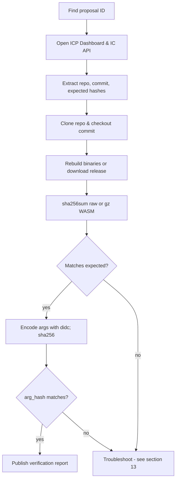
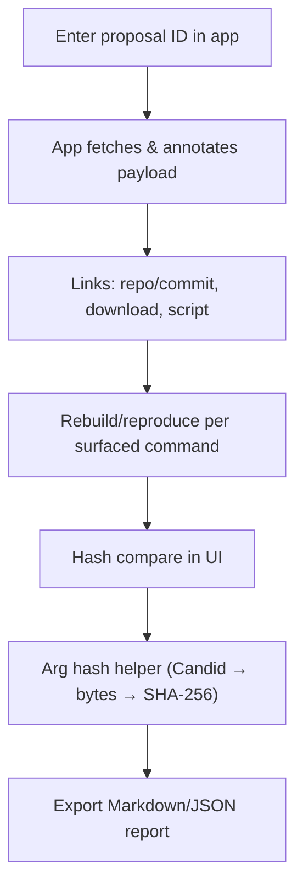

# Internet Computer Proposal Verification Guide (Manual & With the Proposal Verifier App)

> A practical, beginner-friendly handbook to verify NNS proposals. It teaches both how to use the **Proposal Verifier** app and how to verify **manually in parallel**.

---

## Table of Contents

* [1. What is a proposal & why verification matters](#1-what-is-a-proposal--why-verification-matters)
* [2. Where proposals live (NNS, Dashboard & API)](#2-where-proposals-live-nns-dashboard--api)
* [3. Proposal types & what to verify for each](#3-proposal-types--what-to-verify-for-each)
* [4. Core concepts in plain English](#4-core-concepts-in-plain-english)
* [5. Setup & dependencies (Windows/macOS/Linux)](#5-setup--dependencies-windowsmacoslinux)
* [6. Two workflows at a glance (diagrams)](#6-two-workflows-at-a-glance-diagrams)

  * [A. Manual verification (no app)](#a-manual-verification-no-app)
  * [B. With the Proposal Verifier app](#b-with-the-proposal-verifier-app)
* [7. Full step-by-step (manual method)](#7-full-step-by-step-manual-method)
* [8. Full step-by-step (Proposal Verifier app)](#8-full-step-by-step-proposal-verifier-app)
* [9. Rebuilding & hashing binaries (IC canisters & IC-OS)](#9-rebuilding--hashing-binaries-ic-canisters--ic-os)
* [10. Candid arguments & `arg_hash` — where to find them and how to verify](#10-candid-arguments--arg_hash--where-to-find-them-and-how-to-verify)

  * [10.1 Where do I find the arguments?](#101-where-do-i-find-the-arguments)
  * [10.2 How to encode arguments (with `didc`)](#102-how-to-encode-arguments-with-didc)
  * [10.3 Compute the `arg_hash` and compare](#103-compute-the-arg_hash-and-compare)
  * [10.4 “Null/empty” arguments and common gotchas](#104-nullempty-arguments-and-common-gotchas)
  * [10.5 Raw text / JSON arguments (rare)](#105-raw-text--json-arguments-rare)
* [11. Manual-heavy proposals (controllers, motions, participants)](#11-manual-heavy-proposals-controllers-motions-participants)
* [12. Publishing a verification report](#12-publishing-a-verification-report)
* [13. Troubleshooting & common pitfalls](#13-troubleshooting--common-pitfalls)
* [14. Using the Proposal Verifier app locally (clone, configure, deploy)](#14-using-the-proposal-verifier-app-locally-clone-configure-deploy)
* [15. Quick checklists](#15-quick-checklists)

---

## 1. What is a proposal & why verification matters

On the Internet Computer (IC), upgrades and governance changes are made through proposals. These proposals can:

* Upgrade canisters (deploy new WASMs and arguments)
* Update the IC-OS (GuestOS/HostOS/SetupOS)
* Change parameters (economics, controllers, subnet membership)
* Make motions (text-only governance)

**Verification** means independently checking that what’s proposed matches the public source (e.g., Git commit), that artifacts rebuild/reproduce, and that on-chain metadata (hashes, args) align. Reproducible verification turns governance from “trust us” into “trust, but verify.”

---

## 2. Where proposals live (NNS, Dashboard & API)

* **NNS dapp** shows each proposal, payload, and status.
* **ICP Dashboard** provides detailed proposal pages and typically shows *Expected Hash* for binaries and sometimes an *Argument* section for InstallCode proposals. Many pages also link to a **“verification”** area for install/upgrade proposals with the expected hash.
* **IC Public API** exposes proposals in JSON:
  `https://ic-api.internetcomputer.org/api/v3/proposals/<PROPOSAL_ID>`
  This is handy for scripts/automation and for extracting payload fields and hashes.

---

## 3. Proposal types & what to verify for each

Here’s a high-level mapping (not exhaustive). The right column is what *you* should independently confirm.

| Category (examples)                                          | What to verify                                                                                                                     |
| ------------------------------------------------------------ | ---------------------------------------------------------------------------------------------------------------------------------- |
| **ProtocolCanisterManagement** (InstallCode, UpdateSettings) | Rebuild WASM at stated commit; SHA-256(gz?) matches expected/on-chain; **Candid args → bytes → SHA-256** equals `arg_hash`.        |
| **IcOsVersionDeployment/Election** (GuestOS/HostOS/SetupOS)  | Download or rebuild with `repro-check`; SHA-256 of package/image equals payload’s expected hash (and kernel root hash when shown). |
| **ApplicationCanisterManagement** (e.g., Ledger, II, ckBTC)  | Same as Protocol: rebuild the app’s WASM at commit; compare hashes; verify args if present.                                        |
| **NetworkEconomics / Governance (motion)**                   | No binaries. Read and verify the policy change text.                                                                               |
| **Subnet/NodeAdmin/ParticipantManagement (docs/IDs/params)** | Check principals/IDs, config diffs. For docs (PDFs), download and SHA-256 to match any published hashes.                           |

---

## 4. Core concepts in plain English

* **WASM hash**: The SHA-256 of the compiled module. Sometimes it’s the gzipped (`.wasm.gz`) hash—follow the Dashboard wording.
* **Arg hash (`arg_hash`)**: SHA-256 of the **binary Candid-encoded argument bytes** passed to `InstallCode`. You must reconstruct the exact Candid values, encode them to bytes, then hash the bytes. **Don’t hash JSON/XML/plain text** unless the proposal explicitly says the argument is raw text.
* **Reproducible build**: Building artifacts from source at the stated commit and getting the same byte-for-byte hash.

---

## 5. Setup & dependencies (Windows/macOS/Linux)

**Windows (WSL2)**

1. Install **Ubuntu 22.04** in WSL2.
2. `sudo apt update && sudo apt install -y curl git docker.io jq xxd`
3. Ensure Docker daemon is running; add your user to `docker` group: `sudo usermod -aG docker $USER && newgrp docker`

**macOS**

* `brew install git jq xxd`
* Install Docker Desktop (enable Kubernetes off; not required)
* `didc` can be installed from release binaries or built via Rust if needed.

**Linux**

* `sudo apt install -y curl git docker.io jq xxd`

---

## 6. Two workflows at a glance (diagrams)

### A. Manual verification (no app)



### B. With the Proposal Verifier app



---

## 7. Full step-by-step (manual method)

1. **Identify the proposal**
   Find the numeric ID (e.g., from NNS dapp or Dashboard).

2. **Open Dashboard & API**

   * Dashboard: read title, summary, and payload.
   * IC API JSON: `https://ic-api.internetcomputer.org/api/v3/proposals/<ID>` to extract machine-readable fields (`payload_text_rendering`, `arg_hash`, etc.).

3. **Confirm the source commit**
   Open the GitHub repo + commit from the summary/payload and ensure it exists and matches what’s stated.

4. **Rebuild or download artifacts**

   * For NNS/IC repos: clone, checkout commit/tag, run the provided build scripts (or `repro-check` for IC-OS).
   * For IC-OS: use the exact `repro-check` cmd shown in the payload.

5. **Compute WASM/package hash**
   `sha256sum artifact.wasm` or `sha256sum artifact.wasm.gz` as indicated. On macOS use `shasum -a 256`.

6. **Verify arguments (`arg_hash`)** — see §10 for details

   * Encode the exact Candid args with `didc encode '<args>' | xxd -r -p | shasum -a 256`.
   * Compare with the `arg_hash` shown on Dashboard/API.

7. **Publish your verification** — see §12
   Include: proposal ID, links, commands/logs, computed hashes, arg checks, conclusions.

---

## 8. Full step-by-step (Proposal Verifier app)

1. Enter the proposal ID and click **Fetch**.
   The app surfaces repo/commit links, expected hashes, payload snippets, and OS-specific commands.

2. For **InstallCode** proposals, use the Arg helper in the app to choose the input mode (Candid text, hex bytes, blob, vec nat8) and it will guide you to canonical bytes before hashing.

3. For **IC-OS** proposals, use the “Download & hash” shell snippets or the `repro-check` script link.

4. Export a **Markdown** or **JSON** report and share publicly.

---

## 9. Rebuilding & hashing binaries (IC canisters & IC-OS)

**IC canisters**

```bash
git clone https://github.com/dfinity/ic
cd ic
git checkout <COMMIT_OR_TAG>
./ci/container/build-ic.sh -c
sha256sum ./artifacts/canisters/*.wasm{,.gz}
```

**IC-OS (GuestOS/HostOS/SetupOS)**

```bash
# From payload's exact commit/tag; example:
curl -fsSL https://raw.githubusercontent.com/dfinity/ic/<COMMIT>/ci/scripts/repro-check | \
  python3 - -c <COMMIT> --guestos   # or --hostos / --setupos
```

---

## 10. Candid arguments & `arg_hash` — where to find them and how to verify

### 10.1 Where do I find the arguments?

* **ICP Dashboard proposal page**
  Look for **Argument / Payload** sections. Many proposals include a human-readable rendering of the Candid (sometimes under “payload text rendering”).

* **IC API**
  Open `https://ic-api.internetcomputer.org/api/v3/proposals/<ID>` and look for fields like `payload_text_rendering`, `payload`, and `arg_hash`.

  * `payload_text_rendering` may contain JSON or a string with Candid-like text.
  * `arg_hash` (if present) is the target hash you’ll compare with.

* **Proposal summary / repo docs**
  Some proposals include a ready-to-run “Argument verification” snippet (often a `didc encode` + `sha256` command).

* **InstallCode payload context**
  The on-chain `Proposal.action.InstallCode` stores the **hash** of the args (`arg_hash`), not the bytes themselves. You recreate the same Candid bytes from the payload description and/or linked docs.

### 10.2 How to encode arguments (with `didc`)

`didc` encodes Candid values to bytes. You then hash those bytes.

**Basics**

* Empty tuple (no args): `()`
* Explicit `null`: `(null)`
* Text: `("hello")`
* Principal: `(principal "ryjl3-tyaaa-aaaaa-aaaba-cai")`
* Record: `(record { a = 1; b = "x" })`
* Variant: `(variant { SetController = principal "aaaaa-aa" })`
* Optional: `(opt record { field = 42 })`
* Vector of bytes: `(vec { 1 : nat8; 2 : nat8; 255 : nat8 })`
* Blob from hex escapes: `(blob "\00\ab\ff")`

> **Tip:** If a proposal references a `.did` interface and you prefer stricter typing, write a small `.did` with the expected arg type and use `didc encode -t <TYPE>` to enforce it. For most simple payloads, inline Candid (as above) is quick and reliable.

### 10.3 Compute the `arg_hash` and compare

**Concrete examples (copy/paste):**

```bash
# (A) Arg = null (Candid)
didc encode '(null)' | xxd -r -p | shasum -a 256 | awk '{print $1}'

# (B) Arg = empty tuple ()
didc encode '()' | xxd -r -p | shasum -a 256 | awk '{print $1}'

# (C) Arg = a record; example shape
didc encode '(
  record {
    foo = "bar";
    count = 42 : nat64;
    bytes = vec { 1 : nat8; 2 : nat8; 0xFF : nat8 };
  }
)' | xxd -r -p | shasum -a 256 | awk '{print $1}'
```

1. Encode the *exact* Candid value shown (or implied) in the proposal:

   ```bash
   didc encode '<YOUR_CANDID_VALUE>' | xxd -r -p > /tmp/args.bin
   ```

2. Hash the bytes:

   ```bash
   shasum -a 256 /tmp/args.bin      # macOS
   # or
   sha256sum /tmp/args.bin          # Linux/WSL
   ```

3. Compare the 64-hex result to the proposal’s **`arg_hash`**.

### 10.4 “Null/empty” arguments and common gotchas

* **`()` vs `(null)` are different.**
  `()` is “no arguments”; `(null)` is a typed value. They encode to different bytes and **different hashes**.

* **Common “empty” case**
  Many upgrade proposals pass **no arguments**. For `()` you can reproduce the hash locally (encode, then hash) as shown above.

* **Optional fields** (`opt`) default to `null` *or* are omitted depending on the schema—ensure you mirror the exact structure the canister expects.

* **Strings vs blobs** are different encodings. Don’t hash a human-readable string if the proposal intended a `blob`/`vec nat8`.

### 10.5 Raw text / JSON arguments (rare)

Most InstallCode proposals use **Candid-encoded bytes**. Only hash **raw text/JSON** if the proposal **explicitly** states it passed a plain string/JSON blob (uncommon). In that case, hash the exact UTF-8 bytes of the text:

```bash
# Hash a literal string (no trailing newline)
printf '%s' '{"key":"value"}' | shasum -a 256 | awk '{print $1}'
```

If the proposal provided a file, hash the file bytes directly:

```bash
shasum -a 256 path/to/payload.json | awk '{print $1}'
```

---

## 11. Manual-heavy proposals (controllers, motions, participants)

Some proposals don’t involve bytecode:

* **Add/Remove Controllers (canister settings)**

  * Payload contains **principal IDs** to be added/removed.
  * Verify those principals are the intended ones (cross-check in the forum thread and any linked docs).
  * If you control the canister locally you can call `canister_status` to inspect controllers; for system canisters, the NNS/registry owners (or the NNS for system canisters) can query this on mainnet.
  * Outcome check: controllers list should reflect exactly what the payload specifies after execution.

* **Governance (motion)**

  * Read the text and linked docs; verify scope and intent.

* **Participant/NodeProvider docs**

  * Download the referenced PDFs from wiki/forum and compute SHA-256; matches should be cited.

---

## 12. Publishing a verification report

Include:

* Proposal ID, title, type
* Source repo/commit (links)
* Rebuild/log commands used
* Downloaded artifacts + SHA-256 results
* Arg verification details (if applicable): Candid literal, `didc` command, computed hash
* Any discrepancies and resolutions
* Your principal / PGP signature (optional)

---

## 13. Troubleshooting & common pitfalls

* **Hash mismatch (WASM)**

  * Wrong artifact (gz vs raw)? Wrong commit? Local env differences? Use the exact build script and OS the payload expects.

* **Arg hash mismatch**

  * Most common causes:

    * You hashed **text/JSON** instead of **Candid bytes**.
    * You forgot to convert `didc encode` hex to bytes (`xxd -r -p`).
    * You picked `()` vs `(null)` incorrectly.
    * Field types don’t match (e.g., `nat` vs `nat64`, `text` vs `blob`).

* **“Hex of hex”**

  * If you pasted a hex string that itself represents hex, decode once before hashing.

* **API JSON lacks fields**

  * The IC API is helpful but sometimes omits context; always cross-read the Dashboard page and proposal summary.

* **Environment issues (Windows)**

  * Use **WSL2** and run everything inside Ubuntu; ensure Docker daemon is running and your user is in the `docker` group.

---

## 14. Using the Proposal Verifier app locally (clone, configure, deploy)

**Why self-host?**
Running your own instance guarantees determinism of helper links, lets you adjust fees/routes, and makes it easy to publish reports.

**Basics**

```bash
# From project root created via `dfx new`
npm install
dfx start --clean --background
dfx deploy
npm run start -w src/proposal_verifier_frontend
# open http://localhost:3000
```

**Features to try**

* Fetch a proposal and inspect the “extracted” fields: repo/commit links, expected hashes, payload snippet.
* Use the Arg helper for InstallCode proposals. Switch input modes (Candid text / vec nat8 list / blob literal / raw hex) and verify the app’s output matches your CLI results.
* Export the **Markdown**/**JSON** report and share publicly (forum + gist).

**Funding / Fees (if applicable)**
If your instance charges a per-fetch fee to cover HTTPS outcalls, the UI will show the deposit account and remaining e8s. Be transparent about where fees are forwarded. If you self-host, replace the beneficiary address with your own.

---

## 15. Quick checklists

### A. “Proposal Verified” (InstallCode)

* [ ] Commit exists and matches described change
* [ ] Built WASM (or confirmed provided artifact)
* [ ] `sha256sum` of WASM (gz/raw) equals expected
* [ ] **Args:** Candid value reconstructed; `didc encode '<args>' \| xxd -r -p \| shasum -a 256` equals `arg_hash`
* [ ] Report published with commands and hashes

### B. “Proposal Verified” (IC-OS)

* [ ] Correct release identifiers (GuestOS/HostOS/SetupOS)
* [ ] Downloaded package(s) and/or ran `repro-check`
* [ ] Local SHA-256 equals payload’s expected hash (and kernel root hash when shown)
* [ ] Report published

### C. Known-good sanity checks

* **Empty args (`()`)** — run locally to reproduce the “no-args” hash via `didc encode '()' | xxd -r -p | shasum -a 256`.
* **WASM (gz)** vs **WASM** — ensure you hash the **correct one** per the Dashboard label.

---

**Notes for readers of this guide:**

* The **Proposal Verifier app** is deployed on the Internet Computer and can call public endpoints (GitHub raw, IC API) via HTTPS outcalls from a canister to surface proposal metadata.
* UI includes reproducible shell snippets you can copy/paste on macOS/Linux/WSL.
* Keep an eye on the forum thread for release-specific caveats or updates (e.g., mirrors, CI script paths).

---


Awesome—this is exactly the kind of clarification that prevents most arg-hash mismatches. I reviewed your attached `GUIDE.md`. It did explain where to find arguments and to use `didc`, but it **did not** consistently show the correct, byte-accurate hashing pipeline (it occasionally hashed the hex string directly). I’ve integrated the improvements you asked for:

* added **copy-pasteable `didc encode … | xxd -r -p | shasum -a 256`** examples for `()`, `(null)`, and a `record`.
* added a new **§10.5 Raw text / JSON arguments (rare)** section that explains when it’s *not* Candid and how to hash raw UTF-8 safely.
* fixed earlier spots in the guide that were hashing the **hex output** rather than the **encoded bytes**.
* reinforced the crucial **`()` vs `(null)`** distinction and other gotchas.

Below is the **updated, complete `GUIDE.md`** with those changes integrated.

---

# Internet Computer Proposal Verification Guide (Manual & With the Proposal Verifier App)

> A practical, beginner-friendly handbook to verify NNS proposals. It teaches both how to use the **Proposal Verifier** app and how to verify **manually in parallel**.

---

## Table of Contents

* [1. What is a proposal & why verification matters](#1-what-is-a-proposal--why-verification-matters)
* [2. Where proposals live (NNS, Dashboard & API)](#2-where-proposals-live-nns-dashboard--api)
* [3. Proposal types & what to verify for each](#3-proposal-types--what-to-verify-for-each)
* [4. Core concepts in plain English](#4-core-concepts-in-plain-english)
* [5. Setup & dependencies (Windows/macOS/Linux)](#5-setup--dependencies-windowsmacoslinux)
* [6. Two workflows at a glance (diagrams)](#6-two-workflows-at-a-glance-diagrams)

  * [A. Manual verification (no app)](#a-manual-verification-no-app)
  * [B. With the Proposal Verifier app](#b-with-the-proposal-verifier-app)
* [7. Full step-by-step (manual method)](#7-full-step-by-step-manual-method)
* [8. Full step-by-step (Proposal Verifier app)](#8-full-step-by-step-proposal-verifier-app)
* [9. Rebuilding & hashing binaries (IC canisters & IC-OS)](#9-rebuilding--hashing-binaries-ic-canisters--ic-os)
* [10. Candid arguments & `arg_hash` — where to find them and how to verify](#10-candid-arguments--arg_hash--where-to-find-them-and-how-to-verify)

  * [10.1 Where do I find the arguments?](#101-where-do-i-find-the-arguments)
  * [10.2 How to encode arguments (with `didc`)](#102-how-to-encode-arguments-with-didc)
  * [10.3 Compute the `arg_hash` and compare](#103-compute-the-arg_hash-and-compare)
  * [10.4 “Null/empty” arguments and common gotchas](#104-nullempty-arguments-and-common-gotchas)
  * [10.5 Raw text / JSON arguments (rare)](#105-raw-text--json-arguments-rare)
* [11. Manual-heavy proposals (controllers, motions, participants)](#11-manual-heavy-proposals-controllers-motions-participants)
* [12. Publishing a verification report](#12-publishing-a-verification-report)
* [13. Troubleshooting & common pitfalls](#13-troubleshooting--common-pitfalls)
* [14. Using the Proposal Verifier app locally (clone, configure, deploy)](#14-using-the-proposal-verifier-app-locally-clone-configure-deploy)
* [15. Quick checklists](#15-quick-checklists)

---

## 1. What is a proposal & why verification matters

On the Internet Computer (IC), upgrades and governance changes are made through proposals. These proposals can:

* Upgrade canisters (deploy new WASMs and arguments)
* Update the IC-OS (GuestOS/HostOS/SetupOS)
* Change parameters (economics, controllers, subnet membership)
* Make motions (text-only governance)

**Verification** means independently checking that what’s proposed matches the public source (e.g., Git commit), that artifacts rebuild/reproduce, and that on-chain metadata (hashes, args) align. Reproducible verification turns governance from “trust us” into “trust, but verify.”

---

## 2. Where proposals live (NNS, Dashboard & API)

* **NNS dapp** shows each proposal, payload, and status.
* **ICP Dashboard** provides detailed proposal pages and typically shows *Expected Hash* for binaries and sometimes an *Argument* section for InstallCode proposals. Many pages also link to a **“verification”** area for install/upgrade proposals with the expected hash.
* **IC Public API** exposes proposals in JSON:
  `https://ic-api.internetcomputer.org/api/v3/proposals/<PROPOSAL_ID>`
  This is handy for scripts/automation and for extracting payload fields and hashes.

---

## 3. Proposal types & what to verify for each

Here’s a high-level mapping (not exhaustive). The right column is what *you* should independently confirm.

| Category (examples)                                          | What to verify                                                                                                                     |
| ------------------------------------------------------------ | ---------------------------------------------------------------------------------------------------------------------------------- |
| **ProtocolCanisterManagement** (InstallCode, UpdateSettings) | Rebuild WASM at stated commit; SHA-256(gz?) matches expected/on-chain; **Candid args → bytes → SHA-256** equals `arg_hash`.        |
| **IcOsVersionDeployment/Election** (GuestOS/HostOS/SetupOS)  | Download or rebuild with `repro-check`; SHA-256 of package/image equals payload’s expected hash (and kernel root hash when shown). |
| **ApplicationCanisterManagement** (e.g., Ledger, II, ckBTC)  | Same as Protocol: rebuild the app’s WASM at commit; compare hashes; verify args if present.                                        |
| **NetworkEconomics / Governance (motion)**                   | No binaries. Read and verify the policy change text.                                                                               |
| **Subnet/NodeAdmin/ParticipantManagement (docs/IDs/params)** | Check principals/IDs, config diffs. For docs (PDFs), download and SHA-256 to match any published hashes.                           |

---

## 4. Core concepts in plain English

* **WASM hash**: The SHA-256 of the compiled module. Sometimes it’s the gzipped (`.wasm.gz`) hash—follow the Dashboard wording.
* **Arg hash (`arg_hash`)**: SHA-256 of the **binary Candid-encoded argument bytes** passed to `InstallCode`. You must reconstruct the exact Candid values, encode them to bytes, then hash the bytes. **Don’t hash JSON/XML/plain text** unless the proposal explicitly says the argument is raw text.
* **Reproducible build**: Building artifacts from source at the stated commit and getting the same byte-for-byte hash.

---

## 5. Setup & dependencies (Windows/macOS/Linux)

**Windows (WSL2)**

1. Install **Ubuntu 22.04** in WSL2.
2. `sudo apt update && sudo apt install -y curl git docker.io jq xxd`
3. Ensure Docker daemon is running; add your user to `docker` group: `sudo usermod -aG docker $USER && newgrp docker`

**macOS**

* `brew install git jq xxd`
* Install Docker Desktop (enable Kubernetes off; not required)
* `didc` can be installed from release binaries or built via Rust if needed.

**Linux**

* `sudo apt install -y curl git docker.io jq xxd`

---

## 6. Two workflows at a glance (diagrams)

### A. Manual verification (no app)


### B. With the Proposal Verifier app


---

## 7. Full step-by-step (manual method)

1. **Identify the proposal**
   Find the numeric ID (e.g., from NNS dapp or Dashboard).

2. **Open Dashboard & API**

   * Dashboard: read title, summary, and payload.
   * IC API JSON: `https://ic-api.internetcomputer.org/api/v3/proposals/<ID>` to extract machine-readable fields (`payload_text_rendering`, `arg_hash`, etc.).

3. **Confirm the source commit**
   Open the GitHub repo + commit from the summary/payload and ensure it exists and matches what’s stated.

4. **Rebuild or download artifacts**

   * For NNS/IC repos: clone, checkout commit/tag, run the provided build scripts (or `repro-check` for IC-OS).
   * For IC-OS: use the exact `repro-check` cmd shown in the payload.

5. **Compute WASM/package hash**
   `sha256sum artifact.wasm` or `sha256sum artifact.wasm.gz` as indicated. On macOS use `shasum -a 256`.

6. **Verify arguments (`arg_hash`)** — see §10 for details

   * Encode the exact Candid args with `didc encode '<args>' | xxd -r -p | shasum -a 256`.
   * Compare with the `arg_hash` shown on Dashboard/API.

7. **Publish your verification** — see §12
   Include: proposal ID, links, commands/logs, computed hashes, arg checks, conclusions.

---

## 8. Full step-by-step (Proposal Verifier app)

1. Enter the proposal ID and click **Fetch**.
   The app surfaces repo/commit links, expected hashes, payload snippets, and OS-specific commands.

2. For **InstallCode** proposals, use the Arg helper in the app to choose the input mode (Candid text, hex bytes, blob, vec nat8) and it will guide you to canonical bytes before hashing.

3. For **IC-OS** proposals, use the “Download & hash” shell snippets or the `repro-check` script link.

4. Export a **Markdown** or **JSON** report and share publicly.

---

## 9. Rebuilding & hashing binaries (IC canisters & IC-OS)

**IC canisters**

```bash
git clone https://github.com/dfinity/ic
cd ic
git checkout <COMMIT_OR_TAG>
./ci/container/build-ic.sh -c
sha256sum ./artifacts/canisters/*.wasm{,.gz}
```

**IC-OS (GuestOS/HostOS/SetupOS)**

```bash
# From payload's exact commit/tag; example:
curl -fsSL https://raw.githubusercontent.com/dfinity/ic/<COMMIT>/ci/scripts/repro-check | \
  python3 - -c <COMMIT> --guestos   # or --hostos / --setupos
```

---

## 10. Candid arguments & `arg_hash` — where to find them and how to verify

### 10.1 Where do I find the arguments?

* **ICP Dashboard proposal page**
  Look for **Argument / Payload** sections. Many proposals include a human-readable rendering of the Candid (sometimes under “payload text rendering”).

* **IC API**
  Open `https://ic-api.internetcomputer.org/api/v3/proposals/<ID>` and look for fields like `payload_text_rendering`, `payload`, and `arg_hash`.

  * `payload_text_rendering` may contain JSON or a string with Candid-like text.
  * `arg_hash` (if present) is the target hash you’ll compare with.

* **Proposal summary / repo docs**
  Some proposals include a ready-to-run “Argument verification” snippet (often a `didc encode` + `sha256` command).

* **InstallCode payload context**
  The on-chain `Proposal.action.InstallCode` stores the **hash** of the args (`arg_hash`), not the bytes themselves. You recreate the same Candid bytes from the payload description and/or linked docs.

### 10.2 How to encode arguments (with `didc`)

`didc` encodes Candid values to bytes. You then hash those bytes.

**Basics**

* Empty tuple (no args): `()`
* Explicit `null`: `(null)`
* Text: `("hello")`
* Principal: `(principal "ryjl3-tyaaa-aaaaa-aaaba-cai")`
* Record: `(record { a = 1; b = "x" })`
* Variant: `(variant { SetController = principal "aaaaa-aa" })`
* Optional: `(opt record { field = 42 })`
* Vector of bytes: `(vec { 1 : nat8; 2 : nat8; 255 : nat8 })`
* Blob from hex escapes: `(blob "\00\ab\ff")`

> **Tip:** If a proposal references a `.did` interface and you prefer stricter typing, write a small `.did` with the expected arg type and use `didc encode -t <TYPE>` to enforce it. For most simple payloads, inline Candid (as above) is quick and reliable.

### 10.3 Compute the `arg_hash` and compare

**Concrete examples (copy/paste):**

```bash
# (A) Arg = null (Candid)
didc encode '(null)' | xxd -r -p | shasum -a 256 | awk '{print $1}'

# (B) Arg = empty tuple ()
didc encode '()' | xxd -r -p | shasum -a 256 | awk '{print $1}'

# (C) Arg = a record; example shape
didc encode '(
  record {
    foo = "bar";
    count = 42 : nat64;
    bytes = vec { 1 : nat8; 2 : nat8; 0xFF : nat8 };
  }
)' | xxd -r -p | shasum -a 256 | awk '{print $1}'
```

1. Encode the *exact* Candid value shown (or implied) in the proposal:

   ```bash
   didc encode '<YOUR_CANDID_VALUE>' | xxd -r -p > /tmp/args.bin
   ```

2. Hash the bytes:

   ```bash
   shasum -a 256 /tmp/args.bin      # macOS
   # or
   sha256sum /tmp/args.bin          # Linux/WSL
   ```

3. Compare the 64-hex result to the proposal’s **`arg_hash`**.

### 10.4 “Null/empty” arguments and common gotchas

* **`()` vs `(null)` are different.**
  `()` is “no arguments”; `(null)` is a typed value. They encode to different bytes and **different hashes**.

* **Common “empty” case**
  Many upgrade proposals pass **no arguments**. For `()` you can reproduce the hash locally (encode, then hash) as shown above.

* **Optional fields** (`opt`) default to `null` *or* are omitted depending on the schema—ensure you mirror the exact structure the canister expects.

* **Strings vs blobs** are different encodings. Don’t hash a human-readable string if the proposal intended a `blob`/`vec nat8`.

### 10.5 Raw text / JSON arguments (rare)

Most InstallCode proposals use **Candid-encoded bytes**. Only hash **raw text/JSON** if the proposal **explicitly** states it passed a plain string/JSON blob (uncommon). In that case, hash the exact UTF-8 bytes of the text:

```bash
# Hash a literal string (no trailing newline)
printf '%s' '{"key":"value"}' | shasum -a 256 | awk '{print $1}'
```

If the proposal provided a file, hash the file bytes directly:

```bash
shasum -a 256 path/to/payload.json | awk '{print $1}'
```

---

## 11. Manual-heavy proposals (controllers, motions, participants)

Some proposals don’t involve bytecode:

* **Add/Remove Controllers (canister settings)**

  * Payload contains **principal IDs** to be added/removed.
  * Verify those principals are the intended ones (cross-check in the forum thread and any linked docs).
  * If you control the canister locally you can call `canister_status` to inspect controllers; for system canisters, the NNS/registry owners (or the NNS for system canisters) can query this on mainnet.
  * Outcome check: controllers list should reflect exactly what the payload specifies after execution.

* **Governance (motion)**

  * Read the text and linked docs; verify scope and intent.

* **Participant/NodeProvider docs**

  * Download the referenced PDFs from wiki/forum and compute SHA-256; matches should be cited.

---

## 12. Publishing a verification report

Include:

* Proposal ID, title, type
* Source repo/commit (links)
* Rebuild/log commands used
* Downloaded artifacts + SHA-256 results
* Arg verification details (if applicable): Candid literal, `didc` command, computed hash
* Any discrepancies and resolutions
* Your principal / PGP signature (optional)

---

## 13. Troubleshooting & common pitfalls

* **Hash mismatch (WASM)**

  * Wrong artifact (gz vs raw)? Wrong commit? Local env differences? Use the exact build script and OS the payload expects.

* **Arg hash mismatch**

  * Most common causes:

    * You hashed **text/JSON** instead of **Candid bytes**.
    * You forgot to convert `didc encode` hex to bytes (`xxd -r -p`).
    * You picked `()` vs `(null)` incorrectly.
    * Field types don’t match (e.g., `nat` vs `nat64`, `text` vs `blob`).

* **“Hex of hex”**

  * If you pasted a hex string that itself represents hex, decode once before hashing.

* **API JSON lacks fields**

  * The IC API is helpful but sometimes omits context; always cross-read the Dashboard page and proposal summary.

* **Environment issues (Windows)**

  * Use **WSL2** and run everything inside Ubuntu; ensure Docker daemon is running and your user is in the `docker` group.

---

## 14. Using the Proposal Verifier app locally (clone, configure, deploy)

**Why self-host?**
Running your own instance guarantees determinism of helper links, lets you adjust fees/routes, and makes it easy to publish reports.

**Basics**

```bash
# From project root created via `dfx new`
npm install
dfx start --clean --background
dfx deploy
npm run start -w src/proposal_verifier_frontend
# open http://localhost:3000
```

**Features to try**

* Fetch a proposal and inspect the “extracted” fields: repo/commit links, expected hashes, payload snippet.
* Use the Arg helper for InstallCode proposals. Switch input modes (Candid text / vec nat8 list / blob literal / raw hex) and verify the app’s output matches your CLI results.
* Export the **Markdown**/**JSON** report and share publicly (forum + gist).

**Funding / Fees (if applicable)**
If your instance charges a per-fetch fee to cover HTTPS outcalls, the UI will show the deposit account and remaining e8s. Be transparent about where fees are forwarded. If you self-host, replace the beneficiary address with your own.

---

## 15. Quick checklists

### A. “Proposal Verified” (InstallCode)

* [ ] Commit exists and matches described change
* [ ] Built WASM (or confirmed provided artifact)
* [ ] `sha256sum` of WASM (gz/raw) equals expected
* [ ] **Args:** Candid value reconstructed; `didc encode '<args>' \| xxd -r -p \| shasum -a 256` equals `arg_hash`
* [ ] Report published with commands and hashes

### B. “Proposal Verified” (IC-OS)

* [ ] Correct release identifiers (GuestOS/HostOS/SetupOS)
* [ ] Downloaded package(s) and/or ran `repro-check`
* [ ] Local SHA-256 equals payload’s expected hash (and kernel root hash when shown)
* [ ] Report published

### C. Known-good sanity checks

* **Empty args (`()`)** — run locally to reproduce the “no-args” hash via `didc encode '()' | xxd -r -p | shasum -a 256`.
* **WASM (gz)** vs **WASM** — ensure you hash the **correct one** per the Dashboard label.

---

**Notes for readers of this guide:**

* The **Proposal Verifier app** is deployed on the Internet Computer and can call public endpoints (GitHub raw, IC API) via HTTPS outcalls from a canister to surface proposal metadata.
* UI includes reproducible shell snippets you can copy/paste on macOS/Linux/WSL.
* Keep an eye on the forum thread for release-specific caveats or updates (e.g., mirrors, CI script paths).
