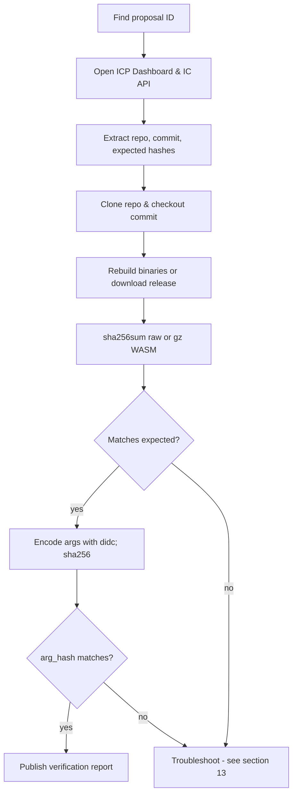
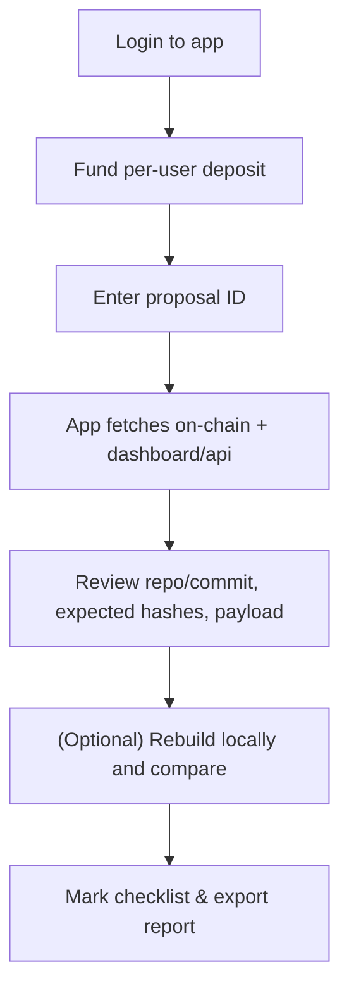

# Internet Computer Proposal Verification Guide (Manual & With the Proposal Verifier App)

> A practical, beginner-friendly handbook to verify NNS proposals step-by-step, rebuild binaries, check argument hashes, and publish your results. It also shows how to use the **Proposal Verifier** app and how to verify **manually in parallel**. This guide assumes no prior knowledge of proposals or blockchain governance, explaining everything from the basics to advanced troubleshooting.

If you prefer to **learn by watching**, there is a single long-form companion video on YouTube. Each major topic in this guide has a timestamped segment. Look for the inline **“(video)”** links as you read.
A high-level overview of this written guide itself is here:
**▶︎ [Proposal Verification Tutorial (video)](https://www.youtube.com/watch?v=M02bKI6A3K8)**

---

## Table of Contents

* [1. What is a proposal & why verification matters](#1-what-is-a-proposal--why-verification-matters)
* [2. Where proposals live (NNS, Dashboard & API)](#2-where-proposals-live-nns-dashboard--api)
* [3. Proposal types & what to verify for each](#3-proposal-types--what-to-verify-for-each)
* [4. Core concepts in plain English](#4-core-concepts-in-plain-english)
* [5. Setup & dependencies (Windows/macOS/Linux)](#5-setup--dependencies-windowsmacoslinux)
* [6. Two workflows at a glance (diagrams)](#6-two-workflows-at-a-glance-diagrams)

  * [A. Manual verification (no app)](#a-manual-verification-no-app)
  * [B. With the Proposal Verifier app](#b-with-the-proposal-verifier-app)
* [7. Full step-by-step (manual method)](#7-full-step-by-step-manual-method)
* [8. Full step-by-step (Proposal Verifier app)](#8-full-step-by-step-proposal-verifier-app)
* [9. Rebuilding & hashing binaries (IC canisters & IC-OS)](#9-rebuilding--hashing-binaries-ic-canisters--ic-os)
* [10. Candid arguments & `arg_hash` — where to find them and how to verify](#10-candid-arguments--arg_hash--where-to-find-them-and-how-to-verify)

  * [10.1 Where do I find the arguments?](#101-where-do-i-find-the-arguments)
  * [10.2 How to encode arguments (with `didc`)](#102-how-to-encode-arguments-with-didc)
  * [10.3 Compute the `arg_hash` and compare](#103-compute-the-arg_hash-and-compare)
  * [10.4 “Null/empty” arguments and common gotchas](#104-nullempty-arguments-and-common-gotchas)
* [11. Manual-heavy proposals (controllers, motions, participants)](#11-manual-heavy-proposals-controllers-motions-participants)
* [12. Publishing a verification report](#12-publishing-a-verification-report)
* [13. Troubleshooting & common pitfalls](#13-troubleshooting--common-pitfalls)
* [14. Using the Proposal Verifier app locally (clone, configure, deploy)](#14-using-the-proposal-verifier-app-locally-clone-configure-deploy)
* [15. Quick checklists](#15-quick-checklists)

---

## 1. What is a proposal & why verification matters

The Internet Computer Protocol (ICP) is a decentralized blockchain platform designed to run smart contracts (known as "canisters") in a secure, scalable, and efficient manner. Unlike traditional blockchains, ICP uses a unique governance system called the **Network Nervous System (NNS)**, which is essentially a decentralized autonomous organization (DAO). This NNS allows holders of ICP tokens—who stake their tokens in "neurons"—to participate in decision-making by voting on proposals. These proposals are the core mechanism for evolving the ICP network, ensuring it remains community-driven and transparent.

A **proposal** in the NNS is essentially a formal request or suggestion for a change or action on the ICP network. Think of it like a bill in a legislature: it's submitted, discussed (often on forums), voted on by eligible participants (neurons), and if it passes (adopted), it automatically executes. Proposals can cover a wide range of actions, such as:

* Upgrading the code of critical canisters (e.g., the governance canister itself or the ICP ledger).
* Deploying new versions of the IC Operating System (IC-OS), which runs on the physical nodes that power the network.
* Adding or removing node providers (entities that operate the hardware nodes).
* Changing network economics, like rewards for nodes or voting parameters.
* Even non-binding "motions" that serve as polls or discussions to gauge community sentiment.

For a short visual introduction to NNS proposals and how they appear in the NNS dapp, see:
**▶︎ [NNS Proposals (video)](https://www.youtube.com/watch?v=M02bKI6A3K8&t=24s)**

Proposals are numbered uniquely (e.g., Proposal #12345) and have a status: open (voting period), adopted (passed and executed), rejected, or failed (e.g., due to errors). Each proposal includes a title, summary (description), URL (often linking to forum discussions), and a payload (the actual data or code to execute if adopted). The payload might include hashes for verification, ensuring transparency.

**Why verification matters:** In a decentralized system like ICP, there's no central authority to "trust" blindly. Proposals can be powerful—they might introduce new code that could contain bugs, vulnerabilities, or even malicious changes if not scrutinized. Verification is the process of independently confirming that the proposal does exactly what it claims. For example:

* Does the proposed Wasm code match the source code at the specified commit? (Rebuild and hash to check.)
* Do the arguments (e.g., configuration data passed to a canister) hash to the value in the proposal? (Encode and hash to verify.)
* Are supporting documents (like node provider declarations) authentic and unchanged? (Download and hash to confirm.)

Without verification, the network risks "trust us" governance, where a few entities (like proposal submitters) control changes without checks. Instead, verification enables "trust, but verify"—a key principle of decentralization. Here's why it's crucial:

* **Reduces risks:** Catches errors (e.g., wrong commit), mismatches (e.g., hash doesn't match rebuilt code), or potential attacks (e.g., tampered binaries) before they execute.
* **Builds transparency:** Public verification reports create accountability—submitters know their work will be scrutinized, leading to higher-quality proposals.
* **Enhances resilience:** Distributed checks mean no single point of failure; if one verifier misses something (e.g., a subtle arg change), others might catch it.
* **Increases participation and education:** Verifying teaches you about ICP internals (e.g., how canisters upgrade), making you a better-informed voter and contributor.
* **Prevents centralization:** The more independent verifiers (like you), the less reliance on trusted parties (e.g., DFINITY submissions). This aligns with ICP's goal of full decentralization.
* **Community culture:** Repeated verifications set norms—e.g., always include rebuild instructions in summaries—making governance more robust over time.

In short, verification turns passive staking into active governance. Even if you're new and start with simple checks (like hashing a document), your contribution strengthens the network. Over time, this collective effort prevents centralization and ensures ICP evolves securely and fairly.

For deeper dives, explore the [ICP verifying proposals tutorial](https://internetcomputer.org/docs/building-apps/governing-apps/nns/concepts/proposals/verify-proposals) and [proposal topics/types](https://learn.internetcomputer.org/hc/en-us/articles/34140518658068-Proposal-Topics-and-Types).

---

## 2. Where proposals live (NNS, Dashboard & API)

To start verifying a proposal, you first need to locate it and gather its details. ICP provides several accessible interfaces for this purpose, each offering complementary information. Understanding these sources allows you to cross-reference data for accuracy and completeness. We'll explain each one, including how to navigate them and what key details to extract.

* **NNS dapp** ([nns.ic0.app](https://nns.ic0.app/)): This is the primary, user-friendly web application for interacting with the NNS. It's built as a canister running directly on the ICP network, making it decentralized and tamper-resistant. Here's a detailed walkthrough:

  * Open the site in your browser (no login needed to browse, but required to vote).
  * Go to the "Proposals" tab in the navigation menu.
  * Use filters: Sort by status (e.g., "Open" for proposals currently in voting), topic (e.g., "Governance" or "Subnet Management"), or search by ID.
  * Click on a proposal to view its full details: title, summary (descriptive text), proposer (the neuron or principal that submitted it), payload (the technical data or code), voting status (e.g., votes for/against), and links (often to forum discussions).
  * Key extractions: Copy the summary for repo/commit/hashes; note the payload for arguments (often in Candid format like `(record { ... })`); check the "Action" field for type (e.g., "InstallCode").
  * Why use it: It's the official voting interface, on-chain (data is verifiable), and includes community discussions. If you're a neuron holder, you can follow trusted neurons here for automated voting.
  * Tip: Proposals have a voting deadline (e.g., 4 days)—verify open ones promptly. If the proposal links to a forum thread, read it for context.

* **ICP Dashboard** ([dashboard.internetcomputer.org](https://dashboard.internetcomputer.org/)): This is a more technical, analytics-focused portal maintained by the DFINITY Foundation. It's off-chain but aggregates real-time network data and provides enhanced proposal views.

  * Navigate to the "Governance" or "Proposals" section.
  * Search by ID or browse lists (filter by topic, status, or date).
  * Each proposal page includes: title, summary, proposer, detailed payload rendering (often human-readable JSON or text), expected hashes (crucial for Wasm verification), and sometimes build/rebuild instructions.
  * Key extractions: Look for the "Wasm Verification" section (common in upgrade proposals) with "Proposed WASM (gz) SHA-256" or similar; extract `arg_hash` from payload; note any linked artifacts (e.g., release packages).
  * Why use it: Provides parsed, easy-to-read payloads and verification hints not always in NNS dapp. Great for cross-referencing hashes and args.
  * Tip: If the summary mentions a "release package," the dashboard often links it directly—download and hash immediately.
    For a guided tour of the dashboard UI and the governance section, see:
    **▶︎ [Internet Computer Dashboard introduction (video)](https://www.youtube.com/watch?v=M02bKI6A3K8&t=744s)**

* **IC Public API**: This is a RESTful endpoint for programmatic access, ideal for scripts or when you need raw, structured data in JSON format. No UI—use a browser, curl, or tools like Postman.

  * Base URL: `https://ic-api.internetcomputer.org/api/v3/proposals/<PROPOSAL_ID>`.
  * Fetch example (curl):
    `curl https://ic-api.internetcomputer.org/api/v3/proposals/12345 > proposal.json`.
  * Response structure: A JSON object with fields like `id`, `proposal` (containing `title`, `summary`, `url`, `action` with hashes/args), and status.
  * Key extractions: Use `jq` for parsing (install via [jq download](https://stedolan.github.io/jq/download/)):
    `cat proposal.json | jq .proposal.action.InstallCode.wasm_module_hash` to get hashes; extract `arg_hash` similarly.
  * Why use it: Automation-friendly; precise for fields like binary hashes or encoded args. Handy in scripts to fetch multiple proposals.
  * Tip: If JSON is large, pipe to `jq` for filtering: `curl ... | jq .proposal.summary` for just the description.

**Best practices for using these sources:**

* **Cross-check always**: Start with NNS dapp for overview, Dashboard for details/hashes, API for raw data. If any mismatch (e.g., summary differs), investigate—could be an error.
* **Save offline**: Copy/paste summaries/JSON to files for reference.
* **Security**: Use HTTPS; verify URLs match official domains to avoid phishing.
* **If stuck**: Forum threads (linked in proposals) often clarify details.

These tools make proposals accessible—browse a few to familiarize yourself.

---

## 3. Proposal types & what to verify for each

Proposals are categorized by **topics** (broad groups like "Governance") and **types** (specific actions like "InstallCode"). Topics influence voting (e.g., higher rewards for critical ones) and restrictions (e.g., short periods for some). Types define execution (e.g., upgrade a canister). For a complete list with examples, see [ICP proposal topics and types](https://learn.internetcomputer.org/hc/en-us/articles/34140518658068-Proposal-Topics-and-Types).

Why classify? It guides verification: binary types need rebuilds/hashes; config types need ID checks; motions need intent review. The table maps common categories with minima—always read the summary for specifics. Use [ICP verify tutorial](https://internetcomputer.org/docs/building-apps/governing-apps/nns/concepts/proposals/verify-proposals) for videos/examples.

Here’s a high-level mapping (not exhaustive). The right column is what *you* should independently confirm.

| Category (examples)                                                         | What to verify (minimum)                                                                                                                                                                            |
| --------------------------------------------------------------------------- | --------------------------------------------------------------------------------------------------------------------------------------------------------------------------------------------------- |
| **Protocol Canister Management** (e.g., governance, registry, NNS frontend) | Source **repo & commit**; **rebuild** the WASM (or use release artifact), compute **SHA-256** (raw and/or gzipped), compare to expected/“proposed wasm sha-256”; verify **`arg_hash`** if provided. |
| **Application Canister Management** (ledger, II, ckBTC, etc.)               | Same as above: repo/commit → rebuild → SHA-256 → compare; confirm **payload args** and **install mode** (upgrade vs reinstall).                                                                     |
| **IC-OS Version Deployment/Election**                                       | Confirm **release package** link & **release SHA-256**, or reproduce via the official script; compare calculated hash to the proposal’s expected hash.                                              |
| **Subnet/Node/Participant/Network Economics**                               | No WASM to rebuild; verify **principals/IDs**, **document hashes** (e.g., PDFs), **config/allowances**, and **tables/parameters** against the stated intent.                                        |
| **Governance (Motion) Proposals**                                           | **Text-only** intent. Read the summary/discussion and verify the stated scope and implications. No bytecode to hash.                                                                                |
| **SnsAndCommunityFund** (e.g., CreateServiceNervousSystem)                  | Verify **initial token distribution**, **swap params**, **Neurons' Fund usage**, and **SNS settings**. Rebuild SNS canisters if upgrading; check hashes for documents.                              |

**General tips for all types**: Start with summary—note intent. If hashes/docs, verify first (easy wins). For code, rebuild last (time-intensive). If unsure, forum thread clarifies.

---

## 4. Core concepts in plain English

If you're new to blockchain or ICP, these terms might seem technical—let's break them down simply, like explaining to a friend. We'll use analogies and examples to make them clear.

* **Hash (SHA-256)**: Imagine a file's "DNA" or unique fingerprint—a 64-character code (hex digits) generated from its exact content. If you change even one byte (e.g., add a space in a document), the hash changes completely. Analogy: Like a book's ISBN—if the book changes, so does the ISBN. In proposals, hashes prove "this is the exact file/code proposed." Tools like `sha256sum` compute it instantly. Example: Hash "hello" vs "hello!"—totally different outputs. Mismatch during verification? Signals a problem (e.g., wrong file).
  For a visual explanation of hashing and why it is so sensitive to tiny changes, watch:
  **▶︎ [Hashing explained (video)](https://www.youtube.com/watch?v=M02bKI6A3K8&t=110s)**

* **Wasm (WebAssembly)**: The compiled, binary code that ICP canisters run. It's like an app's executable file (.exe on Windows). Proposals often upgrade Wasm—e.g., fix bugs or add features. To verify: Rebuild from source code (using tools like Docker) and hash the output. Matches proposal hash? The code is authentic. Analogy: Baking a cake from a recipe—if your cake matches the photo, the recipe is good.

* **Candid arguments**: Data passed to canisters during install/upgrade, like settings or configs. Often written in Candid (a human-readable format, e.g., `(record { key = "value" })`). Proposals hash these for integrity—`arg_hash` is SHA-256 of the encoded bytes. To verify: Encode text to bytes with `didc`, hash, compare. Analogy: Mailing a package—the label (Candid text) must match the contents (bytes) when unpacked (hashed).

* **Reproducible builds**: The holy grail of verification—same input (code at exact commit) produces identical output (Wasm/hash) on any machine. ICP scripts/Docker ensure this. Why? Prevents "my build differs" issues. Analogy: Following a recipe exactly—everyone gets the same cake.

* **On-chain vs off-chain**: On-chain = stored on blockchain (immutable, verifiable, e.g., hashes in proposal). Off-chain = external (e.g., GitHub code, PDFs)—you fetch/rebuild to verify. Analogy: On-chain is a sealed contract; off-chain is supporting evidence you check.

* **Principals/IDs**: Unique strings identifying users, canisters, nodes (e.g., "ryjl3-tyaaa-aaaaa-aaaba-cai"). Like email addresses but cryptographic. Verify they match expected (e.g., in configs). Analogy: Checking IDs at a door—wrong ID? No entry.

* **HTTPS outcalls**: Canisters calling external APIs (e.g., GitHub for commit existence). App uses these—consensus ensures responses match across replicas (prevents divergence). Analogy: Group fact-check—majority agrees on answer.

These concepts ensure trustless verification—no blind faith. For practical hashing examples, see the [ICP verify hash guide](https://internetcomputer.org/docs/building-apps/governing-apps/nns/concepts/proposals/verify-proposals#verifying-arguments-match-the-hash).

---

## 5. Setup & dependencies (Windows/macOS/Linux)

Verification requires tools for code management, building, encoding, and hashing. We'll cover installation step-by-step, assuming no prior setup. This ensures reproducibility—your environment matches others'. Test each tool after install to catch issues early.

### Common Tools (All OS)

These are foundational—install first. They enable cloning, building, and verifying.

* **Git**: Version control for cloning repos and checking commits.

  * Why: Proposals reference GitHub—clone to rebuild.
  * Download/install: [git-scm.com](https://git-scm.com/downloads) (choose your OS).
  * Post-install: Add to PATH if prompted. Test: Open terminal/Git Bash, run `git --version` (should show version like 2.XX).

* **sha256sum/shasum**: Computes SHA-256 hashes for files/bytes.

  * Why: Core to verification—match proposal hashes.
  * Linux: Built-in (`sha256sum`).
  * macOS: Built-in (`shasum -a 256`).
  * Windows: Included in Git Bash (use `shasum -a 256`); or WSL.
  * Test: `echo -n "test" | sha256sum` (output: `a94a8fe5ccb19ba61c4c0873d391e987982fbbd3`).

* **didc**: Candid encoder/decoder for args.

  * Why: Converts Candid text to bytes for hashing.
  * Download binary: [GitHub releases](https://github.com/dfinity/candid/releases) (choose your OS/arch, e.g., `didc-linux64`).
  * Extract, add to PATH: Copy to `/usr/local/bin` (macOS/Linux) or a PATH dir (Windows).
  * Test: `didc --version` (shows version).

* **IC CDK (dfx)**: ICP CLI for local testing/queries.

  * Why: Optional for queries (e.g., canister status); useful for advanced checks and for manual fetching of proposals.
  * Install:
    `DFX_VERSION=0.15.0 sh -ci "$(curl -fL https://internetcomputer.org/install.sh)"`
  * Test: `dfx --version`.

* **Node.js**: For scripts/apps (e.g., app frontend).

  * Why: If self-hosting the Proposal Verifier app.
  * Download: [nodejs.org](https://nodejs.org/en/download) (LTS version).
  * Test: `node --version`.

* **Docker**: Containerizes builds for reproducibility.

  * Why: ICP scripts use Docker—ensures same output.
  * Install Desktop: [docker.com](https://docs.docker.com/desktop/setup/install/windows-install/) (enable WSL on Windows).
  * Test: `docker --version`; then `docker run hello-world`.

### Windows-Specific Setup

Windows lacks some native Linux tools—use **WSL** for compatibility. WSL runs Linux inside Windows.

1. Enable WSL:
   Settings → Apps → Optional features → *More Windows features* → enable **Virtual Machine Platform** & **Windows Subsystem for Linux**. Restart.
2. Install Ubuntu: Microsoft Store → search "Ubuntu" → Install. Launch; set username/password.
3. In Ubuntu terminal:
   `sudo apt update && sudo apt install git curl docker.io -y`
4. Add user to Docker group:
   `sudo usermod -aG docker $USER` (then log out/in).
5. Install dfx/didc inside WSL as described above.
6. Docker integration: Docker Desktop → Settings → Resources → WSL Integration → enable for Ubuntu.

Full guide: [Microsoft WSL install](https://learn.microsoft.com/en-us/windows/wsl/install). Tip: Use VS Code with the WSL extension for editing.

### macOS/Linux Setup

* macOS: Install Homebrew:

  ```bash
  /bin/bash -c "$(curl -fsSL https://raw.githubusercontent.com/Homebrew/install/HEAD/install.sh)"
  ```

  Then: `brew install git docker coreutils`.

  Start Docker Desktop.

* Linux (Ubuntu/Debian):

  ```bash
  sudo apt update && sudo apt install git curl docker.io -y
  ```

  Add to Docker group as above.

* Install dfx/didc as in “Common Tools”.

**Troubleshooting:**

* PATH: Edit `~/.bash_profile` (macOS) or `~/.bashrc` (Linux/WSL):
  `export PATH="$PATH:/path/to/tool"`, then `source ~/.bashrc`.
* Permissions: `chmod +x tool`.
* Docker "daemon not running": Start Docker Desktop/app/service.

---

## 6. Two workflows at a glance (diagrams)

Verification has two paths: manual (hands-on, educational) or app-assisted (faster, automated). Choose based on experience—start manual to learn, then use the app for efficiency.

### A. Manual verification (no app)



### B. With the Proposal Verifier app



A full walkthrough of the app UI and how these steps look in practice is here:
**▶︎ [Verifier App Walkthrough and start of proposal verification (video)](https://www.youtube.com/watch?v=M02bKI6A3K8&t=370s)**

---

## 7. Full step-by-step (manual method)

This section provides a complete, foundational guide to verifying NNS proposals manually, **without** relying on any apps or automated tools. It's designed for absolute beginners, assuming you have no prior experience with command-line tools, blockchain concepts, or verification processes. We'll explain every step in detail, including why it's important, potential pitfalls, troubleshooting tips, and exact commands with examples. By following this, you'll learn the core principles of verification while gaining hands-on experience.

Manual verification builds your understanding of ICP governance and ensures you can spot issues independently. It's more time-consuming than using the Proposal Verifier app (see Section 8), but it's reproducible on any machine and doesn't require login or fees. Always cross-reference with the proposal's summary, the [ICP Verify Proposals Tutorial](https://internetcomputer.org/docs/current/building-apps/governing-apps/nns/concepts/proposals/verify-proposals), and Section 3 (Proposal Types) for type-specific details.

Before starting, ensure your tools are set up (see Section 5: Setup & Dependencies). You'll need a terminal (e.g., Command Prompt on Windows, Terminal on macOS/Linux) and basic navigation skills (e.g., `cd folder` to change directories). If a command fails, copy the error and search it online (e.g., "git clone error").

1. **Find the proposal**
   The first step is locating the proposal details. Proposals are publicly viewable on multiple platforms, which helps cross-verify information. Start by obtaining the proposal ID (a number like `12345`) from discussions on the [DFINITY Developer Forum](https://forum.dfinity.org/c/governance/20) or announcements.

   * Open the [NNS dapp](https://nns.ic0.app/) in your browser. This is the official voting interface—search for the ID or browse open proposals. Click the proposal to view its title, summary (description), status (e.g., "Open" for voting), proposer (principal ID), and payload (data/code). Copy the full summary and any linked URLs. Note the voting deadline—if it's "Open," verify quickly to influence votes.

   * Alternatively, use the [ICP Dashboard](https://dashboard.internetcomputer.org/governance). Search by ID; it shows detailed payload (e.g., JSON-like args for code upgrades). Copy the "Payload" section if available—it's often more structured than the summary.

   * Via command line (advanced but tamper-proof): Use `dfx` to query directly:

     ```bash
     dfx canister call rrkah-fqaaa-aaaaa-aaaaq-cai get_proposal_info '(12345)' --network ic
     ```

     This calls the governance canister and outputs Candid data—parse for summary/hashes.

   * Why? Ensures you're working with the canonical on-chain data. Pitfall: If status is "Adopted" or "Executed," verification is post-facto but still useful for audits. Save everything to a text file for reference.

   You can watch this step (including the `dfx` call) in:
   **▶︎ [Fetching the proposal from the governance canister using DFX (video)](https://www.youtube.com/watch?v=M02bKI6A3K8&t=1013s)**
   Basic browsing of proposals in the NNS UI is also shown in:
   **▶︎ [NNS Proposals (video)](https://www.youtube.com/watch?v=M02bKI6A3K8&t=24s)**

2. **Determine type/topic**
   Every proposal belongs to a topic (e.g., `ProtocolCanisterManagement`) and type (e.g., `InstallCode`), which dictates what to verify (e.g., code vs. text). Refer to Section 3 (Proposal types & what to verify for each) or the official docs for a full list.

   * From the summary or Dashboard: Look for keywords like "InstallCode" (code upgrade), "Motion" (text poll), or "AddNodeProvider" (participant). The Dashboard often labels "Proposal Type" explicitly.
   * Why? Topics guide focus—e.g., high-reward ones like Governance need deep review; binary-heavy like `IcOsVersionElection` require builds. Example: If "Upgrade the governance canister," it's ProtocolCanisterManagement → InstallCode, so prioritize Wasm/args.
   * Pitfall: Misclassification leads to wrong checks (e.g., hashing text as binary). Cross-check with [Proposal Topics Docs](https://learn.internetcomputer.org/hc/en-us/articles/34140518658068-Proposal-Topics-and-Types).

3. **Extract key info**
   Scan the summary/payload for verifiable elements. This is like detective work—look for patterns.

   * Common items: Repo (e.g., `https://github.com/dfinity/ic` or `dfinity/ic`), commit (40-hex string like `abcdef1234567890abcdef1234567890abcdef12`), hashes (64-hex SHA-256 like `1234567890abcdef...`), args (Candid like `(record { key = value })`), docs (bullets like "* Declaration: hash" or URLs).
   * How: Copy summary to a text editor. Search for `"github.com"` (repo), 40-hex near "commit/checkout", 64-hex near "hash/sha256". For args, look for `(record ...)` in payload. You can also parse JSON from the IC API.
   * Why? These are the building blocks—wrong extraction invalidates everything.
   * Pitfall: Summaries vary—if unclear, check the forum link.

4. **Clone & checkout repo**

   * Command:

     ```bash
     git clone https://github.com/<org>/<repo>
     cd <repo>
     git checkout <commit>
     ```

     Example:

     ```bash
     git clone https://github.com/dfinity/ic
     cd ic
     git checkout abcdef1234567890abcdef1234567890abcdef12
     ```

   * Verify with `git log -1` or `git rev-parse HEAD`.

   * Why? Ensures you're working with the claimed code—wrong commit could hide changes.

   * Pitfall: Clone fails? Check URL or network; invalid commit? Proposal error—report it.

5. **Rebuild binaries**

   * Follow the repo’s README (e.g., for `dfinity/ic`, there are scripts under `ci/`).

   * Example (IC repo):

     ```bash
     ./ci/container/build-ic.sh -c
     ```

   * Or use Docker for reproducibility:

     ```bash
     docker run --rm -v "$(pwd)":/ic ubuntu:22.04 /ic/ci/container/build-ic.sh -c
     ```

   * Output: look for `artifacts/` or `target/release/` for `.wasm` or `.wasm.gz` files.

   * Why? Confirms no backdoors—rebuild from source, not pre-built binaries.

   * Pitfall: Missing dependencies? Install them as per README.

   The “Rebuild locally” step is demonstrated in:
   **▶︎ [Rebuild locally section (video)](https://www.youtube.com/watch?v=M02bKI6A3K8&t=1270s)**

6. **Compute hashes**

   * Use `sha256sum` or `shasum -a 256`:

     ```bash
     sha256sum artifacts/canisters/governance.wasm.gz
     ```

     or on macOS:

     ```bash
     shasum -a 256 artifacts/canisters/governance.wasm.gz
     ```

   * For raw Wasm:

     ```bash
     gunzip governance.wasm.gz
     sha256sum governance.wasm
     ```

   * Compare to proposal's expected hash (`wasm_module_hash` or similar).

   * Why? Detects tampering—if hashes differ, file altered.

   * Pitfall: Hashing gzipped vs raw incorrectly.

   Locating the right artifact and hashing it are shown in:
   **▶︎ [Artifact location (video)](https://www.youtube.com/watch?v=M02bKI6A3K8&t=1620s)**
   **▶︎ [Hashing the artifact (video)](https://www.youtube.com/watch?v=M02bKI6A3K8&t=1740s)**

7. **Verify args**

   * Find Candid args in the summary/payload or IC API (see Section 10.1).
   * Encode with `didc` (Section 10.2), convert to bytes, then hash (Section 10.3).
   * Compare computed hash to proposal’s `arg_hash`.
   * Why? Args configure the upgrade—mismatch could change behavior.
   * Pitfall: Hashing the text directly instead of encoded bytes.

8. **Verify docs**

   * Download linked PDFs or documents (e.g., node provider declarations).
   * Hash with `sha256sum file.pdf` and compare to documented hash.
   * Why? Confirms documents haven't been modified.

9. **Check extras**

   * Verify principals, controller lists, motion text, or economic parameters depending on the type.
   * For controllers and participants, see Section 11.

10. **Report mismatches**

* If anything fails (hash mismatch, missing docs, inconsistent principals), record details.
* Share on the forum (Section 12) and vote accordingly (usually "Reject" if unfixable).
* Use the Proposal Verifier app (Section 8) to generate a structured report if you’d like.

---

## 8. Full step-by-step (Proposal Verifier app)

The Proposal Verifier app is a powerful, user-friendly tool deployed directly on the ICP blockchain (at [https://g5ige-nyaaa-aaaap-an4rq-cai.icp0.io/](https://g5ige-nyaaa-aaaap-an4rq-cai.icp0.io/)) that streamlines the manual verification process by automating data fetching, parsing, and basic checks where possible. It queries the NNS governance canister, extracts key elements like repositories, commits, hashes, arguments, and URLs from the proposal summary, performs automated verifications (e.g., commit existence via GitHub API), and allows you to manually verify arguments and documents with built-in hashing tools. The app also provides type-specific checklists, guidance, and report exports to make verification accessible even for complete beginners.

Using the app reduces errors, saves time, and ensures consistency—it's especially helpful if you're new, as it handles complex parsing and provides visual feedback (e.g., ✅/❌ for matches). However, it complements (doesn't replace) manual checks: always reproduce critical steps like rebuilding binaries locally for full confidence.

A full walkthrough of the app UI and how a verification session starts is here:
**▶︎ [Verifier App Walkthrough and Start of proposal verification (video)](https://www.youtube.com/watch?v=M02bKI6A3K8&t=370s)**

The following subsections call out specific video segments where you can see each step in action.

> **Important:** Some actions (like fetching proposals and performing HTTPS outcalls) consume cycles on the backend canister and are billed in ICP via your in-app deposit. The app requires enough cycles on the backend to function (see the note under Step 3 and Section 14).

---

1. **Access app**

   * Visit the live app:
     `https://g5ige-nyaaa-aaaap-an4rq-cai.icp0.io/`
   * Click **"Login with Internet Identity"** (II). If you're new to II, it's ICP's secure, passwordless authentication system—create an anchor by following the prompts.
   * Once logged in, the app shows your principal ID and per-user accounting information.

   Sometimes the UI takes a few moments to reflect that you're logged in (especially if you just created an anchor or switched devices). If it still looks logged out after a bit, refresh the page and try again.

   You can see the login and initial UI in the main walkthrough:
   **▶︎ [Verifier App Walkthrough and Start of proposal verification (video)](https://www.youtube.com/watch?v=M02bKI6A3K8&t=370s)**

2. **Fund deposit**

   Once logged in, the app displays a **unique deposit address** derived from your principal (a subaccount). This address is where you send ICP to pay for fetch operations, HTTPS outcalls, and other billed actions.

   * Copy your deposit address from the app.

   * Send ICP to it using:

     * The NNS dapp, or
     * Any compatible wallet, or
     * `dfx ledger transfer` via CLI.

   * Example (CLI):

     ```bash
     dfx ledger transfer <YOUR_DEPOSIT_ADDRESS> --icp 0.1 --memo 0 --network ic
     ```

   * After sending, click **"Refresh balances"** in the app.
     The app queries the ICP ledger and updates:

     * Your per-user deposit balance,

     * The total you've ever credited,

     * How much is currently available.

   > **Important:** Your **deposit** lives on the ICP ledger, not inside the app UI. The app will not see your new funds until:
   >
   > 1. The transaction is finalized on-chain, **and**
   > 2. You click **"Refresh balances"** after that finalization.
   >
   > This can take a short amount of time. If you just funded your account and still see a zero balance:
   >
   > * Double-check you sent ICP to the exact deposit address shown in the app.
   > * Wait 30–60 seconds.
   > * Click **"Refresh balances"** again.
   > * If it still doesn’t show up, verify the transaction on the ICP dashboard and check that the address matches exactly.

   The full deposit flow is demonstrated here:
   **▶︎ [How to fund account (video)](https://www.youtube.com/watch?v=M02bKI6A3K8&t=427s)**

3. **Enter ID & fetch**

   In the main input box, enter the proposal ID (a number like `12345`) and click **"Fetch Proposal"**. The app:

   * Deducts the configured ICP fee from your **per-user deposit balance**.
   * Calls `get_proposal_info` on the NNS governance canister.
   * Parses the returned data for:

     * Repo & commit,
     * On-chain hashes (Wasm, args, docs),
     * URLs and document references,
     * Proposal type/topic.

   On success, the app shows structured proposal details and extracted info sections.

   The fetch flow (from typing a proposal ID to seeing results) is shown here:
   **▶︎ [Fetching a proposal (video)](https://www.youtube.com/watch?v=M02bKI6A3K8&t=470s)**

   > **Note (backend cycles requirement):**
   > The **backend canister** that powers the Proposal Verifier app must maintain a healthy cycles balance to perform HTTPS outcalls and other work. In the reference deployment, you should keep at least about
   > `3_000_000_000_000` (3 **trillion** cycles)
   > in the backend canister. If the backend drops below this threshold, fetch calls and outcalls may start failing with messages like "insufficient cycles" even if **your personal ICP balance** is fine.
   >
   > * If you’re using the public deployment and see recurring "insufficient cycles" errors, it usually means the backend canister needs to be topped up by its controller.
   > * If you self-host (Section 14), make topping up to ≥ 3e12 cycles part of your operations checklist.

4. **Review extracted**

   After a successful fetch, the app displays:

   * Basic proposal info: ID, title, status, topic, type.
   * Parsed summary text and URLs.
   * Extracted repo/commit.
   * On-chain hashes (Wasm hash, arg hash, doc hashes).
   * Document table with human-readable names and expected hashes.

   This view is where you sanity-check that the app parsed the proposal correctly: is the repo the one you expected, is the commit length 40 hex characters, do the document names match what the summary described, etc.

   This “what do I see after fetching?” view is shown here:
   **▶︎ [What is returned in the app after fetching a proposal (video)](https://www.youtube.com/watch?v=M02bKI6A3K8&t=589s)**

5. **Verify commit**

   In the **Extracted Info** area, the app automatically checks whether the commit exists in the indicated repo using the GitHub REST API:

   * If successful, you’ll see something like:
     `✅ Commit exists on dfinity/ic @ <commit>`
   * If it fails, you’ll see:
     `❌ Commit not found`
     and/or details about the error.

   You can always click through to GitHub manually (the app links the repo/commit) to double-check.

6. **Verify docs**

   The **Document verification** section lists any documents the proposal references with expected hashes (e.g., node provider declarations, self-declarations, PDFs).

   For each document:

   * Either:

     * Download it manually (e.g., from the wiki/forum), then **upload** it into the app’s file input, or
     * Let the app fetch it via HTTPS outcall (if supported) and hash the response body.
   * The app computes the SHA-256 hash of the content and compares it to the on-chain expected hash.
   * A ✅/❌ indicator shows whether it matches, and previews are shown when possible.

   The UI for this process is demonstrated here:
   **▶︎ [Document verification section (video)](https://www.youtube.com/watch?v=M02bKI6A3K8&t=1145s)**

7. **Verify args**

   The **Arg hash verification** area helps you check `arg_hash`.

   * The app attempts to parse any Candid-looking arguments (e.g., `(record { ... })`) from the proposal.
   * You can paste:

     * Candid text,
     * A hex-encoded Candid blob,
     * Or raw bytes (depending on mode).
   * The app encodes (if needed), hashes the bytes, and compares the result to the on-chain `arg_hash`.

   This is a great way to verify that you have the correct argument shape before fully scripting it yourself.

   A focused demo of this feature is here:
   **▶︎ [Verifying Arg Hash (video)](https://www.youtube.com/watch?v=M02bKI6A3K8&t=2610s)**

8. **Check extras & type-specific guidance**

   Depending on the proposal type, the app shows a **Type-Specific Checklist**. Examples:

   * InstallCode / canister upgrades:

     * Fetch proposal.
     * Confirm commit exists.
     * Confirm Wasm hash.
     * Confirm `arg_hash`.
     * Rebuild locally and compare.
   * Node provider / participant proposals:

     * Fetch proposal.
     * Verify PDFs and declarations.
     * Confirm principal IDs.
   * Motion proposals:

     * Read and understand motion text.
     * Cross-reference forum thread.

   Some items are automatically ticked (e.g., commit existence check), while others you mark manually after doing a manual step off-app.

   The checklist UI and how it ties to the underlying verification steps are shown here:
   **▶︎ [Verification steps section in app (video)](https://www.youtube.com/watch?v=M02bKI6A3K8&t=818s)**

   And an example of how the app presents **different instructions depending on proposal type** is shown here:
   **▶︎ [Demo of how the app presents different instructions depending on the type of proposal (video)](https://www.youtube.com/watch?v=M02bKI6A3K8&t=2430s)**

9. **Export report**

   In the **Export Report** section, the app:

   * Auto-fills:

     * Proposal metadata (ID, title, type, status),
     * Extracted repo/commit,
     * All on-chain hashes,
     * Your computed results from the in-app tools.
   * Lets you add:

     * Reviewer name/handle,
     * Extra notes,
     * A final recommendation (e.g., "Verified – recommend adopt" or "Mismatch – recommend reject").

   You can then export:

   * **Markdown** (ready to paste into the DFINITY forum),
   * **PDF** (for printing or sharing),
   * **JSON** (machine-readable),
   * And sometimes a plain text metadata dump.

   How the report looks and what each field means is demonstrated here:
   **▶︎ [Verification Report explained (video)](https://www.youtube.com/watch?v=M02bKI6A3K8&t=1860s)**
   The export options themselves (Markdown/PDF) are shown here:
   **▶︎ [Exporting Verification Report (video)](https://www.youtube.com/watch?v=M02bKI6A3K8&t=2085s)**

10. **Publish & share**

Once you have a report (Markdown or PDF), publish it on the [DFINITY Developer Forum](https://forum.dfinity.org/):

* Category: **Governance → NNS Proposal Discussion**
* Title: `Verification Report for Proposal #<ID>: <Title> – Verified/Mismatch`
* Paste your Markdown report and optionally attach the PDF.

The process of posting the report in the forum is shown here:
**▶︎ [Posting Report in Developer Forum (video)](https://www.youtube.com/watch?v=M02bKI6A3K8&t=2190s)**

Finally, the app also has an integrated **FAQ page** that explains common questions and flows. You can see a walkthrough of that FAQ page here:
**▶︎ [Proposal Verifier App FAQ page explained (video)](https://www.youtube.com/watch?v=M02bKI6A3K8&t=2360s)**

---

## 9. Rebuilding & Hashing Binaries (IC Canisters & IC-OS)

Rebuilding binaries from source code and hashing them is a critical step in proposal verification. It confirms that the proposed code (e.g., Wasm modules or OS images) exactly matches the source at the specified commit, preventing backdoors, tampering, or errors. By rebuilding independently, you ensure the binary in the proposal hasn't been altered post-build. Hashing computes a unique "fingerprint" (e.g., SHA-256 digest) of the file—if even one bit changes, the hash differs, alerting you to mismatches.

Hashing is a one-way cryptographic function: it turns any file into a fixed-length string (64 hex characters for SHA-256), but you can't reverse it to get the original file. It's deterministic (same input = same output) and collision-resistant (hard to find two files with the same hash). In verification:

* Download or build the file locally.
* Compute its hash.
* Compare to the proposal's expected hash (e.g., "wasm_module_hash" for canisters or image hashes for IC-OS).

A match means the file is authentic; a mismatch could indicate a wrong commit, corruption, or foul play.

The conceptual side of hashing is also covered in:
**▶︎ [Hashing explained (video)](https://www.youtube.com/watch?v=M02bKI6A3K8&t=110s)**
The practical “where do I find the built artifact and how do I hash it?” steps are shown in:
**▶︎ [Rebuild locally section (video)](https://www.youtube.com/watch?v=M02bKI6A3K8&t=1270s)**
**▶︎ [Artifact location (video)](https://www.youtube.com/watch?v=M02bKI6A3K8&t=1620s)**
**▶︎ [Hashing the artifact (video)](https://www.youtube.com/watch?v=M02bKI6A3K8&t=1740s)**

Here's how to compute hashes on different platforms, with examples.

### Hashing basics by platform

* **Linux (`sha256sum`, usually built-in):**

  ```bash
  sha256sum <file>
  ```

  Example:

  ```bash
  sha256sum artifacts/canisters/governance.wasm.gz
  ```

* **macOS (`shasum`):**

  ```bash
  shasum -a 256 artifacts/canisters/governance.wasm.gz
  ```

* **Windows (PowerShell):**

  ```powershell
  Get-FileHash artifacts\canisters\governance.wasm.gz -Algorithm SHA256
  ```

  Or use WSL and `sha256sum` for consistency.

### IC Canisters (e.g., Governance, Ledger)

For canister upgrades (ProtocolCanisterManagement proposals):

1. Clone repo:

   ```bash
   git clone https://github.com/dfinity/ic
   cd ic
   git checkout <commit-from-proposal>
   ```

2. Build (example script; see repo docs):

   ```bash
   ./ci/container/build-ic.sh -c
   ```

   Or via Docker for reproducible builds.

3. Locate artifacts (e.g., in `artifacts/canisters/`).

4. Hash:

   ```bash
   sha256sum artifacts/canisters/governance.wasm.gz
   ```

5. Compare to the proposal’s `wasm_module_hash`.

### IC-OS (GuestOS/HostOS/SetupOS)

For `IcOsVersionElection` proposals:

1. Use the official repro-check script from the IC repo, pinned to the proposal commit.
2. The script will build images and output hashes for each component.
3. Compare them with the hashes in the proposal.

If they match, you have high confidence in the binary integrity.

---

## 10. Candid arguments & `arg_hash` — where to find them and how to verify

Candid arguments (often abbreviated as "args") are the input parameters or configuration data passed to a canister during actions like installations or upgrades in NNS proposals. They are typically written in Candid, ICP's interface description language, which defines how data is structured and serialized (converted to bytes) for on-chain execution. The `arg_hash` is the SHA-256 hash (a 64-character hexadecimal digest) of these serialized argument bytes. Verifying the `arg_hash` ensures the arguments haven't been tampered with and match exactly what the proposal claims—preventing subtle changes that could alter behavior, like wrong configurations or malicious data.

The **in-app** way to verify `arg_hash` is shown in:
**▶︎ [Verifying Arg Hash (video)](https://www.youtube.com/watch?v=M02bKI6A3K8&t=2610s)**

The rest of this section explains the underlying manual process using `didc` and CLI tools.

### 10.1 Where do I find the arguments?

Arguments are often provided in the proposal's summary or payload, but locating them requires checking multiple sources for completeness and cross-verification.

* Proposal summary (NNS dapp or Dashboard).
* Payload rendering on the ICP Dashboard.
* IC Public API (`ic-api.internetcomputer.org`) JSON.
* Linked forum posts or documentation.

See Section 2 for where and how to access those sources.

### 10.2 How to encode arguments (with `didc`)

Encoding converts Candid text to the exact binary format that ICP uses internally. That’s what you must hash.

Basic pattern:

```bash
didc encode '(record { some_field = 42 : nat })' > hex.txt
xxd -r -p hex.txt > args.bin
sha256sum args.bin
```

If a `.did` interface file is required:

```bash
didc encode -d governance.did '(record { ... })' > hex.txt
```

See the `didc` GitHub releases page for installation and Section 5 for environment setup.

### 10.3 Compute the `arg_hash` and compare

Once you have `args.bin` (the raw bytes):

* Linux:

  ```bash
  sha256sum args.bin
  ```

* macOS:

  ```bash
  shasum -a 256 args.bin
  ```

* Windows PowerShell:

  ```powershell
  Get-FileHash args.bin -Algorithm SHA256 | Select-Object -ExpandProperty Hash
  ```

Normalize both strings (lowercase, no spaces) and compare with the `arg_hash` from the proposal payload or dashboard.

If they match, your understanding of the arguments is correct. If not, revisit the Candid text and encoding steps.

### 10.4 “Null/empty” arguments and common gotchas

Null or empty arguments are easy to misunderstand:

* `()` (empty tuple): **no arguments**.
* `(null)`: a single `null` value.

They serialize differently and therefore produce **different hashes**. If a proposal claims `arg_hash` corresponds to an "empty" argument, test **both** forms unless the summary explicitly clarifies which is used.

Common mistakes:

* Hashing the Candid **string** instead of the encoded bytes.
* Including trailing whitespace or newlines in the hex string.
* Double-encoding (hex-of-hex) by mistake.

Section 8’s “Verifying Arg Hash” video shows the app helping you avoid these pitfalls.

---

## 11. Manual-heavy proposals (controllers, motions, participants)

Some proposal types rely heavily on **manual inspection** rather than automated rebuilding or hashing of binaries. These include:

* Controller changes (UpdateCanisterSettings),
* Motion proposals (purely textual),
* Participant management (node providers, data centers, etc.).

Verification focuses on ensuring that what the proposal **claims** matches reality:

* Correct principals (no unexpected new controllers),
* Authentic documents (hashes match PDFs),
* Clear, honest motion text.

The steps and patterns for these are already laid out in your current GUIDE (controller checks with `canister_status`, doc hashing for participants, and motion sanity checks). Use those in combination with the Dashboard views and the Proposal Verifier app’s type-specific checklist.

---

## 12. Publishing a verification report

Publishing your verification report is an essential and highly impactful step in the proposal verification process. It not only solidifies your own findings but also contributes to the broader ICP community's collective intelligence and decision-making. By sharing your report publicly, you enable other neuron holders, developers, node providers, and governance participants to review your work, reproduce your steps, and make more informed voting choices—whether to adopt, reject, or seek clarifications on a proposal.

To make publishing easy and structured, the **Proposal Verifier App** provides a built-in report generator and export feature.

How the report structure works and how to interpret it is described here:
**▶︎ [Verification Report explained (video)](https://www.youtube.com/watch?v=M02bKI6A3K8&t=1860s)**
How to actually export the report as Markdown/PDF is shown here:
**▶︎ [Exporting Verification Report (video)](https://www.youtube.com/watch?v=M02bKI6A3K8&t=2085s)**
And how to post that report on the forum is shown here:
**▶︎ [Posting Report in Developer Forum (video)](https://www.youtube.com/watch?v=M02bKI6A3K8&t=2190s)**

### Step-by-Step: Building and Exporting a Report in the Proposal Verifier App

1. **Access the App and Log In**
   Use Internet Identity and ensure you’re authenticated (Section 8, Step 1).

2. **Fetch the Proposal**
   Enter the proposal ID and click **Fetch Proposal** (Section 8, Step 3).

3. **Perform Verifications**
   Use the app to:

   * Confirm commit existence,
   * Verify documents,
   * Verify `arg_hash`,
   * Optionally rebuild locally (outside the app) and tick the checklist entries.

4. **Export Report**

   * Navigate to **Export Report**.
   * Review auto-filled fields.
   * Add your notes and conclusion.
   * Export as Markdown, PDF, and/or JSON.

5. **Publish on the Forum**

   * Go to the DFINITY Developer Forum → Governance → NNS Proposal Discussion.
   * Create a new post titled, for example:
     `Verification Report for Proposal #12345: <Title> – Verified`
   * Paste the Markdown.
   * Attach the PDF if you have one.

Publishing via the app plus a forum post turns your verification into a reusable resource that others can build on.

---

## 13. Troubleshooting & common pitfalls

This section collects practical Q&A-style issues that users run into, including app-specific behavior, funding problems, and cycles-related errors.

* **Hash mismatch (binaries)**

  * Are you hashing the **gzipped** file when the proposal’s hash is for the gzipped version, or vice-versa?
  * Did you definitely check out the **exact** commit listed in the proposal?
  * Did you rebuild in a clean environment with the right script (e.g., `./ci/container/build-ic.sh -c`)?

* **`arg_hash` mismatch**

  * Did you encode the Candid with `didc` before hashing?
  * Are you accidentally hashing the string (text) instead of the bytes?
  * Did you try both `()` and `(null)` if the args are "empty"?

* **IC-OS not matching**

  * Use the official `repro-check` script from the IC repo pinned to the proposal commit.
  * Make sure you have enough disk space and the correct OS/versions.

* **API lacks fields / payload looks incomplete**

  * Cross-check the same proposal on:

    * NNS dapp,
    * ICP Dashboard,
    * IC Public API JSON.
  * Sometimes one interface surfaces more structured payload than another.

* **Windows issues (tools not working)**

  * Prefer WSL (Ubuntu) with `sha256sum`, `didc`, and Docker.
  * Make sure Docker Desktop is running and WSL integration is enabled.
  * Confirm your PATH contains the tools (`which didc`, `which sha256sum`).

* **“I sent ICP to my deposit address but the app still shows 0 balance”**

  * Confirm you sent ICP to **exactly** the deposit address shown in the app (not your principal, not a previous address).
  * Check the transaction on the ICP dashboard to make sure it’s finalized.
  * Wait 30–60 seconds and then click **"Refresh balances"** in the app.
  * If you just logged in with Internet Identity for the first time, a short delay before the UI updates is normal—try refreshing the page and then hitting **"Refresh balances"** again.
  * If it still doesn’t update, verify:

    * Network is set to `ic`,
    * You’re on the same deployment (URL) the docs refer to.

  The “How to fund account” video walks through the whole process and shows what a successful refresh looks like:
  **▶︎ [How to fund account (video)](https://www.youtube.com/watch?v=M02bKI6A3K8&t=427s)**

* **“I just logged in with Internet Identity but the app still behaves as if I’m not authenticated”**

  * Refresh the browser tab after logging in.
  * Make sure pop-ups and third-party cookies are not blocked for the II and app domains.
  * Try a different browser if you suspect a browser extension or privacy setting is interfering.

* **“Fetching a proposal fails with 'insufficient cycles' or similar error”**

  * This usually means the **backend canister** running the Proposal Verifier app is low on cycles.
  * Your per-user ICP deposit only pays for actions if the backend still has enough cycles to actually perform work (especially HTTPS outcalls).
  * In the reference deployment, you should keep the backend at **≥ 3 trillion cycles** (`3_000_000_000_000`) to avoid these errors.
  * If you’re just a user of the public deployment, there’s nothing you can fix yourself—this is for the canister controller/maintainer to address.
  * If you’re self-hosting (Section 14), top up your backend canister’s cycles and try again.

---

## 14. Using the Proposal Verifier app locally (clone, configure, deploy)

**Why self-host?**
Self-hosting gives you control over:

* The canister IDs and controllers,
* The fee configuration and beneficiary,
* The cycles balance and upgrade cadence.

Key links:

* **Live app**:
  `https://g5ige-nyaaa-aaaap-an4rq-cai.icp0.io/`
* **GitHub repo**:
  `https://github.com/dickhery/proposal_verifier`

**Basic local workflow:**

1. **Clone the repo**

   ```bash
   git clone https://github.com/dickhery/proposal_verifier
   cd proposal_verifier
   ```

2. **Update configuration**

   * Edit `dfx.json` and any config files to:

     * Set your own **beneficiary** principal for ICP fees,
     * Set your preferred canister names/IDs if needed,
     * Adjust any environment variables.

3. **Development deploy (local replica)**

   ```bash
   dfx start --clean --background
   dfx deploy
   npm install
   npm start
   ```

   Then open the local frontend URL printed in the terminal.

4. **Production deploy (mainnet)**

   ```bash
   dfx deploy --network ic
   ```

   After deployment:

   * Note your new **backend canister ID**.

   * Update any hardcoded IDs in the frontend or config to point to your new backend.

   * Fund the backend with cycles:

     ```bash
     dfx wallet --network ic send <backend-canister-id> --amount <cycles-amount>
     ```

   > **Important:** For a production deployment, keep the backend canister’s cycles well above the minimum required for HTTPS outcalls. A good operational target (matching the reference deployment) is **at least**
   > `3_000_000_000_000` (3 trillion cycles).
   > Below that, you may see "insufficient cycles" or failed fetches even when users still have ICP in their deposit balances.

   Finally, test:

   * Login with Internet Identity against your new frontend.
   * Fund your deposit address with a tiny amount of ICP.
   * Fetch a small proposal ID to confirm everything works end-to-end.

---

## 15. Quick checklists

These are intentionally short “grab-and-go” lists. Use them as a refresher once you’ve gone through the more detailed sections above.

### A. “Proposal Verified” (binary-bearing proposals)

* [ ] Identify proposal type/topic (Section 3).
* [ ] Locate proposal on NNS and ICP Dashboard.
* [ ] Extract:

  * [ ] Repo & commit,
  * [ ] On-chain Wasm hash,
  * [ ] `arg_hash` (if present),
  * [ ] Document URLs & hashes.
* [ ] Clone repo & checkout **exact** commit.
* [ ] Rebuild binaries (Docker/official scripts).
* [ ] Hash the exact artifact(s) mentioned in the proposal (gz vs raw).
* [ ] Encode args with `didc`, hash bytes, and compare to `arg_hash`.
* [ ] Verify all referenced documents (PDFs, declarations) by hashing.
* [ ] Write/export a verification report (Section 12) and publish it.
* [ ] Cast your vote informed by the result.

### B. Manual verification (controllers/participants/motions)

* [ ] Controllers: Query `canister_status` and compare current vs proposed controllers.
* [ ] Motions: Read text and associated forum thread; check scope and clarity.
* [ ] Participants:

  * [ ] Verify node provider or data center documents by hashing.
  * [ ] Check forum introductions and wiki entries for consistency.
* [ ] Summarize findings and share them as a verification report.

### C. Known-good sanity checks

* [ ] Empty args:

  * `didc encode '()' | xxd -r -p | sha256sum`
* [ ] Null args:

  * `didc encode '(null)' | xxd -r -p | sha256sum`
* [ ] Wasm hashing:

  * Confirm whether the proposal expects **gzipped** or **raw** Wasm and hash that exact version.
* [ ] Dashboard vs API:

  * If fields seem missing in one, cross-check the other.

---

**Additional resources**

* ICP docs: [Verify proposals](https://internetcomputer.org/docs/building-apps/governing-apps/nns/concepts/proposals/verify-proposals)
* ICP docs: [Proposal topics/types](https://learn.internetcomputer.org/hc/en-us/articles/34140518658068-Proposal-Topics-and-Types)
* Companion video timeline (key segments referenced above):

  * [NNS Proposals (video)](https://www.youtube.com/watch?v=M02bKI6A3K8&t=24s)
  * [Hashing explained (video)](https://www.youtube.com/watch?v=M02bKI6A3K8&t=110s)
  * [Verifier App Walkthrough and Start of proposal verification (video)](https://www.youtube.com/watch?v=M02bKI6A3K8&t=370s)
  * [How to fund account (video)](https://www.youtube.com/watch?v=M02bKI6A3K8&t=427s)
  * [Fetching a proposal (video)](https://www.youtube.com/watch?v=M02bKI6A3K8&t=470s)
  * [What is returned in the app after fetching a proposal (video)](https://www.youtube.com/watch?v=M02bKI6A3K8&t=589s)
  * [Internet Computer Dashboard introduction (video)](https://www.youtube.com/watch?v=M02bKI6A3K8&t=744s)
  * [Verification steps section in app (video)](https://www.youtube.com/watch?v=M02bKI6A3K8&t=818s)
  * [Fetching the proposal from the governance canister using DFX (video)](https://www.youtube.com/watch?v=M02bKI6A3K8&t=1013s)
  * [Document verification section (video)](https://www.youtube.com/watch?v=M02bKI6A3K8&t=1145s)
  * [Rebuild locally section (video)](https://www.youtube.com/watch?v=M02bKI6A3K8&t=1270s)
  * [Artifact location (video)](https://www.youtube.com/watch?v=M02bKI6A3K8&t=1620s)
  * [Hashing the artifact (video)](https://www.youtube.com/watch?v=M02bKI6A3K8&t=1740s)
  * [Verification Report explained (video)](https://www.youtube.com/watch?v=M02bKI6A3K8&t=1860s)
  * [Exporting Verification Report (video)](https://www.youtube.com/watch?v=M02bKI6A3K8&t=2085s)
  * [Posting Report in Developer Forum (video)](https://www.youtube.com/watch?v=M02bKI6A3K8&t=2190s)
  * [Proposal Verification Guide explained (video)](https://www.youtube.com/watch?v=M02bKI6A3K8&t=2302s)
  * [Proposal Verifier App FAQ page explained (video)](https://www.youtube.com/watch?v=M02bKI6A3K8&t=2360s)
  * [Demo of how the app presents different instructions depending on the type of proposal (video)](https://www.youtube.com/watch?v=M02bKI6A3K8&t=2430s)
  * [Verifying Arg Hash (video)](https://www.youtube.com/watch?v=M02bKI6A3K8&t=2610s)
