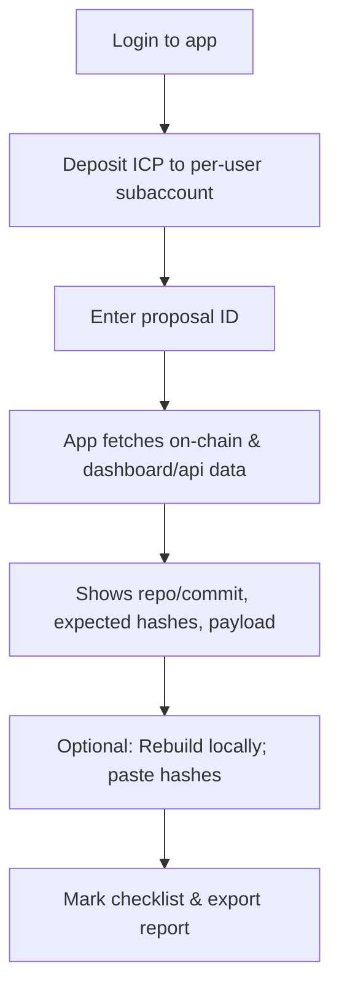

# **Internet Computer Proposal Verification — Complete Guide (with & without the Proposal Verifier app)**

> A practical, beginner-friendly handbook to verify NNS proposals step-by-step, rebuild binaries, check argument hashes, and publish your results. It also shows how to use the **Proposal Verifier** app and how to verify **manually in parallel**.

---

## Table of Contents

* [1. What is a proposal & why verification matters](#1-what-is-a-proposal--why-verification-matters)
* [2. Where proposals live (NNS, Dashboard & API)](#2-where-proposals-live-nns-dashboard--api)
* [3. Proposal types & what to verify for each](#3-proposal-types--what-to-verify-for-each)
* [4. Core concepts in plain English](#4-core-concepts-in-plain-english)
* [5. Setup & dependencies (Windows/macOS/Linux)](#5-setup--dependencies-windowsmacoslinux)
* [6. Two workflows at a glance (diagrams)](#6-two-workflows-at-a-glance-diagrams)
* [7. Full step-by-step (manual method)](#7-full-step-by-step-manual-method)
* [8. Full step-by-step (Proposal Verifier app)](#8-full-step-by-step-proposal-verifier-app)
* [9. Rebuilding & hashing binaries (IC canisters & IC-OS)](#9-rebuilding--hashing-binaries-ic-canisters--ic-os)
* [10. Arguments & arg_hash verification (including “null”/empty cases)](#10-arguments--arg_hash-verification-including-nullempty-cases)
* [11. Manual-heavy proposals (controllers, motions, participants)](#11-manual-heavy-proposals-controllers-motions-participants)
* [12. Publishing a verification report](#12-publishing-a-verification-report)
* [13. Troubleshooting & common pitfalls](#13-troubleshooting--common-pitfalls)
* [14. Using the Proposal Verifier app locally (clone, configure, deploy)](#14-using-the-proposal-verifier-app-locally-clone-configure-deploy)
* [15. Quick checklists](#15-quick-checklists)

---

## 1. What is a proposal & why verification matters

On the Internet Computer (IC), upgrades and governance changes are enacted via **Network Nervous System (NNS) proposals**. These can upgrade core protocol canisters, deploy new features, change controllers, and even roll out new IC-OS versions. Because proposals can be powerful, **anyone** should be able to independently verify what’s being voted on: confirm the source commit, rebuild the binaries, check hashes and arguments, and ensure the payload does exactly what it claims. Clear, reproducible verification is what turns governance from “trust us” into “trust, but verify.”

---

## 2. Where proposals live (NNS, Dashboard & API)

* **NNS dapp** shows each proposal, payload, and status.
* **ICP Dashboard** provides detailed proposal pages and a “Wasm Verification” section for install/upgrade proposals.
* **IC Public API** exposes proposals in JSON:
  `https://ic-api.internetcomputer.org/api/v3/proposals/<PROPOSAL_ID>` (handy for scripting/automation and extracting payload fields/hashes).

---

## 3. Proposal types & what to verify for each

Here’s a high-level mapping (not exhaustive). The “what to verify” column is what *you* should independently confirm.

| Category (examples)                                                                   | What to verify (minimum)                                                                                                                                                                          |
| ------------------------------------------------------------------------------------- | ------------------------------------------------------------------------------------------------------------------------------------------------------------------------------------------------- |
| **Protocol Canister Management** (e.g., governance, registry, NNS frontend canisters) | Source **repo & commit**, **rebuild** the WASM (or use release artifact), compute **SHA-256** (raw and/or gzipped), compare to expected/“proposed wasm sha-256”; verify **arg_hash** if provided. |
| **Application Canister Management** (ledger, II, ckBTC, etc.)                         | As above: repo/commit → rebuild → SHA-256 → compare; confirm **payload args** and **install mode** (upgrade vs reinstall).                                                                        |
| **IC-OS Version Deployment/Election**                                                 | Confirm **release package** link & **release SHA-256**, or reproduce via the official script; compare calculated hash to the proposal’s expected hash.                                            |
| **Subnet/Node/Participant/Network Economics**                                         | No WASM to rebuild; verify **principals/IDs**, **document hashes** (e.g., PDFs), **config/allowances**, and **tables/parameters** against the stated intent.                                      |
| **Governance (Motion) Proposals**                                                     | **Text-only** intent. Read the summary/discussion and verify the stated scope and implications. These carry no bytecode to hash.                                                                  |

See “Proposals (Overview)” and “Proposal Topics & Types” for canonical categories and examples.

---

## 4. Core concepts in plain English

* **Git commit** – a fingerprint (hash) that points to *exact* source code. The proposal should state a commit or link you can check.
* **WASM module** – compiled bytecode you deploy to a canister. We hash the bytes (and sometimes the gzipped bytes) to verify integrity.
* **Hash (SHA-256)** – a one-way fingerprint of bytes. If two parties compute SHA-256 on the *same* file/bytes, they must match.
* **Arguments / `arg_hash`** – for install/upgrade proposals, the payload can include arguments. The NNS governance proposal often stores **`arg_hash`**, which is **SHA-256 of the Candid-encoded argument bytes**. You should encode the same arguments and compare.
* **Reproducible build** – re-building the WASM from the given commit in a clean environment and reproducing the same hash.

The official “Verify Proposals” doc demonstrates these ideas with concrete commands and a “Wasm Verification” section.

---

## 5. Setup & dependencies (Windows/macOS/Linux)

You don’t need deep dev experience—just a clean environment and the right tools.

### Common tools (all OS)

* **Git** (clone the repo and checkout the commit)
* **Docker** (official IC build scripts use Docker to make builds reproducible)
* **curl** (download release artifacts or helper scripts)
* **sha256sum / shasum** (compute hashes)
* **`dfx`** (IC SDK; optional but useful)
* **`didc`** (Candid codec; encode args to compare against `arg_hash`)

#### Install `dfx` (recommended)

Use the official `dfxvm` installer to manage `dfx` versions:

```bash
sh -ci "$(curl -fsSL https://internetcomputer.org/install.sh)"
```

Then initialize or switch versions: `dfxvm install <version>` / `dfx --version`.

> Tip: `dfx` isn’t strictly required for basic verification, but it’s handy for interacting with canisters locally and building some community canisters.

#### Install `didc`

* macOS: `brew install dfinity/tap/didc` (or download a release binary if available)
* Linux/WSL: download a `didc` binary for your architecture (or build from source) and put it on your `PATH`.
* Windows: use **WSL** (Ubuntu) and follow Linux steps.

> If you can’t find a packaged binary, you can still **encode** simple arguments with small scripts or use the Proposal Verifier app’s helpers.

### OS-specific notes

**Windows (best: WSL2 + Ubuntu)**

1. Install **WSL2** and Ubuntu from the Microsoft Store.
2. Inside Ubuntu: `sudo apt update && sudo apt install -y git docker.io curl coreutils`
3. Add your WSL user to the `docker` group; restart your WSL session.
4. Install `dfx` via `dfxvm` (see above).

**macOS**

1. Install **Homebrew**; then: `brew install git docker coreutils`
2. Install Docker Desktop (start it to run Docker daemon).
3. Install `dfx` via `dfxvm`.

**Linux (Ubuntu/Debian)**

```bash
sudo apt update
sudo apt install -y git docker.io curl coreutils
# start/enable docker service depending on distro
```

Then install `dfx` via `dfxvm`.

---

## 6. Two workflows at a glance (diagrams)

### A. Manual verification (no app)

```mermaid
flowchart TD
  A[Find proposal ID] --> B[Open ICP Dashboard/IC API]
  B --> C[Extract repo + commit + expected hashes]
  C --> D[Clone repo & checkout commit]
  D --> E[Rebuild binaries or download release]
  E --> F[sha256sum raw/gz WASM]
  F --> G{Matches expected?}
  G -- yes --> H[Encode args with didc & sha256]
  H --> I{arg_hash matches?}
  I -- yes --> J[Publish verification report]
  G -- no --> K[Troubleshoot (see section 13)]
  I -- no --> K
```

### B. With the Proposal Verifier app



---

## 7. Full step-by-step (manual method)

1. **Identify the proposal**
   Find the ID (e.g., from NNS dapp or Dashboard). The Dashboard page usually shows **“Wasm Verification”** for install/upgrade proposals with the expected hash.

2. **Open Dashboard & API**

   * Dashboard proposal page: read title, summary, and payload.
   * IC API: `https://ic-api.internetcomputer.org/api/v3/proposals/<ID>` to extract fields like payload, `arg_hash`, release URLs, etc.

3. **Confirm the source commit**
   The summary or payload usually links to a **GitHub repo + commit**. Open it and ensure it exists and matches what’s stated (commit SHA or tag).

4. **Rebuild or download artifacts**

   * For NNS/IC repos: clone repo, checkout the commit, run official scripts (see §9).
   * For IC-OS releases: use the published release package link and verify the **SHA-256** reported in the proposal.

5. **Compute hashes & compare**

   * Run `sha256sum <file.wasm>` and, if the proposal specifies gzipped **WASM (gz)**, also `sha256sum <file.wasm.gz>`.
   * Compare with Dashboard’s “Proposed WASM (gz) SHA-256” (or similar label).

6. **Verify arguments (`arg_hash`)**

   * Encode the exact Candid args with **`didc encode`** or equivalent.
   * Hash the **encoded bytes**: `sha256sum <(didc encode '(<your args>)')` (see §10 for details & null/empty cases).
   * Compare with the `arg_hash` shown on Dashboard/API.

7. **Write and publish your verification**
   Include: proposal ID, links, commands/logs, computed hashes, arg checks, and any caveats (see §12).

---

## 8. Full step-by-step (Proposal Verifier app)

**Live app:** `https://g5ige-nyaaa-aaaap-an4rq-cai.icp0.io/`
**Source repo:** `https://github.com/dickhery/proposal_verifier`

> The app runs **on-chain** (Internet Computer). When it fetches a proposal and related data, it performs **HTTPS outcalls** and governance queries which burn **cycles** on the backend canister. Therefore, **each fetch has a small fee** (collected from your per-user deposit subaccount). You’ll see your deposit address in-app and can top it up with ICP.

**Using the app**

1. **Login** (Internet Identity).
2. **Fund deposit** (the app shows your per-user deposit account identifier).
3. Enter a **proposal ID** → the app fetches on-chain data + dashboard/API JSON.
4. The app parses out **expected hashes**, **repo/commit**, and **payload** details.
   You can optionally **rebuild locally**, then paste your computed hashes to confirm.
5. Use the **checklist** and **export** actions to publish a “Proposal Verified” report.

> Want to host your own copy? See §14 to clone, switch the beneficiary address, and deploy. You pay only for your own cycles.

---

## 9. Rebuilding & hashing binaries (IC canisters & IC-OS)

### A. Protocol/Application canisters (IC repo example)

Use the official containerized build to reproduce artifacts:

```bash
git clone https://github.com/dfinity/ic
cd ic
git fetch --all
git checkout <COMMIT>
./ci/container/build-ic.sh -c
# Artifacts appear under ./artifacts/canisters/...
sha256sum ./artifacts/canisters/*.wasm
sha256sum ./artifacts/canisters/*.wasm.gz  # if proposal expects gz hash
```

Then compare your SHA-256 to the **expected** hash shown on the Dashboard (labels like “Proposed WASM (gz) SHA-256”).

### B. IC-OS releases (GuestOS/HostOS)

IC-OS proposals usually link a **release package**; you’ll either:

* Download and hash it directly (compare to the proposal’s release SHA-256), or
* Run the official **repro-check** script (from the IC repo) that reproduces the release and prints hashes to compare.

---

## 10. Arguments & `arg_hash` verification (including “null”/empty cases)

**What is `arg_hash`?**
For install/upgrade proposals, the governance payload often includes **`arg_hash`** = **SHA-256 of the Candid-encoded argument bytes**. To verify:

1. Determine the **exact** Candid value (from the proposal payload or docs).
2. Encode it with **`didc`** (or another Candid encoder).
3. Hash the bytes with SHA-256 and compare to `arg_hash`.

**Examples with `didc`**

* **Empty arguments** (no args / Candid `()`):

  ```bash
  didc encode '()' | shasum -a 256
  # commonly observed hash: 0fee102bd16b05302d3f44c393c4b8b0cdabe88f51256733b8071bdf7d53da4e
  ```

  The above 64-hex value appears in real upgrade proposals when **no arguments** are passed.

* **Explicit `null`** (Candid `null`) vs `()`
  `null` is a typed Candid value and **not** the same as `()` (empty). If a proposal says the argument is `null`, encode **`(null)`** instead of `()`. The **hash will be different** because the encoded bytes differ. Use:

  ```bash
  didc encode '(null)' | shasum -a 256
  ```

  > Tip: When comparing “null-like” payloads, always check the exact Candid being used—`()` vs `(null)` vs `record {}` produce different bytes and therefore different hashes.

* **Blob/vec examples**

  ```bash
  # blob from hex escapes
  didc encode '(blob "\00\ab\ff")' | shasum -a 256

  # vec of bytes
  didc encode '(vec {1; 2; 255})' | shasum -a 256
  ```

**Gz vs raw WASM note**
Proposals often state the expected hash of the **gzipped WASM**. Hash **both** the raw `.wasm` and `.wasm.gz` and match whichever the proposal references (labels like “Proposed WASM (gz) SHA-256”).

---

## 11. Manual-heavy proposals (controllers, motions, participants)

Some proposals don’t involve bytecode:

* **Add/Remove Controllers (canister settings)**

  * Payload contains **principal IDs** to be added/removed.
  * Verify those principals are the intended ones (cross-check in the forum thread and any linked docs).
  * If you control the canister locally you can call `canister_status` via the **management canister** to see current controllers; but note only controllers (or the NNS for system canisters) can query this on mainnet.
  * Outcome check: controllers list should reflect exactly what the payload specifies after execution.

* **Motion (Governance) proposals**

  * Text-only, expressing intent or policy.
  * Verify clarity, scope, and that it **does not** implicitly authorize actions beyond what it states. Motions don’t deploy code.

* **Participant / Node provider changes**

  * Check identity documents or hashes (e.g., PDF hashes), forum due diligence, and that the principals match the intended entities.
  * Hash any linked PDFs yourself: `sha256sum file.pdf` and compare.

---

## 12. Publishing a verification report

A good report makes your work easy to reproduce:

* **Header**: proposal ID, title, links (NNS dapp & Dashboard), repo+commit, proposer (if listed).
* **Hashes**: your computed raw/gz WASM hashes and expected hash from the proposal.
* **Args**: the exact Candid value you encoded and the resulting `sha256`.
* **Build log**: key commands you ran and their outputs.
* **Conclusion**: “Verified” / “Mismatch” with brief notes.
* **Artifacts**: attach logs or paste hashes as code blocks.

The Dashboard’s “Verify proposals” page is a good reference for structuring your steps and commands.

---

## 13. Troubleshooting & common pitfalls

* **Hash mismatch**

  * Check if the **proposal expects gzipped** WASM. Hash **`.wasm.gz`** if so.
  * Make sure you checked out the **exact commit** (no uncommitted changes, right branch/tag).
  * Rebuild in a **clean** environment (Docker build script).

* **`arg_hash` mismatch**

  * Confirm the **exact Candid** shape: `()` vs `(null)` vs `record {}` are different.
  * Encode precisely with `didc`.
  * Some proposals encode **empty args**; when truly empty, the commonly observed arg hash for `()` is
    `0fee102bd16b05302d3f44c393c4b8b0cdabe88f51256733b8071bdf7d53da4e`.

* **IC-OS release not matching**

  * Make sure you used the **release package** or the official **repro-check** for the same commit/version.

* **API JSON lacks fields**

  * The IC API (`/api/v3/proposals/<id>`) is helpful but sometimes omits context; always cross-read the Dashboard page and proposal summary.

* **Environment issues (Windows)**

  * Use **WSL2** and run everything inside Ubuntu; ensure Docker daemon is running and your user is in the `docker` group.

---

## 14. Using the Proposal Verifier app locally (clone, configure, deploy)

**Why self-host?**
Running your own instance means you control your cycles and pay only your own costs.

**Repo**: `https://github.com/dickhery/proposal_verifier`

**Before you deploy your fork:**

1. **Change the beneficiary address** (where ICP fees are forwarded) from
   `2ec3dee16236d389ebdff4346bc47d5faf31db393dac788e6a6ab5e10ade144e`
   to **your** account identifier (64-hex). This constant appears in the backend code.
2. **Replace canister IDs** (frontend/backend) after your first local deploy (`dfx deploy`) so your frontend points to *your* backend canister.
3. Review the repo **README** for any per-env notes (e.g., Content-Security-Policy, Internet Identity config, etc.).

**Basic local steps**

```bash
# in project root
npm install
dfx start --clean --background
dfx deploy
# start the frontend workspace
npm start
```

**Production deploy**

* Create mainnet canisters with `dfx`, set cycles, and deploy the backend first.
* Update the frontend `declarations` and CSP as needed, then deploy the asset canister.
* Test a fetch on a known proposal (see §15 “Known-good sanity checks”).

> **Fees**: The app charges a **per-fetch** fee because HTTPS outcalls and governance queries **burn cycles** on the backend. You’ll see (and fund) your **per-user deposit subaccount** in the UI; the app forwards the fee to the configured beneficiary address.

---

## 15. Quick checklists

### A. “Proposal Verified” (binary-bearing proposals)

* [ ] Open Dashboard + API for **<ID>**. Extract **expected hash** & any **arg_hash**.
* [ ] Follow repo link & **checkout the commit**.
* [ ] **Rebuild** with the official script (Docker).
* [ ] Compute **sha256** of **raw** and/or **gzipped** WASM (as the proposal specifies).
* [ ] **Compare** with expected.
* [ ] **Encode args** with `didc` (exact Candid), **sha256** the bytes, compare to `arg_hash`.
* [ ] Publish your **report** with commands + logs.

### B. Manual verification (controllers/participants/motions)

* [ ] Read payload and **list all principals** and values to change.
* [ ] Confirm identities with forum context and/or documentation.
* [ ] For motions, confirm scope and that no implicit authorization is hidden.
* [ ] Publish your **report**.

### C. Known-good sanity checks

* **Empty args (`()`)** hash you can reproduce:
  `didc encode '()' | shasum -a 256` → commonly `0fee102b...d53da4e`.
* **WASM (gz)** vs **WASM** difference: Ensure you hash the correct one per Dashboard’s label.

---

### Appendix: Where to look things up quickly

* **Verify Proposals (official guide)** — commands & “Wasm Verification” section.
* **Proposals overview / topics & types** — know the intent and what to verify for each class.
* **IC API proposals endpoint** — machine-readable payloads & fields.
* **Install `dfx` via dfxvm** — modern install path.
* **Real-world empty-arg hash** example (`()`) — matches observed proposal arg hash.

---

## License & Sharing

This guide is intended to be open, remixable, and shareable. Please keep steps reproducible and transparent—so **anyone** in the community can follow along and independently reach the same conclusion.

---

**Notes for readers of this guide:**

* The **Proposal Verifier app** is deployed on the Internet Computer at `https://g5ige-nyaaa-aaaap-an4rq-cai.icp0.io/`. Each fetch consumes cycles and charges a small fee. You may **clone and deploy your own** copy from `https://github.com/dickhery/proposal_verifier`; before deploying, change the beneficiary address and update canister IDs so your frontend points to your backend.
* If you’re new, start with **IC-OS** or **simple canister upgrade** proposals; they’re the most straightforward to reproduce and hash. Then move on to controller or participant proposals to practice manual reviews.
