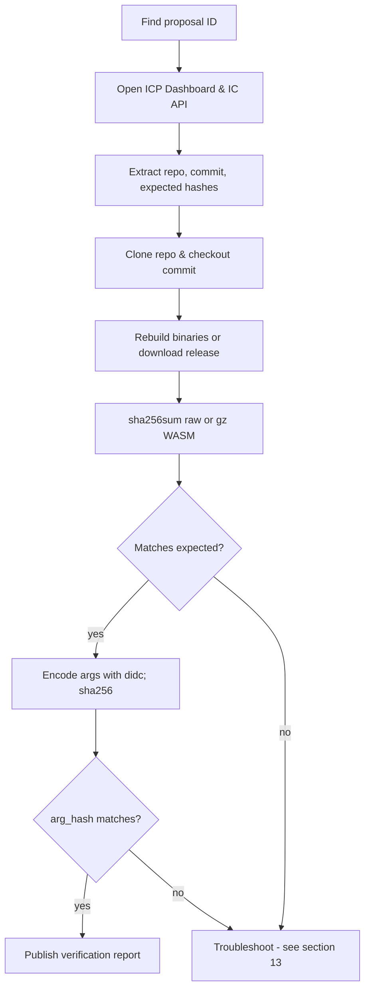
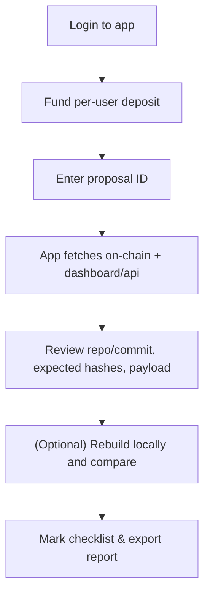

# Internet Computer Proposal Verification Guide (Manual & With the Proposal Verifier App)

> A practical, beginner-friendly handbook to verify NNS proposals step-by-step, rebuild binaries, check argument hashes, and publish your results. It also shows how to use the **Proposal Verifier** app and how to verify **manually in parallel**. This guide assumes no prior knowledge of proposals or blockchain governance, explaining everything from the basics to advanced troubleshooting.

---

## Table of Contents

* [1. What is a proposal & why verification matters](#1-what-is-a-proposal--why-verification-matters)
* [2. Where proposals live (NNS, Dashboard & API)](#2-where-proposals-live-nns-dashboard--api)
* [3. Proposal types & what to verify for each](#3-proposal-types--what-to-verify-for-each)
* [4. Core concepts in plain English](#4-core-concepts-in-plain-english)
* [5. Setup & dependencies (Windows/macOS/Linux)](#5-setup--dependencies-windowsmacoslinux)
* [6. Two workflows at a glance (diagrams)](#6-two-workflows-at-a-glance-diagrams)

  * [A. Manual verification (no app)](#a-manual-verification-no-app)
  * [B. With the Proposal Verifier app](#b-with-the-proposal-verifier-app)
* [7. Full step-by-step (manual method)](#7-full-step-by-step-manual-method)
* [8. Full step-by-step (Proposal Verifier app)](#8-full-step-by-step-proposal-verifier-app)
* [9. Rebuilding & hashing binaries (IC canisters & IC-OS)](#9-rebuilding--hashing-binaries-ic-canisters--ic-os)
* [10. Candid arguments & `arg_hash` — where to find them and how to verify](#10-candid-arguments--arg_hash--where-to-find-them-and-how-to-verify)

  * [10.1 Where do I find the arguments?](#101-where-do-i-find-the-arguments)
  * [10.2 How to encode arguments (with `didc`)](#102-how-to-encode-arguments-with-didc)
  * [10.3 Compute the `arg_hash` and compare](#103-compute-the-arg_hash-and-compare)
  * [10.4 “Null/empty” arguments and common gotchas](#104-nullempty-arguments-and-common-gotchas)
* [11. Manual-heavy proposals (controllers, motions, participants)](#11-manual-heavy-proposals-controllers-motions-participants)
* [12. Publishing a verification report](#12-publishing-a-verification-report)
* [13. Troubleshooting & common pitfalls](#13-troubleshooting--common-pitfalls)
* [14. Using the Proposal Verifier app locally (clone, configure, deploy)](#14-using-the-proposal-verifier-app-locally-clone-configure-deploy)
* [15. Quick checklists](#15-quick-checklists)

---

## 1. What is a proposal & why verification matters

The Internet Computer Protocol (ICP) is a decentralized blockchain platform designed to run smart contracts (known as "canisters") in a secure, scalable, and efficient manner. Unlike traditional blockchains, ICP uses a unique governance system called the **Network Nervous System (NNS)**, which is essentially a decentralized autonomous organization (DAO). This NNS allows holders of ICP tokens—who stake their tokens in "neurons"—to participate in decision-making by voting on proposals. These proposals are the core mechanism for evolving the ICP network, ensuring it remains community-driven and transparent.

A **proposal** in the NNS is essentially a formal request or suggestion for a change or action on the ICP network. Think of it like a bill in a legislature: it's submitted, discussed (often on forums), voted on by eligible participants (neurons), and if it passes (adopted), it automatically executes. Proposals can cover a wide range of actions, such as:
- Upgrading the code of critical canisters (e.g., the governance canister itself or the ICP ledger).
- Deploying new versions of the IC Operating System (IC-OS), which runs on the physical nodes that power the network.
- Adding or removing node providers (entities that operate the hardware nodes).
- Changing network economics, like rewards for nodes or voting parameters.
- Even non-binding "motions" that serve as polls or discussions to gauge community sentiment.

Proposals are numbered uniquely (e.g., Proposal #12345) and have a status: open (voting period), adopted (passed and executed), rejected, or failed (e.g., due to errors). Each proposal includes a title, summary (description), URL (often linking to forum discussions), and a payload (the actual data or code to execute if adopted). The payload might include hashes for verification, ensuring transparency.

**Why verification matters:** In a decentralized system like ICP, there's no central authority to "trust" blindly. Proposals can be powerful—they might introduce new code that could contain bugs, vulnerabilities, or even malicious changes if not scrutinized. Verification is the process of independently confirming that the proposal does exactly what it claims. For example:
- Does the proposed Wasm code match the source code at the specified commit? (Rebuild and hash to check.)
- Do the arguments (e.g., configuration data passed to a canister) hash to the value in the proposal? (Encode and hash to verify.)
- Are supporting documents (like node provider declarations) authentic and unchanged? (Download and hash to confirm.)

Without verification, the network risks "trust us" governance, where a few entities (like proposal submitters) control changes without checks. Instead, verification enables "trust, but verify"—a key principle of decentralization. Here's why it's crucial:
- **Reduces risks:** Catches errors (e.g., wrong commit), mismatches (e.g., hash doesn't match rebuilt code), or potential attacks (e.g., tampered binaries) before they execute.
- **Builds transparency:** Public verification reports create accountability—submitters know their work will be scrutinized, leading to higher-quality proposals.
- **Enhances resilience:** Distributed checks mean no single point of failure; if one verifier misses something (e.g., a subtle arg change), others might catch it.
- **Increases participation and education:** Verifying teaches you about ICP internals (e.g., how canisters upgrade), making you a better-informed voter and contributor.
- **Prevents centralization:** The more independent verifiers (like you), the less reliance on trusted parties (e.g., DFINITY submissions). This aligns with ICP's goal of full decentralization.
- **Community culture:** Repeated verifications set norms—e.g., always include rebuild instructions in summaries—making governance more robust over time.

In short, verification turns passive staking into active governance. Even if you're new and start with simple checks (like hashing a document), your contribution strengthens the network. Over time, this collective effort prevents centralization and ensures ICP evolves securely and fairly.

For deeper dives, explore the [ICP verifying proposals tutorial](https://internetcomputer.org/docs/building-apps/governing-apps/nns/concepts/proposals/verify-proposals) and [proposal topics/types](https://learn.internetcomputer.org/hc/en-us/articles/34140518658068-Proposal-Topics-and-Types).

---

## 2. Where proposals live (NNS, Dashboard & API)

To start verifying a proposal, you first need to locate it and gather its details. ICP provides several accessible interfaces for this purpose, each offering complementary information. Understanding these sources allows you to cross-reference data for accuracy and completeness. We'll explain each one, including how to navigate them and what key details to extract.

* **NNS dapp** ([nns.ic0.app](https://nns.ic0.app/)): This is the primary, user-friendly web application for interacting with the NNS. It's built as a canister running directly on the ICP network, making it decentralized and tamper-resistant. Here's a detailed walkthrough:
  - Open the site in your browser (no login needed to browse, but required to vote).
  - Go to the "Proposals" tab in the navigation menu.
  - Use filters: Sort by status (e.g., "Open" for proposals currently in voting), topic (e.g., "Governance" or "Subnet Management"), or search by ID.
  - Click on a proposal to view its full details: title, summary (descriptive text), proposer (the neuron or principal that submitted it), payload (the technical data or code), voting status (e.g., votes for/against), and links (often to forum discussions).
  - Key extractions: Copy the summary for repo/commit/hashes; note the payload for arguments (often in Candid format like `(record { ... })`); check the "Action" field for type (e.g., "InstallCode").
  - Why use it: It's the official voting interface, on-chain (data is verifiable), and includes community discussions. If you're a neuron holder, you can follow trusted neurons here for automated voting.
  - Tip: Proposals have a voting deadline (e.g., 4 days)—verify open ones promptly. If the proposal links to a forum thread, read it for context.

* **ICP Dashboard** ([dashboard.internetcomputer.org](https://dashboard.internetcomputer.org/)): This is a more technical, analytics-focused portal maintained by the DFINITY Foundation. It's off-chain but aggregates real-time network data and provides enhanced proposal views.
  - Navigate to the "Governance" or "Proposals" section.
  - Search by ID or browse lists (filter by topic, status, or date).
  - Each proposal page includes: title, summary, proposer, detailed payload rendering (often human-readable JSON or text), expected hashes (crucial for Wasm verification), and sometimes build/rebuild instructions.
  - Key extractions: Look for the "Wasm Verification" section (common in upgrade proposals) with "Proposed WASM (gz) SHA-256" or similar; extract `arg_hash` from payload; note any linked artifacts (e.g., release packages).
  - Why use it: Provides parsed, easy-to-read payloads and verification hints not always in NNS dapp. Great for cross-referencing hashes and args.
  - Tip: If the summary mentions a "release package," the dashboard often links it directly—download and hash immediately.

* **IC Public API**: This is a RESTful endpoint for programmatic access, ideal for scripts or when you need raw, structured data in JSON format. No UI—use a browser, curl, or tools like Postman.
  - Base URL: `https://ic-api.internetcomputer.org/api/v3/proposals/<PROPOSAL_ID>`.
  - Fetch example (curl): `curl https://ic-api.internetcomputer.org/api/v3/proposals/12345 > proposal.json`.
  - Response structure: A JSON object with fields like `id`, `proposal` (containing `title`, `summary`, `url`, `action` with hashes/args), and status.
  - Key extractions: Use `jq` for parsing (install via [jq download](https://stedolan.github.io/jq/download/)): `cat proposal.json | jq .proposal.action.InstallCode.wasm_module_hash` to get hashes; extract `arg_hash` similarly.
  - Why use it: Automation-friendly; precise for fields like binary hashes or encoded args. Handy in scripts to fetch multiple proposals.
  - Tip: If JSON is large, pipe to `jq` for filtering: `curl ... | jq .proposal.summary` for just the description.

**Best practices for using these sources:**
- **Cross-check always**: Start with NNS dapp for overview, Dashboard for details/hashes, API for raw data. If any mismatch (e.g., summary differs), investigate—could be an error.
- **Save offline**: Copy/paste summaries/JSON to files for reference.
- **Security**: Use HTTPS; verify URLs match official domains to avoid phishing.
- **If stuck**: Forum threads (linked in proposals) often clarify details.

These tools make proposals accessible—browse a few to familiarize yourself.

---

## 3. Proposal types & what to verify for each

Proposals are categorized by **topics** (broad groups like "Governance") and **types** (specific actions like "InstallCode"). Topics influence voting (e.g., higher rewards for critical ones) and restrictions (e.g., short periods for some). Types define execution (e.g., upgrade a canister). For a complete list with examples, see [ICP proposal topics and types](https://learn.internetcomputer.org/hc/en-us/articles/34140518658068-Proposal-Topics-and-Types).

Why classify? It guides verification: binary types need rebuilds/hashes; config types need ID checks; motions need intent review. The table maps common categories with minima—always read the summary for specifics. Use [ICP verify tutorial](https://internetcomputer.org/docs/building-apps/governing-apps/nns/concepts/proposals/verify-proposals) for videos/examples.

Here’s a high-level mapping (not exhaustive). The right column is what *you* should independently confirm.

| Category (examples)                                                         | What to verify (minimum)                                                                                                                                                                            |
| --------------------------------------------------------------------------- | --------------------------------------------------------------------------------------------------------------------------------------------------------------------------------------------------- |
| **Protocol Canister Management** (e.g., governance, registry, NNS frontend) | Source **repo & commit**; **rebuild** the WASM (or use release artifact), compute **SHA-256** (raw and/or gzipped), compare to expected/“proposed wasm sha-256”; verify **`arg_hash`** if provided. |
| **Application Canister Management** (ledger, II, ckBTC, etc.)               | Same as above: repo/commit → rebuild → SHA-256 → compare; confirm **payload args** and **install mode** (upgrade vs reinstall).                                                                     |
| **IC-OS Version Deployment/Election**                                       | Confirm **release package** link & **release SHA-256**, or reproduce via the official script; compare calculated hash to the proposal’s expected hash.                                              |
| **Subnet/Node/Participant/Network Economics**                               | No WASM to rebuild; verify **principals/IDs**, **document hashes** (e.g., PDFs), **config/allowances**, and **tables/parameters** against the stated intent.                                        |
| **Governance (Motion) Proposals**                                           | **Text-only** intent. Read the summary/discussion and verify the stated scope and implications. No bytecode to hash.                                                                                 |
| **SnsAndCommunityFund** (e.g., CreateServiceNervousSystem)                  | Verify **initial token distribution**, **swap params**, **Neurons' Fund usage**, and **SNS settings**. Rebuild SNS canisters if upgrading; check hashes for documents.                           |

**General tips for all types**: Start with summary—note intent. If hashes/docs, verify first (easy wins). For code, rebuild last (time-intensive). If unsure, forum thread clarifies.

---

## 4. Core concepts in plain English

If you're new to blockchain or ICP, these terms might seem technical—let's break them down simply, like explaining to a friend. We'll use analogies and examples to make them clear.

* **Hash (SHA-256)**: Imagine a file's "DNA" or unique fingerprint—a 64-character code (hex digits) generated from its exact content. If you change even one byte (e.g., add a space in a document), the hash changes completely. Analogy: Like a book's ISBN—if the book changes, so does the ISBN. In proposals, hashes prove "this is the exact file/code proposed." Tools like `sha256sum` compute it instantly. Example: Hash "hello" vs "hello!"—totally different outputs. Mismatch during verification? Signals a problem (e.g., wrong file).
* **Wasm (WebAssembly)**: The compiled, binary code that ICP canisters run. It's like an app's executable file (.exe on Windows). Proposals often upgrade Wasm—e.g., fix bugs or add features. To verify: Rebuild from source code (using tools like Docker) and hash the output. Matches proposal hash? The code is authentic. Analogy: Baking a cake from a recipe—if your cake matches the photo, the recipe is good.
* **Candid arguments**: Data passed to canisters during install/upgrade, like settings or configs. Often written in Candid (a human-readable format, e.g., `(record { key = "value" })`). Proposals hash these for integrity—`arg_hash` is SHA-256 of the encoded bytes. To verify: Encode text to bytes with `didc`, hash, compare. Analogy: Mailing a package—the label (Candid text) must match the contents (bytes) when unpacked (hashed).
* **Reproducible builds**: The holy grail of verification—same input (code at exact commit) produces identical output (Wasm/hash) on any machine. ICP scripts/Docker ensure this. Why? Prevents "my build differs" issues. Analogy: Following a recipe exactly—everyone gets the same cake.
* **On-chain vs off-chain**: On-chain = stored on blockchain (immutable, verifiable, e.g., hashes in proposal). Off-chain = external (e.g., GitHub code, PDFs)—you fetch/rebuild to verify. Analogy: On-chain is a sealed contract; off-chain is supporting evidence you check.
* **Principals/IDs**: Unique strings identifying users, canisters, nodes (e.g., "ryjl3-tyaaa-aaaaa-aaaba-cai"). Like email addresses but cryptographic. Verify they match expected (e.g., in configs). Analogy: Checking IDs at a door—wrong ID? No entry.
* **HTTPS outcalls**: Canisters calling external APIs (e.g., GitHub for commit existence). App uses these—consensus ensures responses match across replicas (prevents divergence). Analogy: Group fact-check—majority agrees on answer.

These concepts ensure trustless verification—no blind faith. For practical hashing, see [ICP verify hash guide](https://internetcomputer.org/docs/building-apps/governing-apps/nns/concepts/proposals/verify-proposals#verifying-arguments-match-the-hash).

---

## 5. Setup & dependencies (Windows/macOS/Linux)

Verification requires tools for code management, building, encoding, and hashing. We'll cover installation step-by-step, assuming no prior setup. This ensures reproducibility—your environment matches others'. Test each tool after install to catch issues early.

### Common Tools (All OS)
These are foundational—install first. They enable cloning, building, and verifying.
* **Git**: Version control for cloning repos and checking commits.
  - Why: Proposals reference GitHub—clone to rebuild.
  - Download/install: [git-scm.com](https://git-scm.com/downloads) (choose your OS).
  - Post-install: Add to PATH if prompted. Test: Open terminal/Git Bash, run `git --version` (should show version like 2.XX).
* **sha256sum/shasum**: Computes SHA-256 hashes for files/bytes.
  - Why: Core to verification—match proposal hashes.
  - Linux: Built-in (`sha256sum`).
  - macOS: Built-in (`shasum -a 256`).
  - Windows: Included in Git Bash (use `shasum -a 256`); or WSL.
  - Test: `echo -n "test" | sha256sum` (output: a94a8fe5ccb19ba61c4c0873d391e987982fbbd3).
* **didc**: Candid encoder/decoder for args.
  - Why: Converts Candid text to bytes for hashing.
  - Download binary: [GitHub releases](https://github.com/dfinity/candid/releases) (choose your OS/arch, e.g., didc-linux64).
  - Extract, add to PATH: Copy to `/usr/local/bin` (macOS/Linux) or a PATH dir (Windows).
  - Test: `didc --version` (shows version).
* **IC CDK (dfx)**: ICP CLI for local testing/queries.
  - Why: Optional for queries (e.g., canister status); useful for advanced.
  - Install: `DFX_VERSION=0.15.0 sh -ci "$(curl -fL https://internetcomputer.org/install.sh)"`.
  - Test: `dfx --version`.
* **Node.js**: For scripts/apps (e.g., app frontend).
  - Why: If self-hosting app.
  - Download: [nodejs.org](https://nodejs.org/en/download) (LTS version).
  - Test: `node --version`.
* **Docker**: Containerizes builds for reproducibility.
  - Why: ICP scripts use Docker—ensures same output.
  - Install Desktop: [docker.com](https://docs.docker.com/desktop/setup/install/windows-install/) (enable WSL on Windows).
  - Test: `docker --version`; run `docker run hello-world`.

### Windows-Specific Setup
Windows lacks native Linux tools—use **WSL** for compatibility. WSL runs Linux inside Windows.
1. Enable WSL: Settings > Apps > Optional features > More Windows features > Virtual Machine Platform & Windows Subsystem for Linux. Restart.
2. Install Ubuntu: Microsoft Store > Ubuntu > Install. Launch; set username/password (takes ~5 min).
3. In Ubuntu terminal: Update packages `sudo apt update && sudo apt install git curl docker.io -y`.
4. Add user to Docker: `sudo usermod -aG docker $USER`; logout/login.
5. Install dfx/didc: As above (in WSL).
6. Docker integration: In Docker Desktop > Settings > Resources > WSL Integration > Enable for Ubuntu.
Full guide: [Microsoft WSL install](https://learn.microsoft.com/en-us/windows/wsl/install). Tip: Use VS Code with WSL extension for editing.

### macOS/Linux Setup
* macOS: Install Homebrew (`/bin/bash -c "$(curl -fsSL https://raw.githubusercontent.com/Homebrew/install/HEAD/install.sh)"`); then `brew install git docker coreutils`. Start Docker Desktop.
* Linux: `sudo apt update && sudo apt install git curl docker.io -y`. Add to Docker group (as above).
* Install dfx/didc: As common.

**Troubleshoot**:
- PATH: Edit `~/.bash_profile` (macOS) or `~/.bashrc` (Linux/WSL): `export PATH="$PATH:/path/to/tool"`. Reload: `source ~/.bashrc`.
- Permissions: `chmod +x tool`.
- Docker: If "daemon not running," start app/service.

---

## 6. Two workflows at a glance (diagrams)

Verification has two paths: manual (hands-on, educational) or app-assisted (faster, automated). Choose based on experience—start manual to learn, then use app for efficiency.

### A. Manual verification (no app)

### B. With the Proposal Verifier app

---

## 7. Full step-by-step (manual method)

This is the foundational way—do everything yourself. It's detailed for beginners; follow exactly.

1. **Find the proposal**: Open [NNS dapp](https://nns.ic0.app/) or [Dashboard](https://dashboard.internetcomputer.org/). Search by ID (e.g., 12345). Note status—if open, verify before voting ends. Copy summary/payload.

2. **Determine type/topic**: From summary or Dashboard. Use Section 3 table. E.g., if "InstallCode", focus on Wasm/args.

3. **Extract key info**: Scan summary for repo (e.g., "github.com/dfinity/ic"), commit (40-hex), hashes (64-hex for SHA-256), args (Candid text), docs (URLs/hashes).

4. **Clone & checkout repo**: `git clone https://github.com/<org>/<repo>`. `cd <repo>`. `git checkout <commit>`. Verify: `git log -1` shows commit.

5. **Rebuild binaries**: Follow repo README. E.g., for IC: `./ci/container/build-ic.sh -c`. Use Docker for isolation: `docker run --rm -v $(pwd):/ic ubuntu:22.04 /ic/build.sh`. Output in artifacts/.

6. **Compute hashes**: `sha256sum artifacts/*.wasm.gz`. For raw: unzip first. Compare to proposal "wasm_module_hash" or Dashboard "expected hash".

7. **Verify args**: Find Candid (e.g., `(record { ... })`). Encode: `didc encode '(args)' > hex.txt`. Bytes: `xxd -r -p hex.txt > args.bin`. Hash: `sha256sum args.bin`. Match "arg_hash".

8. **Verify docs**: Download PDFs. `sha256sum file.pdf`. Match proposal hashes.

9. **Check extras**: Principals? Query registry. Motions? Read implications.

10. **Report mismatches**: If issues, reject & post on forum.

Full examples: [ICP verify tutorial](https://internetcomputer.org/docs/building-apps/governing-apps/nns/concepts/proposals/verify-proposals).

---

## 8. Full step-by-step (Proposal Verifier app)

The app streamlines manual steps—parses, fetches, checks automatically where possible. Deploy your own for customization.

1. **Access app**: [Live](https://g5ige-nyaaa-aaaap-an4rq-cai.icp0.io/). Login with Internet Identity ([II docs](https://internetcomputer.org/docs/references/ii-spec)).

2. **Fund deposit**: Copy address from app. Send ICP (e.g., via wallet). Refresh balances. Fees: 0.03 ICP/fetch + network (0.0001 ICP).

3. **Enter ID & fetch**: Input proposal ID. Click "Fetch" (billed). App queries governance, parses summary (repo/commit/hashes/args/URLs).

4. **Review extracted**: Check repo/commit (auto-verifies via GitHub API). Links/docs listed.

5. **Verify commit**: App shows status (exists?). If fail, manual: browse GitHub.

6. **Verify docs**: Upload files—app hashes/compares. Or fetch URLs (text/JSON).

7. **Verify args**: Paste Candid/hex. App encodes (didc helpers), hashes, compares to arg_hash.

8. **Check extras**: Use checklists for type-specific (e.g., motions: manual review).

9. **Export report**: Fill overrides/notes. Download JSON/MD/PDF.

10. **Publish**: Post report on forum.

Clone: [Repo](https://github.com/dickhery/proposal_verifier). Change beneficiary/canister IDs.

---

## 9. Rebuilding & hashing binaries (IC canisters & IC-OS)

Rebuilding confirms code matches proposal—prevents backdoors.

* **IC Canisters**: E.g., governance.
  - Clone: `git clone https://github.com/dfinity/ic`.
  - Checkout: `git checkout <commit>`.
  - Build: `./ci/container/build-ic.sh -c` (Docker required).
  - Locate: `artifacts/canisters/*.wasm.gz`.
  - Hash: `sha256sum file.wasm.gz`.
  - Compare: To proposal "wasm_module_hash".

* **IC-OS**: GuestOS/HostOS.
  - Script: `curl https://raw.githubusercontent.com/dfinity/ic/<commit>/gitlab-ci/tools/repro-check.sh | bash -s -- -c <commit>`.
  - Hashes: In output; compare to proposal.

Details: [ICP GitHub verifying releases](https://github.com/dfinity/ic?tab=readme-ov-file#verifying-releases).

---

## 10. Candid arguments & `arg_hash` — where to find them and how to verify

### 10.1 Where do I find the arguments?
- Summary/payload: Often `(record { ... })`.
- Dashboard: "Payload" section.
- API: JSON `arg` field.

### 10.2 How to encode arguments (with `didc`)
`didc encode '(args)' > hex.txt`. With `.did`: `didc encode -d file.did '(args)'`.

### 10.3 Compute the `arg_hash` and compare
`xxd -r -p hex.txt | sha256sum`. Match "arg_hash".

### 10.4 “Null/empty” arguments and common gotchas
`(null)` encodes differently from `()`.
Mismatches: Wrong Candid; missing .did; double-hex (decode first).

---

## 11. Manual-heavy proposals (controllers, motions, participants)

* **Controllers**: Query management canister; match payload.
* **Motions**: Text-only; verify scope.
* **Participants**: Hash PDFs; match proposal.

---

## 12. Publishing a verification report

* **Header**: ID, title, links, repo/commit, proposer.
* **Hashes**: Computed vs expected.
* **Args**: Candid, hashed.
* **Build log**: Commands/outputs.
* **Conclusion**: Verified/mismatch + notes.
* **Artifacts**: Logs/code blocks.

---

## 13. Troubleshooting & common pitfalls

* **Hash mismatch**: Gz vs raw? Wrong commit? Clean build.
* **`arg_hash` mismatch**: Exact Candid; encode with `didc`.
* **IC-OS not matching**: Official repro-check.
* **API lacks fields**: Dashboard/summary.
* **Windows issues**: WSL/Docker.

---

## 14. Using the Proposal Verifier app locally (clone, configure, deploy)

**Why self-host?** Control cycles/fees.

* **Live**: [URL](https://g5ige-nyaaa-aaaap-an4rq-cai.icp0.io/).
* **Repo**: [GitHub](https://github.com/dickhery/proposal_verifier).

**Prep**: Change beneficiary; update IDs.

**Local**: `npm install; dfx start --clean --background; dfx deploy; npm start`.

**Production**: `dfx deploy --network ic`; fund cycles; test.

---

## 15. Quick checklists

### A. “Proposal Verified” (binary-bearing proposals)
* [ ] Dashboard/API: Extract hash/arg_hash.
* [ ] Repo: Checkout commit.
* [ ] Rebuild: Script/Docker.
* [ ] Hash: Raw/gz.
* [ ] Compare.
* [ ] Args: Encode/didc, sha256, compare.
* [ ] Report.

### B. Manual verification (controllers/participants/motions)
* [ ] Payload: List principals/values.
* [ ] Identities: Forum/docs.
* [ ] Motions: Scope/no hidden.
* [ ] Report.

### C. Known-good sanity checks
* Empty args: `didc encode '()' | shasum -a 256`.
* WASM gz/raw: Hash correct file.

---

**Notes:**

* App: Deployed on ICP; fees for outcalls. Clone/change beneficiary/IDs.
* New? Start IC-OS/simple upgrades.
* Resources: [Verify proposals](https://internetcomputer.org/docs/building-apps/governing-apps/nns/concepts/proposals/verify-proposals), [Topics/types](https://learn.internetcomputer.org/hc/en-us/articles/34140518658068-Proposal-Topics-and-Types).